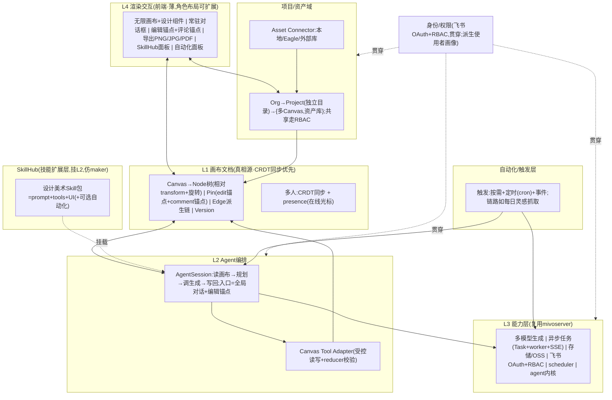

# MivoCanvas 目标架构 v1

> 生成日期：2026-07-01
> 状态：已与产品方向对齐（本文件是"定架构"阶段的收敛结论）。
> 关联文档：`baseline-inventory.md`(前端现状)、`mivo-system-inventory.md`(全栈盘点)、`reference-competitors.md`(选型)、`cindy-replication-assessment.md`。

## 1. 产品定位（架构的出发点）
- MivoCanvas = 老 mivo 的**产品形态迭代**：对话式 + 无限画布,面向**美术/设计师/策划**。
- 范式：从"人↔文字对话完成任务" → "人↔agent/图(锚点)对话完成任务"。图和锚点是设计师的语言,画布是人机对话载体。
- mivoserver 的代码/功能是**可复用能力层**,不是产品核心。

## 2. 核心决定
**以「画布文档」为真相源(canvas-document-centric)+「Agent 编排」为交互中枢 + mivoserver 当「能力层」复用**。骨架四层,外加三个一等域(项目/资产、SkillHub、自动化)和一条贯穿的身份/权限线。

## 3. 架构总览



## 4. 分层与域职责

| 层/域 | 归属 | 职责 |
|-------|------|------|
| L4 渲染交互 | 产品自有(薄) | 无限画布渲染、设计工具组件、常驻对话框、锚点交互、导出、SkillHub/自动化面板;**角色→布局**留扩展缝 |
| L1 画布文档 | 产品自有(**核心/真相源**) | Canvas/Node/Pin/Edge/Version schema;**CRDT 同步 + presence**;前端/agent/后端三方契约 |
| L2 Agent 编排 | 产品自有(复用 mivoserver agent 内核) | 读画布→规划→调生成→写回;两个入口=全局对话 + 编辑锚点;Canvas Tool Adapter 受控读写 |
| L3 能力层 | **mivoserver** | 生成/任务/存储/**飞书OAuth+RBAC**/scheduler/agent 内核——API 调用,不重造 |
| 项目/资产域 | 产品自有(后端底子=mivoserver file/OSS/RBAC) | Org→Project→{Canvas,资产};共享权限;资产 connector(本地/Eagle/外部) |
| SkillHub | 产品自有(仿 maker) | 设计美术 skill 包(prompt+tools+UI+可选自动化),挂 L2 扩展点;浏览/启用 |
| 自动化/触发层 | 产品自有(能力=mivoserver scheduler) | 触发器(按需/定时/事件)+ 自动化链路(如每日灵感抓取) |
| 身份/权限(贯穿) | **复用 mivoserver** | 飞书 OAuth 登录 + RBAC 授权 + 从飞书组织信息派生使用者画像 |

## 5. L1 数据模型（地基,第一天就要对）

```
Canvas { id, projectId, ... }
Node {
  id, parentId,               // 真·嵌套树
  type,                       // frame/image/text/vector/generated/ai-slot/...
  transform { x, y, rotation, w, h },   // 相对父级;世界坐标由父链算
  ...type-specific
}
Pin {                         // 一等对象,统一"钉在图上的坐标对象"
  id, targetNodeId, nx, ny,   // 归一化坐标(0-1),绑定 Node,随其移动/缩放
  kind: 'edit' | 'comment',
  // edit: instruction, status(喂 agent 的定点指令)
  // comment: thread[], resolved, mentions[](人际留言)
}
Edge { fromNodeId, toNodeId, kind }   // 派生链:谁从谁生成/编辑,非破坏可追溯
Version { ... }               // 快照/历史
```

要点:
- **真·嵌套变换 + 旋转**(不是现状的扁平数组+绝对坐标+无旋转)——设计工具/frame/group 的地基。
- **Pin 统一**:编辑锚点(→agent)与评论锚点(→人际留言)共用坐标绑定底层,`kind` 区分。
- **CRDT 同步优先**:文档结构从一开始按可同步设计(Map/Array of records + fractional index 管 z-order),支持离线→在线合并、presence。
- 持久化:落 mivoserver(演进 board 域或新建 canvas 域)。

## 6. 多人协作
- L1 走 CRDT(如 Yjs 系)同步;presence 显示在线光标/选区。
- **评论锚点(Pin.kind=comment)**= Figma 式反馈留言:坐标钉在图上,带 thread/回复/resolve/@提及,实时同步。
- 冲突以 CRDT 自动合并;文档结构需 client/server 同步注册 schema。

## 7. 身份 / 权限 / 使用者画像
- **登录**:复用 mivoserver 飞书 OAuth。
- **授权**:复用 mivoserver RBAC(users/roles/permissions + scope);项目/资产共享按此控制。
- **使用者画像(美术/设计/策划)**:从飞书组织信息(部门/职位,mivoserver 已有 CAS 反查)派生;L4 按角色切换功能布局。**画像功能稍后做,但架构现在就留"角色→布局/能力"的扩展缝,不硬编码单一布局。**

## 8. 项目 / 资产域
- 结构:Org → Project(独立目录,Figma 式)→ {多个 Canvas,资产库}。
- 资产 connector 可插拔:本地目录、Eagle、外部库(现有 `AssetSource` 模型演进;从 vite dev 中间件挪到真后端)。
- 共享/权限走身份层 RBAC。

## 9. SkillHub（仿 maker）
- Skill = 打包的设计美术能力:prompt + tools + 面板 UI(+ 可选自动化链路)。
- 挂 L2 agent 的**扩展点**(L2 从一开始设计成可插拔,不写死能力)。
- Hub:浏览/启用/(内部)安装。开放生态 vs 内部,后续定沙箱/审核策略。

## 10. 自动化 / 触发层
- 触发器:按需(对话/锚点)+ 定时(cron)+ 事件。
- 自动化链路示例:每日灵感抓取 →(可选)入资产库/生成 → 通知。
- 能力底座 = mivoserver scheduler;产品层的"链路定义 + 面板"是新建(借鉴 maker/cindy)。

## 11. 导出
- PNG/JPG:L4 客户端渲染导出(canvas → 位图)。
- PDF:客户端(位图入 PDF)起步;高保真/矢量可选走 L3 服务端渲染。
- **不做 Figma 导入**(暂缓)——因此嵌套变换/旋转是为"设计工具本身"保留,不是为 Figma 兼容。

## 12. 复用 mivoserver 映射
| MivoCanvas 需要 | 复用 mivoserver |
|-----------------|-----------------|
| 真实生成(图/视频/3D) | facade + 各厂商 client/tools |
| 异步任务 + 进度 | Task/Message 投影 + worker + SSE |
| 对话 agent 内核 | ai_agent runtime(多厂商+工具+记忆),定位升级为"画布编排" |
| 登录/权限 | 飞书 OAuth + RBAC(+ CAS 组织信息派生画像) |
| 存储 | OSS/DB(资产、画布快照) |
| 自动化底座 | scheduler(APScheduler) |

## 13. 相对现状要改什么
- 今天:扁平节点/绝对坐标/无旋转/DOM 渲染/AI 全 mock/无后端/localStorage。
- 目标:Node 树+相对变换+旋转/CRDT 同步/MIT 引擎/L2 agent 后端/接 mivoserver/服务端持久化。
- 主要工作:重做 L1 数据模型(含 CRDT)、换 L4 引擎、新建 L2 编排 + Canvas Tool Adapter、建项目资产域/SkillHub/自动化层、接 mivoserver(生成+飞书鉴权+存储+scheduler)。

## 14. 待定的实现级选择（不影响上层架构）
- **前端 MIT 引擎**:方向 Konva 场景图(自带嵌套变换+旋转,可接 CRDT);或 Excalidraw(现成编辑器,嵌套变换要扩)。**tldraw 因授权/水印与开源冲突,不选**。到实现 L4 时定稿。
- SkillHub 开放生态 vs 内部;自动化链路的可视化编排粒度。

## 15. Non-goals（暂不做）
- Figma 设计稿导入(暂缓;导出保留)。
- 使用者画像的具体布局(先留扩展缝,后做)。
- 沿用 mivoserver 的 message-centric 内核当产品核心(明确排除)。
