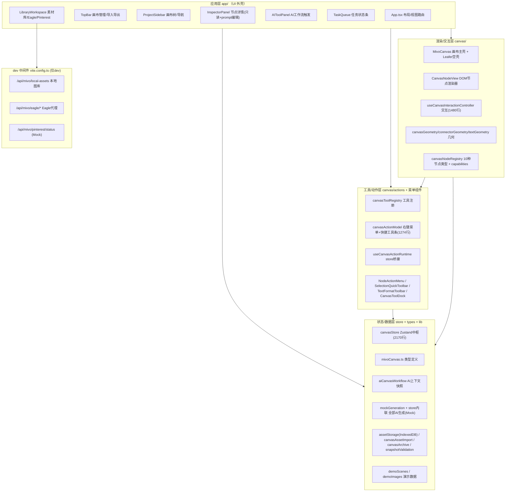

# MivoCanvas 基线清单（Baseline Inventory）

> 生成日期：2026-07-01
> 生成方式：5 个只读分析 agent 并行全盘扫描 src/（18729 行）+ 工程配置，由主 agent 拼接跨域链路
> 快照 commit：`38ab484`（chore: scaffold ECC project conventions）
> 用途：作为二次开发的功能基线参照。实现程度评级基于**当前代码**，非 README 愿景。

## 评级图例

| 标记 | 含义 |
|------|------|
| ✅ 完整 | 端到端打通、真实逻辑 |
| 🟡 部分 | 能用但有明显缺口/限制/依赖外部回调注入 |
| 🔶 Mock | 硬编码/模拟，非真实（点了有反应但结果是假的） |
| 🔲 Stub | 声明了但无实质逻辑（死按钮/占位） |
| ❌ 缺失 | 被引用/被声称但代码不存在 |

---

## 1. 项目概览

| 项 | 值 |
|----|----|
| 定位 | 桌面式 **AI 艺术画布** 交互 Demo，无限画布 + FigJam 风格标注 + AI 图像生成工作流 |
| 技术栈 | Vite 8 + React 19 + TypeScript 6 + Zustand 5 + LeaferJS 2.1 + lucide-react + react-markdown/remark-gfm |
| 渲染引擎 | **React DOM**（LeaferJS 已安装但当前是空壳，见 §3.1） |
| 状态/持久化 | Zustand `persist` → localStorage（key `mivo-canvas-demo`，version 6）；素材二进制 → IndexedDB |
| 测试 | Playwright 单文件冒烟脚本（`e2e-smoke.mjs`，~3679 行，150+ 断言，自带 Eagle mock server） |
| 后端依赖 | 无独立后端；本地资源/Eagle 通过 **Vite dev server 中间件**代理（仅 dev 生效，build 产物不含） |
| 规模 | src 约 18.7K 行；三大重量文件：`canvasStore.ts`(2170)、`useCanvasInteractionController.ts`(1480)、`canvasActionModel.ts`(1274) |
| 可运行性 | `npm install && npm run dev` 应可直接启动（env 均有默认值，Eagle/本地图库缺失时降级不崩溃） |

**一句话结论**：画布编辑器（交互、节点、菜单、组织操作、导入导出、素材库接入）是**真实且相当完整**的工程实现；**AI 生成能力全部是 mock**（同步返回预置图，无任何真实 API 调用）。这是一个"外壳完整、AI 内核待接"的原型。

---

## 2. 架构分层



分层职责与数据流：**所有状态经 Zustand store 单向流动**，组件不持有跨组件回调（少数交互回调如 `onFitAll/onCropNode/onEditText` 由画布层向动作层注入）。

---

## 3. 关键架构事实（二次开发必读）

### 3.1 LeaferJS 是空壳，实际渲染走 React DOM 🔲
- `MivoCanvas.tsx:350-384` 初始化 `new Leafer({...})`，但除 `resize()`/`destroy()` 外**从未调用任何 Leafer 绘图 API**（无 `add()`/`createRect()` 等）。
- 真正的节点渲染在 `div.dom-canvas-layer`，每个节点是 `div.dom-node`，视口变换靠 CSS `transform: translate() scale()`（`MivoCanvas.tsx:420-424`）。
- README/文档明确写明"visible layer 保持 DOM，直到 Leafer 路径完全验证"。**含义**：若要切到 LeaferJS 原生渲染，几乎是重写渲染层的工作量。

### 3.2 AI 生成 100% 是 Mock 🔶
- 5 类生成操作（variations / beside / into-slot / from-annotation / image-edit）全部在 `canvasStore.ts` 内联实现，**同步返回**：
  - 结果图 = `realCaseImages` 中 3 张预置 jpg 循环取（`mockGeneration.ts:39-54`、`canvasStore.ts:1793/1845/1912/1969/2052`）；
  - model 字段硬编码（如 `'Mivo Mock Image Workflow'`），status 直接 `ready`，task 直接 `done` / progress 100。
- `GenerationAdapter` 接口（`generation.ts:14`）只声明了 `generateVariations` 一个方法，其余 4 类无 adapter 抽象。
- **含义**：接真实 AI 是主要待办；接入点清晰（store 的 5 个 generate* action + AIToolPanel/InspectorPanel 的触发路由已就绪）。

### 3.3 本地素材/Eagle 是真实实现，但仅存在于 dev 中间件 ✅（dev-only）
- `vite.config.ts` 的 `localAssetLibraryPlugin`（第 221 行起）在 dev server 注册了 8 个真实 endpoint（本地图库枚举/取文件、Eagle status/folders/assets/thumbnail/file 代理）。含 magic-bytes MIME 检测、路径穿越防护。
- **含义**：`vite build` 产物不含这些 API，生产部署需另建后端；Pinterest 是纯 Mock（`{connected:false, mode:'prototype'}`）。

---

## 4. 端到端功能链路

### 链路 A — 画布交互（✅ 真实完整）
```
指针/键盘事件
  → useCanvasInteractionController (工具分发: select/hand/text/frame/markup)
  → canvasToolHandlers 路由 (canvas空白 / 节点 / resize手柄)
  → canvasInteraction 纯函数 (viewport数学/框选/变形) + canvasGeometry (对齐吸附8px)
  → store.updateNode(s) 提交
  → CanvasNodeView 重渲染 (DOM + CSS transform)
```
平移/缩放/框选/多选/移动/等比&自由缩放/对齐吸附/键盘快捷键/复制粘贴/撤销重做/文字内联编辑/连接器吸附/图片裁剪 — 均 ✅。视口状态按 sceneId 持久化到 localStorage。

### 链路 B — AI 生成（UI/接线 ✅，结果 🔶 Mock）
```
AIToolPanel 提示词输入 (绑定 selectedNode.generation.prompt 或 unboundPrompt)
  → 「立即生成」runPrimaryGeneration()  [AIToolPanel.tsx:67]
     ├ ai-slot 节点   → store.generateIntoAiSlot(id, prompt)
     ├ annotation 节点 → store.generateFromAnnotation(id)
     ├ 其他节点       → store.generateBesideNode(id, prompt)
     └ 无选中         → addAiSlotNode()
  → 【Mock 分界】store 内联同步返回预置图 + 硬编码 model + status:ready
  → aiCanvasWorkflow.chooseAdjacentPlacement 碰撞检测放置新节点 (✅真实算法)
  → TaskQueue 显示 task (状态直跳 done, 无真实轮询)
```
InspectorPanel 的「生成变体」走同一条 store 路径。AI 上下文快照 `getAiContextSnapshot()`（parent/connector/workflow 三类 links + summary 统计）是**真实构建**的，已可直接喂给未来的真实 API。

### 链路 C — 资源导入 / 存储 / 归档（✅ 真实完整）
```
拖拽/粘贴/上传 文件
  → canvasAssetImport.importFileToCanvas (MIME+扩展名嗅探: image/markdown/pdf/video)
  → assetStorage.saveImportedAsset → IndexedDB (Blob原始存储) + alpha透明度扫描(PNG/WebP)
  → 节点 assetUrl = "mivo-asset:<id>"
  → useResolvedAssetUrl hook 异步解析为 object URL 渲染
导出: canvasArchive.createCanvasArchive → 所有 mivo-asset: 序列化为 base64 dataURL → JSON (archive v2)
导入: parseCanvasSnapshot (纯TS字段级校验) → restoreCanvasImportAssets → replaceSnapshot
```

### 链路 D — 素材库 / Eagle（前端 ✅，依赖 dev 中间件）
```
LibraryWorkspace (Assets视图)
  ├ Local:     GET /api/mivo/local-assets      → vite中间件扫 MIVO_ASSET_DIR (默认~/Desktop/Images)
  ├ Eagle:     GET /api/mivo/eagle/status|folders|assets → 代理 Eagle 127.0.0.1:41595
  └ Pinterest: GET /api/mivo/pinterest/status   → 🔶 永远返回 prototype
  → 双击/拖拽素材 → importImageUrlToCanvas → 落到画布
```

---

## 5. 功能矩阵

### 5.1 画布交互能力（域B）

| 能力 | 程度 | 证据 |
|------|------|------|
| 视口平移(Hand/Space)、滚轮/Cmd± 缩放、缩放至指针 | ✅ | useCanvasInteractionController + canvasInteraction |
| 视口按 sceneId 持久化(localStorage, 180ms debounce) | ✅ | useCanvasInteractionController:~120 |
| 节点移动 / 等比缩放(图片) / 自由缩放(frame/markup) | ✅ | canvasInteraction:409-435 |
| 文字节点左右边缘调宽(高度自适应) | ✅ | CanvasNodeView + beginTextResize |
| 多选框选 / groupId 联选 / Shift 加选 / 组缩放 | ✅ | canvasInteraction:selectedIdsFromSelectionBox / resizeGroupSelection |
| 对齐吸附导引线(移动+resize, 阈值8px) | ✅ | canvasGeometry:getSnappedPosition/Resize |
| 视口裁剪 Culling(520px overscan) | ✅ | MivoCanvas:renderedNodes |
| 键盘快捷键(Space/Esc/Cmd+Z/Y/C/D/Delete/箭头/工具字母/Cmd+0±/Shift+1/2) | ✅ | useCanvasInteractionController:1222-1434 |
| 文字内联编辑(textarea autoSize) | ✅ | CanvasNodeView:CanvasTextEditor |
| 连接器吸附(5锚点/24px阈值)+节点跟随 | ✅ | connectorGeometry |
| 图片裁剪(4角resize+移动, 非破坏 归一化框) | ✅ | ImageCropOverlay + store.cropImageNode |
| 拖入/粘贴导入 + 本地资产拖入(自定义drag type) | ✅ | MivoCanvas:handleDrop |
| 撤销/重做 | 🟡 | 交互层代理 store.undo/redo；实现在 store(60步内存栈) |
| connectorGeometry 指针在节点内的吸附分支 | 🟡 | connectorGeometry:109 未 return，边缘 case 待验证 |

### 5.2 节点类型 × 渲染（域B）

| 节点类型 | 渲染 | 说明 |
|---------|------|------|
| image | ✅ | `` + CSS 裁剪；支持 crop / AI 能力位 |
| text / annotation | ✅ | div + textarea 编辑；左右调宽 |
| frame(Section) | ✅ | 标题栏+背景；子节点内部渲染；4角自由缩放 |
| markup | ✅ | SVG inline(rect/ellipse/brush/arrow/line/note)；端点拖拽；连接器吸附 |
| markdown | ✅ | react-markdown + ResizeObserver 自动高度 |
| video | 🟡 | `<video preload=metadata>`，无自定义播放控件 |
| pdf | 🔶 | 仅静态 `PDF` 徽章，无 PDF.js/页面渲染 |
| ai-slot | 🔶 | 占位 div(title+workflow status)，无实际 AI 内容 |
| task-placeholder | 🔶 | 进度条宽度按 status 静态映射，无实时驱动 |

能力位体系(`nodeCapabilities.ts`)：`baseObjectCapabilities`(可选/移/缩/层/组/锁/隐/导出) → 锁定后退化为 `organizationCapabilities`(仅选/锁/隐)。

### 5.3 工具坞（域C）

| 工具 | 快捷键 | 程度 | 证据 |
|------|--------|------|------|
| select / hand / text / frame | V/H/T/F | ✅ | canvasToolHandlers |
| markup-arrow/line/rect/ellipse/brush/note | A/L/R/O/P/N | ✅ | canvasToolRegistry:85-127 |
| sticker / comment / image / video | — | 🔲 | `enabled:false`，退化为 select（canvasToolRegistry:139-162）|
| markup-note flyout 可见性 | N | 🟡 | 已注册但不在 `markupShapeToolIds`，工具坞 flyout 看不到，仅键盘可触发 |
| `import` 工具引用 | — | ❌ | canvasActionModel:460 引用但从未注册，悬空 |

### 5.4 右键菜单 / 快捷工具条操作项（域C，节选）

| 分类 | 操作项 | 程度 |
|------|--------|------|
| 空白右键 | paste / new-text / new-section / new-ai-slot / new-*-markup / select-all / show-hidden | ✅（AI-slot 生成能力 🟡）|
| 空白右键 | fit-all / import-asset | 🟡 依赖回调注入，import 工具悬空 |
| Section 扩展 | fill(6色) / line(色+样式+宽) / title-toggle / lock-all/bg/unlock / remove-section-only | ✅ |
| Markup 扩展 | arrowheads / fill / line-style / corner-radius | ✅ |
| 通用组织 | copy / duplicate / group / ungroup / lock / hide / 图层前后 / align(6) / distribute(2) / delete | ✅ |
| 通用 | view-details / edit-text / rename / crop / download-original / fit-selection | 🟡 依赖 onOpenDetails/onEditText/onCropNode/onDownloadOriginal/onFitSelection 回调注入，未注入静默 no-op |
| AI 生成菜单 | generate-into-slot / from-annotation / beside / variations / remove-bg / expand / boost-resolution / edit-with-prompt / select-area | 🟡 接线到 store，结果 🔶Mock |
| TextFormatToolbar | 字号± / bold / align / 文字颜色(4色) | ✅ |

动作体系：`CanvasActionRuntime` ~40 方法，全部经 `useCanvasActionRuntime` 代理到 Zustand store。**动作层本身不实现 undo/redo**（依赖 store）。

### 5.5 应用层 UI（域D）

| 区域 | 功能 | 程度 |
|------|------|------|
| TopBar | 标题+计数 / 重命名/复制/删除画布 / 导入·导出·复制 JSON | ✅ |
| TopBar | Move to project / 撤销重做按钮 / 缩放 UI | ❌ 顶栏无（撤销重做在快捷键） |
| ProjectSidebar | 视图导航(Canvas/Assets/Plugins/Skills) / 画布列表 / 新建画布 / hover-peek 折叠 | ✅ |
| ProjectSidebar | 搜索框 / New project / Settings 菜单(Preferences/Appearance/…) | 🔲 死控件 |
| InspectorPanel | 10 种节点类型检测 / 预览 / Markdown 模式切换 / prompt 双向编辑 / 收藏 / 变体 / 下载 / 复制 JSON | ✅ |
| InspectorPanel | 属性编辑(位置/尺寸/颜色/字体) | ❌ 全只读，无输入控件 |
| AIToolPanel | 提示词双向绑定 / 上传参考图 / 新建槽位 / 4 类生成触发 / 查看 AI 上下文 JSON | ✅（结果 🔶Mock）|
| AIToolPanel | 模型选择 / 版本选择 / 数量·比例·质量 / 风格转变·表情包 / 从历史选择 / 实践范例 | 🔲 死按钮，纯视觉 |
| TaskQueue | 显示前 3 条任务状态+进度条 | ✅（无取消/重试/展开）|
| LibraryWorkspace | Local 图库(枚举/搜索/拖放/导入) | ✅ 依赖 dev 中间件 |
| LibraryWorkspace | Eagle(文件夹树/状态/网格/导入) | ✅ 依赖 Eagle 本地运行 |
| LibraryWorkspace | Pinterest(OAuth) | 🔶 Mock，代码注释自认 prototype |
| LibraryWorkspace | Plugins / Skills 列表 | 🔲 硬编码静态，按钮无 onClick |

### 5.6 状态/数据/持久化（域A）

| 功能 | 程度 | 证据 |
|------|------|------|
| Zustand persist → localStorage(v6, partialize 7字段, migrate) | ✅ | canvasStore:653-2168 |
| 多画布管理(create/duplicate/delete/load/rename) | ✅ | canvasStore:666-755 |
| Undo/Redo(内存 60 步) | ✅ | canvasStore:199,251-253 |
| 快照序列化+字段级校验(v1快照/v2归档) | ✅ | snapshotValidation:191-267 |
| IndexedDB 素材存储 + alpha 检测 | ✅ | assetStorage:61-247 |
| 多格式导入(image/md/pdf/video) | ✅ | canvasAssetImport:78-109 |
| AI 上下文快照 + 邻近放置碰撞算法 | ✅ | aiCanvasWorkflow:39-187 |
| Section 归属自动计算 / 连接器自动吸附绑定 | ✅ | canvasStore:323-383 |
| 6 个 demo 场景 + 程序化 demo 图 | ✅ | demoScenes / demoImages |
| 全部 AI 生成 | 🔶 | canvasStore:1793/1845/1912/1969/2052 |
| Eagle / MIVO_ASSET_DIR 在 store 层 | ❌ | 状态层零实现（仅 dev 中间件有） |

### 5.7 工程/构建/测试（域E）

| 项 | 说明 |
|----|------|
| dev/build/lint/preview/test:e2e | build=`tsc -b && vite build`；lint 无 max-warnings；test:e2e 自起 dev server + Playwright chromium |
| TS 严格度 | **半严格**：开 noUnusedLocals/Parameters/noFallthrough，**未开** strict/strictNullChecks |
| dev 中间件 | 8 个真实 endpoint（本地图库+Eagle），magic-bytes MIME 检测，路径穿越防护；Pinterest 🔶Mock |
| e2e 覆盖 | 侧栏动效/画布切换/导入导出/多格式节点/素材库(Local+Eagle+Pinterest)/视口控制/框选对齐缩放/右键菜单/AI mock 流程/持久化/剪贴板 + 零 console error；像素级 ±2px 断言 |
| 环境变量 | `MIVO_ASSET_DIR`(默认~/Desktop/Images) / `MIVO_EAGLE_API_URL`(默认127.0.0.1:41595) / `MIVO_E2E_PORT`(5174) |
| 文档 | 仅 `docs/figjam-quickbar-study.md`（快捷工具栏交互研究，checklist 基本勾完，剩 1 条连接器类型控件待办） |

---

## 6. 实现程度汇总

| 维度 | 状态 |
|------|------|
| **画布编辑器内核**（交互/几何/渲染/节点/组织操作） | ✅ 真实完整，工程质量高 |
| **菜单/工具条系统** | ✅ 绝大部分接线，少数依赖回调注入 |
| **导入/导出/持久化/素材存储** | ✅ 真实完整（archive v2、IndexedDB、字段级校验） |
| **本地图库 + Eagle 接入** | ✅ 真实但 dev-only（生产需另建后端） |
| **AI 图像生成** | 🔶 全 Mock（同步返回预置图，无真实 API） |
| **AI 参数 UI**（模型/版本/数量/比例/质量/历史） | 🔲 死控件 |
| **LeaferJS 原生渲染** | 🔲 空壳，实为 React DOM |
| **PDF 页面渲染 / 视频播放控件** | 🔶/🟡 占位 |
| **Pinterest / Plugins / Skills** | 🔶/🔲 原型占位 |
| **Inspector 属性编辑** | ❌ 只读 |

---

## 7. 关键待办清单（二次开发切入点，按价值排序）

| 待办 | 现在哪里在痛 | 价值 |
|------|-------------|------|
| 接入真实 AI 生成 API | 5 类生成全 Mock（canvasStore 内联同步返回预置图），产品核心卖点不可用；但接入点清晰（store 5 个 generate* + AI 上下文快照已就绪） | 高 |
| AI 参数 UI 接线 | 模型/版本/数量/比例/质量/风格/历史全是死按钮（AIToolPanel.tsx:148-256），用户改不了任何生成参数 | 高 |
| 生产环境素材后端 | 本地图库/Eagle 仅存在于 vite dev 中间件，`vite build` 产物调 `/api/mivo/*` 会 404 | 高（若要上线）|
| 任务真实进度 | TaskQueue/task 节点状态直跳 done，无轮询（canvasStore:1868），接真实 AI 后需重做进度机制 | 中 |
| Inspector 属性编辑 | 位置/尺寸/颜色/字体全只读，改属性只能靠画布拖拽，无精确输入 | 中 |
| PDF/视频节点补全 | PDF 仅徽章无预览，视频无播放控件（CanvasNodeView） | 中 |
| 清理悬空引用/死控件 | `import` 工具悬空引用、sticker/comment/image/video 工具 disabled、Settings/搜索/New project 死按钮 | 低 |

> 注：LeaferJS 空壳属**架构决策**而非缺陷（团队刻意保留 DOM 渲染），是否迁移取决于性能需求，非必修项。

---

## 附录：分析来源

本清单由 5 个并行只读 agent 的报告拼接而成，各域范围与证据行号见对应 agent 输出：
- 域A 状态/数据/lib：`src/store/*`、`src/types/*`、`src/lib/*`
- 域B 渲染/交互：`src/canvas/{MivoCanvas,CanvasNodeView,useCanvasInteractionController,canvasInteraction,*Geometry,ImageCropOverlay}` + `nodeTypes/*`
- 域C 工具/动作/菜单：`src/canvas/actions/*` + `canvasTool*` + `{CanvasContextMenu,NodeActionMenu,SelectionQuickToolbar,TextFormatToolbar,CanvasToolDock}`
- 域D 应用层：`src/App.tsx` + `src/app/*`
- 域E 工程：`vite.config.ts`、`scripts/e2e-*`、`package.json`/`tsconfig*`、`README.md`、`docs/`

行号为快照 commit `38ab484` 时的位置；带 `~` 的为 agent 近似定位。
