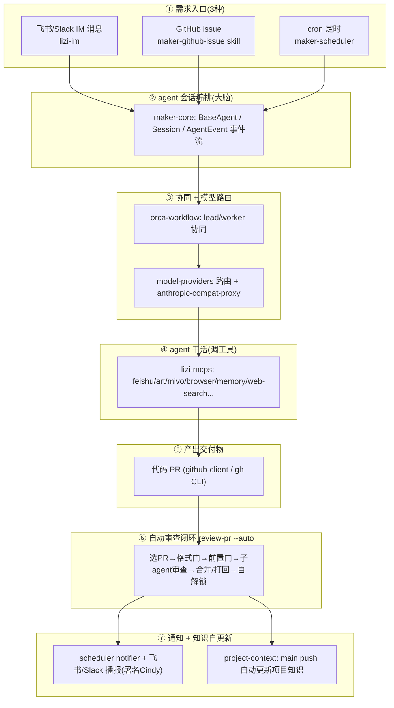

# Cindy 全链路复刻到 MivoCanvas — 评估报告

> 生成日期：2026-07-01
> 方法：4 个只读 agent 并行深读 `reference/Cindy/`(XDMaker 子集拷贝,827 文件),对照 MivoCanvas 前端基线(见 `baseline-inventory.md`)
> 状态：**cindy 侧已摸清;MivoCanvas 后端侧待 `mivoserver` 全盘清单到齐后补全**(mivoserver = mivo 现状后端,另一 agent 正在汇总)

---

## TL;DR(先给结论)

1. **"Cindy" 不是一个机器人程序**,是 dash(CEO)在 **XDMaker(maker 平台)** 里配置的 agent 运行时代号,源码 grep 零命中。它真正代表的是 XDMaker 这套 **"需求进 → agent 编排干活 → 产出交付物 → 自动审查 → 通知"** 的自动化协作流水线。

2. **好消息**:这套流水线的核心引擎(maker-core / orca / scheduler / lizi-im / lizi-mcps / model-providers / anthropic-compat-proxy / project-context)**全是零 Electron 依赖的纯 Node.js 包,靠依赖注入解耦**,理论上可搬。

3. **坏消息**:它们全是 **Node.js 后端**代码,而 **MivoCanvas 现在是纯前端画布(Vite/React),没有任何后端进程、没有真 agent、AI 全是 mock**。cindy 预设了一个成熟 agent 后端的存在,MivoCanvas 连这个前提都还没有。

4. **复刻的本质不是"抄 cindy 代码",而是先给 MivoCanvas 补出 cindy 所依赖的整个后台底座**。这个底座有多少能从 `mivoserver` 现成拿到,是决定工作量的关键——所以这份评估的 MivoCanvas 侧缺口,要等 mivoserver 清单才能钉死。

5. **两条路线,工作量差一个数量级**(见 §5):自建后端(数月)vs 把画布接进现有 XDMaker(数周)。建议先看 mivoserver 清单再定,但有 3 件"无悔前置"现在就能启动(见 §6)。

---

## 1. Cindy 全链路职责详解

| 环节 | 负责什么 | 主要模块 |
|------|---------|---------|
| ① 需求入口 | 任务从 3 个口进来:飞书/Slack 消息(可 thread 隔离)、GitHub issue(经 skill 分类成 Bug/Feature/Other 派到子 session)、cron 定时(9 个内建模板:站会/周报/发版前检查/安全扫描等) | lizi-im / maker-github-issue / maker-scheduler |
| ② 会话编排 | 创建/编排 agent 会话,13 种 AgentEvent 流式事件(text/thinking/tool_use/tool_result/interaction_request/done...),标记来源(user vs scheduler) | maker-core |
| ③ 协同+路由 | lead 通过 MCP 工具 `create_worker` 派 worker,BUSY 消息入队,auto-bridge 状态机把 worker 结果回桥;模型路由支持 anthropic/openai/xd 三供应商,proxy 抹平 Claude/Codex 请求体差异 | orca-workflow / model-providers / anthropic-compat-proxy |
| ④ 干活 | agent 调 17+ MCP 工具族完成任务:飞书、AI 生图(art/mivo)、浏览器、跨会话记忆、web 搜索、jira/confluence 等 | lizi-mcps |
| ⑤ 产出 | 交付物 = 代码 PR(建分支、提 PR);运行时实际走 `gh` CLI,github-client 包为迁移预留 | github-client + gh |
| ⑥ 审查闭环 | `--auto` 无人值守:互斥锁→选最早可处理 PR→格式硬判定→前置门(冲突/未resolve thread/CR)→起独立 Codex 子 agent 审查→APPROVED 自动 squash 合并/CHANGES_REQUESTED 打回并通知作者→自解死锁。**决策全在代码层(context.mjs),不靠 LLM 拍脑袋** | review-pr skill + scripts |
| ⑦ 通知/知识 | schedule 完成后 desktop 通知 + 飞书 DM owner;PR 合并播报署名 Cindy(agent 自己调 Slack/飞书 MCP 发);main push 触发 project-context 用 git diff 增量更新项目知识并回写 | scheduler notifier / lizi-im / project-context |

---

## 2. 复刻的架构现实:三层依赖

MivoCanvas 要复刻 cindy,缺的不是"最上面那层协作逻辑",而是**cindy 脚下的整个后台**。按依赖关系分三层:

| 层 | 内容 | cindy(XDMaker)有 | MivoCanvas 现状 |
|----|------|-----------------|----------------|
| **L0 前台** | 画布/对话 UI、节点编辑、导入导出 | XDMaker 是 Electron agent 客户端 | ✅ 画布编辑器真实完整;AI 对话面板存在但生成全 mock |
| **L1 后台底座(前置)** | 后端进程 + 真 agent + 真模型 + 真生图 + **交付物的服务端持久化** | ✅ 全套成熟 | 🟡 **大半已由 mivoserver 提供**(见下),MivoCanvas 前端尚未接入 |
| **L2 协作层(= cindy)** | 需求入口/队列 + scheduler + orca 协同 + 审查门 + 通知 | ✅ 全套成熟 | ❌ 无 |

> **更正(2026-07-01,基于 mivoserver 结构速览)**:上一版此处写 "L1 几乎为零",系未查 mivoserver 前的误判。实际 **mivoserver(= `ai_server`,XD AI 中台)已经是成熟 L1 底座**:FastAPI + Celery/Taskiq worker + MongoDB(Beanie ODM)+ Redis + OSS/GridFS + Consul;已具备真生图/视频/3D(GPT Image、MJ、Kling、ComfyUI、Blender)、异步任务队列与状态、RBAC 三级权限、**聊天会话与消息流(chat_sessions/messages,含图片/按钮富内容)**、文件元数据+对象存储、还有一个多 provider + 工具调用的 `agent/` 模块(`ai_agent`,含 openai/qwen/doubao/genai/ollama)。

### 2.5 L1 具体工作分解(mivoserver 已有 vs 真要做的)

L1 的真实工作 = **把 MivoCanvas 前端接上 mivoserver + 补两块画布特有的东西**,不是从零建后端。

| L1 工作项 | mivoserver 现状 | MivoCanvas 现状 | 真要做的 | 量级 | 主战场 |
|----------|----------------|----------------|---------|------|--------|
| **① 前端接后端(mock→真)** | 生图/文件/任务 API 齐全 | 连的是 vite dev 中间件,AI 全 mock | 建前端 API client;把 canvasStore 5 类 mock 生成换成调 mivoserver | 中 | 前端 |
| **② 画布领域模型 + 服务端持久化** | 有 chat/message/task/file,**无"画布/节点/快照"概念** | 画布只存 localStorage/IndexedDB(纯本地) | mivoserver 新增 canvas 领域模型(画布文档/节点/版本快照)+ CRUD API | 中 | 后端(mivoserver) |
| **③ agent↔画布桥(核心,基本全新)** | 有 agent 框架+工具+聊天流,**无"操作画布"的工具** | 前端有 AI context snapshot(aiCanvasWorkflow),没接后端 | 把画布操作(增删节点/放图/生成到槽位)暴露成 agent 可调工具;agent 能读画布上下文+往画布写产物 | 大 | 前后端交界 |
| **④ 异步生成任务对接** | 任务队列+状态成熟(提交→轮询/事件→结果) | 前端 mock 是同步的,TaskQueue 是假状态 | 前端生成流改成"提交任务→订阅状态→回填画布";TaskQueue 接真实任务 | 中 | 前端 |
| **⑤ 登录/鉴权打通** | OAuth + RBAC 全有 | 无登录态 | 前端接入 mivoserver 登录 + 会话态 | 小-中 | 前端 |

白赚项:mivoserver 已有的视频/3D/MJ/ComfyUI 能力,画布接上后可直接调用,无需额外开发。

**仍待全量清单确认**(另一 agent 正在做):`agent/` 模块能力强度(能否直接做对话式编排,还是仅 provider SDK 封装)、`api` 现有 routers 明细、聊天消息流能否直接承载画布对话。这三点决定 ③ 里能复用多少、要新建多少。

---

## 3. 源码已有 vs 待补 矩阵(按 cindy 环节)

图例:可搬性 = cindy 源码搬到新项目的难度。

| cindy 环节 | cindy 源码现成(可搬性) | MivoCanvas 现状 | 缺口 / 待补 |
|-----------|----------------------|----------------|------------|
| ① 需求入口 | lizi-im 飞书直连+Slack中继(**高**,需注入 IMHost);scheduler cron 引擎(**高**,纯 Node 零依赖自实现 cron);maker-github-issue skill | 无任何入口(前端无消息/无队列) | 定义"美术需求"入口 + 待审队列;需一个 Node 后端承载 lizi-im/scheduler |
| ② 会话编排 | maker-core 零 Electron 纯 TS(**高**,需注入 AuthAdapter/binaryPath/storage);**CodexAgent 绑 XD 私有 app-server 不可搬**,只能走 ClaudeCodeAgent 路线 | 无 agent 引擎,AI 全 mock | 搭 Node 后端跑 maker-core + Claude Agent SDK + claude-code 二进制 + 鉴权适配 |
| ③ 协同 | orca-workflow(**高**,需 host 注入回调) | 无 | 依赖 L1 就位才有意义;初期单 agent 即可,协同可后置 |
| ③ 模型路由 | model-providers(**极高**,零依赖可直接当 npm 包);anthropic-compat-proxy(**高**,纯 node:http) | 无 | 只用 Claude 官方直连时 proxy 可不要;要多模型再搬 |
| ④ 工具底座 | lizi-mcps 通用族 web-search/browser/memory/scheduler/orca(**可复用**,in-process Node);**art/mivo 生图工具绑 XD 内网但正好是美术场景要的**;feishu 绑 XD(企业内用正合适);xdt-helper/xd-service 绑死 XD 不用 | 画布节点 CRUD/导入导出前端完整,但**没有"agent 可调用的画布写入接口"** | 把画布操作暴露成 agent 可调工具(MCP/API);art/mivo 工具可复用来**替换现在的 AI mock 做真生图** |
| ⑤ 交付物产出 | github-client/gh 绑死 git/PR | 交付物应是画布/美术稿,概念完全不同 | PR 那套不适用;需定义"美术交付物"的产出与存储(且产物现在无服务端,只本地) |
| ⑥ 审查闭环 | 逻辑绑死 PR/git,但**骨架可抽象**:候选队列/格式门/前置门/互斥锁/**子agent审查范式**(整搬,只换 prompt:代码规范→设计规范)/打回通知 | 无 | 重写:数据来源(PR→美术稿队列)、格式门(PR模板→美术交付规范 JSON)、打回(GitHub thread→飞书DM设计师)、合并(gh merge→稿件标记通过/上CDN) |
| ⑦ 通知 | scheduler notifier 绑 Electron(**低**,web 需重写为 web push/webhook);飞书 DM 逻辑可复用;CI 飞书 webhook 卡片可直接搬 | 无 | web 环境重写 desktop 通知;飞书 DM 可留用 |
| ⑦ 项目知识 | project-context 纯 Node(**高**) | 无 | 可选;想让 agent 懂项目结构可直接搬 |

---

## 4. 直接能拿的"现成货"(不管走哪条路线都值得复用)

- **model-providers** — 零依赖,可直接当独立包引入。
- **maker-scheduler 的 cron 引擎**(`engine/cron.ts`)— 零依赖自实现 cron 解析,直接 copy。
- **review-pr 的子 agent 审查范式** — 起独立子 agent、自包含 prompt、输出 APPROVED/CHANGES_REQUESTED+finding 的框架整搬,只换 prompt 为设计规范。这是成本最低、价值最高的复用点。
- **review-pr 的互斥锁**(`prepare.mjs` PID+TTL)— 与平台无关,直接搬。
- **anthropic-compat-proxy** — 若未来要 Claude+GPT 双后端,现成基础设施。
- **project-context** — 代码库自文档化(git diff 驱动 + LLM 增量 + 摘要注入),纯 Node,直接搬。
- **lizi-mcps 的 art/mivo 生图工具** — 直接用来把 MivoCanvas 的 AI mock 换成真生图(它们本就调 XD 内部 AIGC 代理)。

---

## 5. 决策分叉(需要你拍板的方向)

| 路线 | 做法 | 现在哪里在痛 / 前提 | 工作量 |
|------|------|-------------------|--------|
| **A. 自建后端(重)** | MivoCanvas 旁边独立搭 Node 后端,搬 maker-core+orca+scheduler+lizi-im+lizi-mcps 全套,自己实现鉴权/存储/通知,交付物改画布产物 | MivoCanvas 现在连后端都没有,等于把半个 XDMaker 重建;但换来 MivoCanvas 作为独立产品(替代 figma 终局)的自主性 | 数月 |
| **B. 接入现有 XDMaker/cindy(轻)** | 不重建引擎,把 MivoCanvas 画布做成 cindy 能操作的一个"交付面"。cindy 已有引擎/协同/工具/通知,只补:①美术需求入口+队列 ②agent 写画布的接口 ③审查门抽象 | 前提是接受 MivoCanvas 依附 XDMaker 平台运行;失去部分独立性 | 数周 |

**我的建议**:
1. **先等 `mivoserver` 清单**,判断 L1 后台(真 agent/真生图/画布服务端持久化)mivoserver 已经提供多少——这直接决定路线 A 还剩多少活、以及路线 B 是否可行。
2. 若 mivoserver 已具备后端 + agent 能力 → 路线 A 的 L1 大半现成,复刻 cindy 就是在 mivoserver 上加 L2 协作层,可控。
3. 若 mivoserver 只是 mivo 的图像/存储服务 → 需认真评估路线 B(蹭 XDMaker 引擎)是否更快见效。

---

## 6. 无悔前置(不管哪条路线,现在就能启动、不会白做)

| 事项 | 现在哪里在痛 | 价值 |
|------|-------------|------|
| 把 AI 生成从 mock 换成真生图 | 当前 5 类 AI 生成全是同步返回预置图(见 baseline §3.2),产品核心不可用;lizi-mcps 的 art/mivo 工具现成可接 | 高 |
| 给画布产物加**服务端持久化** | 产物现在只存 localStorage/IndexedDB,纯本地、不可协作、agent 无法读写——这是 L1 最硬的缺口,任何协作工作流都绕不开 | 高 |
| 把画布操作暴露成 **agent 可调工具**(MCP/API) | agent 要能"往画布写产物"才能形成"人和图对话"的闭环,现在画布只有前端交互、无程序化写入口 | 高 |

---

## 附录:分析来源

- cindy 链路 A(大脑/协同):`maker-core` / `orca-workflow` / `maker-cc-manager` / `model-providers`
- cindy 链路 B(触发/通道):`maker-scheduler` / `lizi-im` / `apps-desktop notifier & mcp-integrations` / `maker-github-issue`
- cindy 链路 C(产出/审查):`github-client` / `review-pr skill+scripts` / `.gitlab-ci.yml`
- cindy 链路 D(工具底座/耦合):`lizi-mcps`(17+ 工具族)/ `project-context` / `maker-shared` / `anthropic-compat-proxy` / monorepo 打包形态
- MivoCanvas 侧:`docs/baseline-inventory.md`(前端基线);**后端侧待 mivoserver 清单**
