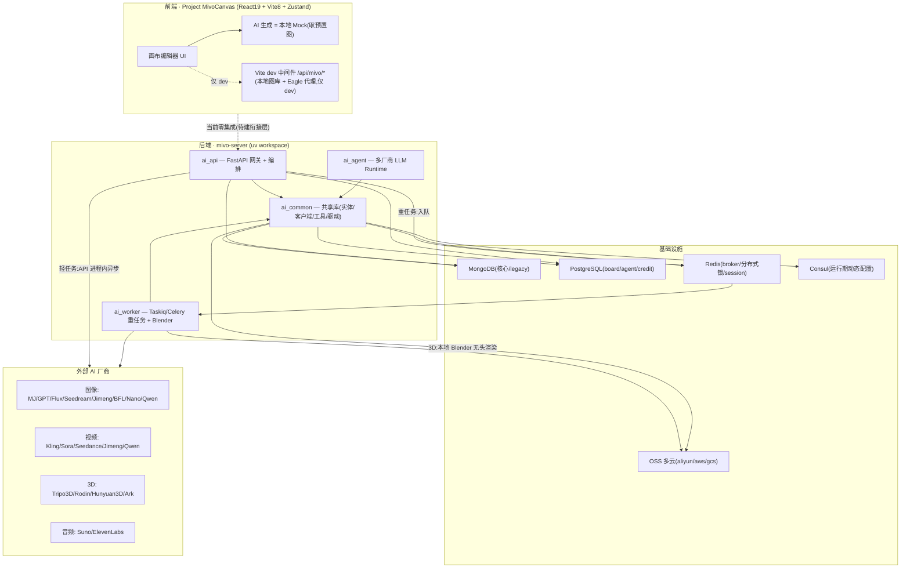
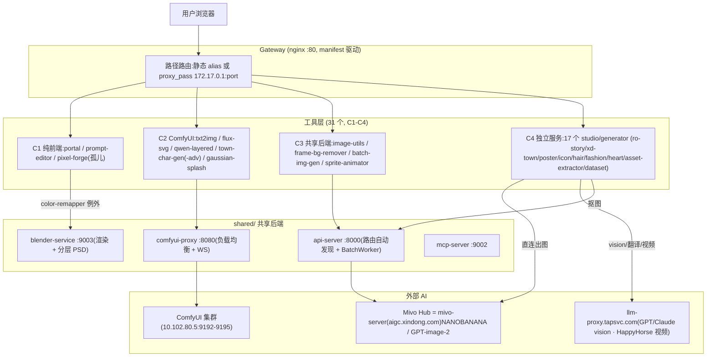

# Mivo 系统架构与前后端功能清单

> **盘点范围**:全栈 —— 后端 `mivo-server`(`/Users/praise/AI-Agent/Claude/reference/projects/mivo-server`)+ 前端 `Project MivoCanvas`(本仓)。
> **方法**:5 个并行 worker 分别深盘 API 层 / Common 共享库 / Worker 异步层 / Agent+CLI+基础设施 / 前端,实际读源码(非仅 docstring),再合成本清单。
> **生成时间**:2026-07-01。
> **⚠️ 头号结论**:前端仓与后端 `mivo-server` **当前零集成**——前端是纯交互 Demo,AI 生成全为本地 mock,无任何指向后端的 HTTP 调用/鉴权/SSE。"前端消费后端 API"在当前代码中**尚不成立**,是最大的待建空白(详见第 5 节)。

---

## 0. 速览与关键结论

Mivo 是一个「AI 生成中台」产品线,由两个独立 git 仓组成:

| 仓 | 角色 | 技术栈 | 状态 |
|----|------|--------|------|
| `mivo-server` | 后端 | uv workspace(Python 3.13)+ FastAPI + Taskiq/Celery + MongoDB/PostgreSQL 双库 | 功能完整、生产在跑 |
| `Project MivoCanvas` | 前端 | Vite 8 + React 19 + TypeScript + Zustand + LeaferJS(空壳) | 交互 Demo,AI 全 mock,未接后端 |

**关键结论(先看这几条)**:

1. **前后端未打通**:MivoCanvas 全仓零后端调用,AI 结果是循环取预置图。要真正跑通产品核心(接后端 gpt/mj/kling/3D 等),需从零建「API client + 鉴权 + 生产 API base + 真实异步任务机制」一整层。
2. **后端是消息驱动的多模型编排中台**:前端发一条 `POST /message`,服务端按 `(messageType, modelType)` 路由到对应 **facade 消息处理器**,轻任务在 API 进程内异步跑、重任务丢 worker,结果统一以 `Task`(事实源)投影回 `Message`(展示),前端用 同步/长轮询/SSE 三种模式拉取。
3. **双数据库拓扑**:老域(user/message/task/file/权限)在 **MongoDB**(Beanie);新域(board 画板 / agent 会话 / credit 计费)在 **PostgreSQL**(SQLAlchemy async,Alembic 管理)。两套 ORM、两套软删/时间字段并存。
4. **双任务框架**:worker 层 **Taskiq 为主(默认)、Celery 为遗留兜底**,共用 Redis broker、同一套 `logic.py` 内核,靠目录约定 `tasks_{taskiq,celery}.py` 互换,处于迁移中间态。
5. **`ai_agent` 是自研多厂商 LLM Runtime 库**(genai/openai/anthropic/qwen/ollama/doubao),**不是 Discord bot**(discord 依赖仅遗留在废弃的 `labs/`)。
6. **两套同名 CLI 勿混淆**:`cli/`(Python,服务端运维,直连 DB)vs `mivo-cli/`(Rust 二进制,客户端,走 HTTP API)。
7. **CI 覆盖失衡**:唯一的 GitHub workflow 只发布 Rust CLI;承载真实业务的 Python 后端**无任何 CI**(lint/test/build 全靠本地自觉)。

---

## 1. 系统拓扑



**部署拓扑**:Docker Compose(prod 只起 `api` + `worker` 两个自建服务,MongoDB/Redis/Consul 用外部托管)+ Caddy 反代(`/api|/auth|/docs` → 后端,其余 → 前端 SPA)+ PM2 进程编排。镜像 base 内置 Blender(3D 渲染),worker 容器限 8G/4CPU。

---

## 2. 外部 AI 服务矩阵(横切汇总)

跨 api/common/worker 三层合并。**执行位置**决定它跑在 API 进程内(轻)还是 worker 队列(重)。

| 服务/模型 | 类型 | 厂商 | 底层 client | 执行位置 | facade 处理器 |
|-----------|------|------|-------------|----------|---------------|
| Midjourney | 图 | MJ(代理) | `mjproxy` | API 内异步轮询 | `MJMessageHandler` |
| GPT-Image / DALL·E | 图 | OpenAI(+百度备选) | `openai` | API 内异步 | `GPTImageMessageHandler` |
| Flux(ComfyUI) | 图/视频 | 自建 ComfyUI 集群 | `comfy` | API 内异步 | `FluxMessageHandler` |
| Seedream | 图 | 火山引擎 | `volcengine` | API 内异步(内存队列) | `VolcMessageHandler` |
| 即梦 Jimeng | 图/视频/数字人 | 火山即梦 | `jimeng` tools | 图:API 内异步;视频:worker `video` | `JimengMessageHandler` |
| BFL FLUX | 图 | Black Forest Labs | `bflai` | API 内异步 | `BFLAIMessageHandler` |
| Nano Banana | 图 | Google Gemini(+minimax/百度) | `nano` tools | **worker `image`** | `NanoBananaMessageHandler` |
| Ark Seedream/Seedance | 图/视频/3D | 火山方舟 | `ark` tools | 图:API 内异步;视频/3D:worker | `ArkMessageHandler` |
| Qwen / Wan | 图/视频 | 阿里 DashScope | `qwen` | 图:API 内异步;视频:worker `video` | `QWenMessageHandler` |
| 阿里云超分 | 图(增强) | 阿里云视觉 | `alicloud` | API 内异步 | `AliCloudMessageHandler` |
| Bria 抠图 | 图(去背景) | Bria AI | `bria` | API 内异步 | `BriaMessageHandler` |
| Kling 可灵 | 视频 | 快手 | `kling`(JWT 签名) | worker `video` | `KlingMessageHandler` |
| Sora | 视频 | OpenAI | `openai` | worker `video` | `SoraMessageHandler` |
| Tripo3D | 3D(最全:生成/绑骨/动画/重拓扑) | Tripo3D.ai | `tripo3d` | worker `model3d` | `Model3dMessageHandler` |
| Rodin | 3D | Deemos | `rodin` | worker `model3d` | `Model3dMessageHandler` |
| Hunyuan3D | 3D | 腾讯混元 | `hunyuan` tools | worker `model3d` | `Model3dMessageHandler` |
| Qmai | 3D/动作捕捉 | Qmai | `qmai` | worker | `Model3dMessageHandler` |
| Suno | 音乐/歌词 | Suno AI | `suno` | worker `audio` | `SunoMessageHandler` |
| ElevenLabs | TTS/音色/音效 | ElevenLabs | `elevenlabs` | worker `audio` | `ElevenLabsMessageHandler` |
| LLM(Agent) | 对话/工具调用 | genai/openai/anthropic(Vertex)/qwen/ollama/doubao | `ai_agent.clients` | API 内 asyncio + worker `agent` | `AgentActionHandler` |

**队列名**:`image / video / audio / model3d / agent`。**分界经验**:轻的(多数图)留 API 进程用 `BackgroundTasks`/内存队列;重的(视频/音频/3D/Nano 图/agent)丢 worker。

---

## 3. 前后端衔接现状(关键 · 二次开发必读)

前端 worker 逐条核验后的事实——**MivoCanvas 当前不是 mivo-server 的消费方**:

| 维度 | 现状 |
|------|------|
| 指向 mivo-server 的调用 | **零**。全仓 `/api/` 只命中 `/api/mivo/local-assets`、`/api/mivo/eagle/*`、`/api/mivo/pinterest/status`,全部打到 Vite dev 中间件,`vite build` 产物不含 |
| API client 封装 | **无**。无统一 fetch/拦截器/baseURL;仅 4 处裸 fetch 打本地素材 |
| 鉴权 token | **无**。无 OAuth/JWT/Authorization/token 存储或刷新 |
| 任务轮询 / SSE / WebSocket | **无**。mock 生成直接同步置 `status:'done', progress:100` |
| 后端能力覆盖(gpt/mj/kling/3D/OSS) | **一个都没接**;AI 面板的模型/版本是硬编码死文本 |
| 环境变量 | 前端侧零 `import.meta.env`/`VITE_*`;3 个 env 均在 Node 侧(vite.config) |

**唯一已就绪的接入资产**:`getAiContextSnapshot()`(`aiCanvasWorkflow.ts:84`)已能把画布节点 + 派生链 + 统计序列化成 JSON,可直接作为未来喂给后端的上下文 payload。

**二次开发切入(工作量提示)**:接后端 = 新建 API client + 鉴权注入 + 生产 API base(替代 dev 中间件)+ **真实异步任务层**(提交 → 轮询/SSE → 回填结果图)。这是「从零建」而非「改进」。后端侧 `GenerationAdapter` 接口目前只声明了 `generateVariations` 一路,需扩展成 5 类生成的完整抽象。

---

## 4. 后端 · API 层(`api` / `ai_api`)

`ai_api` 是 mivo 后端的 **HTTP 入口 + 编排层**:接单、鉴权、参数规整、按 `(messageType, modelType)` 分发到 facade、任务状态投影、结果推送。不做重计算(3D/视频交给 worker)。数据面横跨 MongoDB(Beanie)、PostgreSQL(SQLAlchemy,board/agent 域)、Redis(session/锁/限流)、OSS。

### 4.1 应用装配与启动
- `main.py:46` `create_app()` → 挂 `auth_router`(`:47`)→ `setup_admin_routes`(`:48`)→ CORS(`:49`)→ Redis session 中间件(`:50`)→ **v1 子应用 mount 到 `/api/v1`**(`:52`),prod 再挂静态 SPA(`:57-86`)。
- 生命周期 `app_lifespan`(`:35-43`):启动建 OSS 客户端 → 进 `scheduler_lifespan`(启 APScheduler)→ 关停关 OSS。
- 进程入口 `__main__.py`:prod 非 Windows 用 **Gunicorn + UvicornWorker**(`:37-53`),否则 Uvicorn。
- **路由自动发现** `v1/routers/__init__.py:13`:`glob("*.py")` 动态 import,模块含 `router` 即挂;`IS_DEV=True` 且 prod 环境则跳过(dev 路由隐藏)。
- **认证注入**:`JWT_BEARER`(`internal/jwt.py:369`)做路由级登录校验,端点内 `get_current_user`(`:373`)拿 `User`;`JWTAuth.__call__`(`:166`)按 header → cookie(`session`)→ URL 参数 `token` 三级取 token;`requires_scopes`(`:402`)做 scope 校验。
- 中间件:`CORSMiddleware`(prod 白名单 `aigc.xd.com`)+ 自研 `RedisSessionMiddleware`(`internal/middleware/session.py:92`,session 存 Redis)。

### 4.2 HTTP 端点清单(前缀 `/api/v1/<router>`)

**message(核心生成入口,`/message`)** — 路由级 `JWT_BEARER`
| METHOD 路径 | 功能 | 认证/权限 | 底层 |
|---|---|---|---|
| POST `/message/chat` | 创建会话 | `get_current_user` | `create_chat_session` |
| GET `/message` | 消息列表(分页/收藏/类型/项目/日期/prompt/组) | `require_permission(message,READ)` | `get_user_messages` |
| POST `/message` | **创建消息并触发生成** | WRITE + 项目权限 + 10s 限频 + 图片尺寸校验 | `create_message`→`do_action` |
| PUT `/message/batchFavorite` | 批量收藏 | 逐条 WRITE | `batch_update_message_favorite` |
| DELETE `/message/batchDelete` | 批量删除 | 逐条 DELETE | `batch_soft_delete_messages` |
| PATCH/PUT `/message/{id}` | 改 content/收藏 | WRITE | `FileMeta.batch_update` 等 |
| GET `/message/{id}/result[/{connection_type}]` | 取结果:同步 / `long_poll` / `sse` | `check_read_permission` | `get_sync_result`/`long_poll_generator`/`sse_generator` |
| POST `/message/translate` | 翻译提示词 | 登录 | `translate_prompt` |
| POST `/message/submit` | **提交按钮动作**(MJ/SORA/SUNO) | WRITE | `parse_*_action`→`do_action` |
| POST `/message/{id}/retry` | 重试 | 拥有者/admin | `post_message` |
| DELETE `/message/{id}` | 软删 | DELETE | `soft_delete_message` |

**file(`/file`)** — 列表/多文件上传/二进制快传/元数据/图片视频音频重定向 OSS 签名 URL/下载(Range)/**export-model(异步导出 GLB/OBJ/FBX/USDZ,含 SSE)**/批量 zip/缩略图/签名 URL/3D 预览模型。权限 `require_permission(file, read|write)` + `verify_file_access`。

**其它 v1 路由**:
- `auth`(`/auth`):admin 探针、API Key 获取/续期。
- `state`(`/state`):`/health`(无认证)、`/config`(无认证,**暴露配置需确认脱敏**)、`/token`(API Key 换 30 天 session)。
- `user`(`/user`):`/me`(用户+权限)、`/{id}`。
- `flux`(`/flux`):查 ComfyUI 工作流模板 `FluxSchema`。
- `tools`(`/tools`):translate/polish/ocr。
- `settings`(`/settings`):系统设置 CRUD(admin)。
- `presetprompt`(`/presetprompt`):系统+用户预设提示词。
- `announcements`(`/announcements`):公开公告(**无认证**)。
- `ress`(`/ress`):资源库视图 + 引用图。
- `ideawall`(`/ideawall`):创意墙 + `makeSame` 复用资产建任务。
- `message-group`(`/message-group`):消息组 CRUD + pin/add/remove。
- `agent`(`/agents`,**PostgreSQL**):session CRUD、`/actions` 提交对话轮次(丢 worker `run_agent`)、`/stream` SSE。
- `board`(`/boards`,**PostgreSQL + Konva**):画板 CRUD、`/data`(≤10MB base64)、`/tasks`(worker 或 API 后台任务)+ SSE、`/posters`。
- `board-comments`、`credit-dashboard`(算力消费折人民币)、`voice`(用户音色)、`tapsvc 凭证`(用户个人 API Key,脱敏)。
- `root`:`/`、`/exception`(测试抛错)。

**admin(`admin/`,全 `require_admin_permission()`)**:`fluxschema`(ComfyUI 工作流上传,100MB)、`permissions`、`roles`、`user_roles`、`file_shares`、`agents`。

### 4.3 Facade 层(AI 模型接入)
所有处理器实现 `MessageHandler` ABC(`internal/core.py:187`:`handle()` + `get_task_result()`),在 `service/chat.py:265-323` 按 `(messageType,modelType)` 注册进 `MessageHandlerRegistry`,分发键优先级 `messageType:modelType → modelType → messageType`。详见第 2 节矩阵(处理器 → 服务 → 执行位置)。跨切模式:① 全局 `chat_event_bus` emit `MESSAGE_UPDATE/COMPLETED`;② 结果统一走 `task_projection`;③ API 内异步类用 `TaskRegisterInstance`(Redis)防重复轮询;④ MJ/Sora/Suno 有 `parse_*_action` 供 `/submit`。

### 4.4 Service 层(要点)
| 服务 | 职责 |
|---|---|
| `chat.py` | 处理器注册 + 分发 + 事件总线(`do_action`/`get_task_result`) |
| `message.py` | 消息 CRUD、查询构建、同步/长轮询/SSE、每日视频限额 |
| `task_projection.py` | **Task→Message 幂等投影**(revision 防乱序、状态防降级、终态生成按钮、token 用量) |
| `tasks.py` | 建 worker 任务 / API 内后台任务、任务 SSE、3D 参数解析、内存任务队列 |
| `files.py` | 上传/元数据/权限/缩略图/OSS |
| `board.py` / `agent.py` / `credit_dashboard.py` | PostgreSQL 域:画板 / Agent 会话 / 算力消费 |

### 4.5 API 侧 tasks/ 与定时器
`api/.../tasks/` 是**在 API 进程内跑**的任务(BackgroundTasks/asyncio/内存队列触发,调外部厂商 + 轮询 + 存 OSS + 写 Task)。`scheduler.py` = **APScheduler + RedisJobStore**,唯一任务 `check_pending_tasks` 每 3600s 扫 Mongo,把 `startTime` 早于 2 小时仍 PENDING/PROCESSING 的 SCHEDULER 任务标记 FAILED(超时清理)。

### 4.6 RBAC / OAuth / JWT / 限流
- **RBAC** `admin/service/permission_service.py`:三层 `User.roles → Role.permissions → Permission(resource_type, action, conditions)`;`check_permission` admin 直通 → 聚合角色权限 → 按资源类型逐条条件校验(message 校验 `role_scope.modelTypes` 白名单、file 校验所有权+共享+项目)。
- **JWT** `internal/jwt.py`:HS256,claims 含 sub/roles/permissions/aud/exp;密钥来自 Consul。
- **限流**:`valid.py` 用 Redis `setnx` 做 3 秒创建限频 + 图片尺寸/类型白名单;`daily_limit_service.py` 按角色从 Setting `dailyVideoLimits` 限每日视频数(超限 429)。

### 4.7 值得注意的点
- 设计模式:Facade + Registry 路由 + 事件驱动 + CQRS 味投影(Task 事实源 / Message 展示,revision + 状态 rank 幂等)+ 路由自动发现。
- **双库并存**:核心生成域 MongoDB,board/agent/credit 新域 PostgreSQL,同仓两套 ORM。
- sync/worker 路径不统一(同是图片,GPT 留 API、Nano 走 worker),分界靠经验 + 命名约定(`is_worker_task` 判 `_work` 后缀)。
- **风险**:`/state/config`、`/`(root)无认证暴露配置;`verify_token` 显式 `verify_aud=False`(`jwt.py:103`);`sora.py:236` 三元恒等疑似 bug;多处透传厂商原始 error 给前端;`settings` 路由 `Depends(require_admin_permission)`(未调用)与 admin 写法不一致需核实。

---

## 5. 后端 · Common 共享库(`common` / `ai_common`)

被 api 与 worker 共同依赖的底座,三大能力:数据层(MongoDB motor + PostgreSQL async + 多云 OSS)、外部 AI 客户端(14 client + 17 tools)、基础设施(Redis 分布式信号量 / 事件总线 / 重试 / OAuth / Consul)。**数据库集合设计的真相源在 `entity/`**。

### 5.1 数据实体与集合(数据库设计)

**MongoDB(motor 异步,继承 `BaseMongoModel`)**:通用字段 `_id/createTime/updateTime/version(__v 乐观锁)/isDeleted(软删)`。集合名默认 **类名蛇形复数化**(`class_name_to_collection_name`,`utils/common.py:158`,如 `User`→`users`、`Model3D`→`model3_ds`)。

| 集合 | 实体类 | 关键字段 / 用途 |
|------|--------|----------------|
| `users` | `User`(`entity/user.py:19`) | `id/sub/name/email/provider/scopes/permissions/roles[]`;多认证源 `deep_merge_with` 合并 |
| `messages` | `Message`(`entity/chat.py:140`) | `chatSessionId/chatSessionType/role/modelType/messageType/content(images/videos/audios/model_files/buttons/progress)/payload/usage/spendTimeSeconds` |
| `chat_sessions` | `ChatSession` | `userId/userSub/title/type` |
| `file_metas` | `FileMeta`(`filemeta.py:96`) | `objectKey(OSS)/size/etag/op(OssProvider)/fsId(GridFS)/thumbnailFsId/hashsum/isPreview`;桥接 OSS/GridFS |
| `tasks` | `Task`(`task.py:36`) | `ownerId(=messageId)/taskType(worker/scheduler/asyncio)/status/parameters/results[]/progress/externalIds/revision(save 自增,防乱序)` |
| `announcements` | `Announcement` | `title/content/pinned/is_hidden/published_at` |
| `flux_schemas` | `FluxSchema` | `schemaData(ComfyUI workflow JSON)/inputsMappings(payload→schema 映射)` |
| `model3_ds` | `Model3D` | `fileId(GLB)/previewImages[]/prompt/parameters` |
| `permissions`/`roles`/`user_roles`/`file_shares` | 权限四件套 | RBAC:权限定义/角色/用户角色关联(带 scope)/文件共享 |
| `preset_prompts` | `PresetPrompt` | 预设提示词(system/user,fixed/dynamic 内容) |
| `settings` | `Setting` | 键值配置(value/options/mapping,`isAdminOnly`) |
| `api_keys` | `ApiKey` | MCP API Key(前缀 `mivo_`,默认 30 天,支持轮换/刷新) |
| `tapsvc_credentials` | `TapsvcCredential` | 用户个人 LLM 代理凭证(唯一索引 user_sub+provider) |
| `agent_memory` | `AgentMemory` | Agent 对话记忆(session_id+created_at 索引) |
| `voice_assets` | `VoiceAsset` | TTS 音色资源库 |
| `credit_pricing_configs`/`cron_event_log` | 计费 | 定价规则 / cron 审计 |

**PostgreSQL(SQLAlchemy async,继承 `BasePGDataModel`,主键 `uuidv7()`,软删 `is_deleted`)**:`boards / board_data / board_comments / board_posters / assets / agents / agent_sessions / agent_messages / credit_users / credit_usage_daily / credit_usage_window`。

> **技术债**:两套 ORM、两套软删字段(`isDeleted` vs `is_deleted`)、两套时间字段(`createTime/updateTime` vs `created_at/updated_at`)。

### 5.2 数据访问层 dba
- `mongo.py`:motor 封装,**按事件循环 id 缓存客户端**;`BaseMongoModel` 全套 CRUD + `$bsonSize` 算文档大小 + **乐观锁**(`save_object` 带 `__v` 条件 + `$inc`);GridFS。
- `redis.py`:薄封装 `jcutil` async Redis。
- `pgdata.py`:PostgreSQL async,`auto_commit_session`(单操作)/`get_db`(手动提交)。
- `oss/`:**多云工厂**,`OSSClientFactory.get_client_class`(`factory.py:41`)按 `config.driver` 分发 `aliyun`/`minio,s3,aws`(boto3)/`gcs`;统一接口 `OssClientProtocol`(40+ 方法);签名 URL 默认 7 天 TTL。

### 5.3 外部 AI 客户端(clients/,鉴权碎片化)
详见第 2 节矩阵。鉴权五花八门:header key(mjproxy `mj-api-secret`、bflai `x-key`、elevenlabs `xi-api-key`)、Bearer(rodin/tripo3d/qwen/suno/minimax)、**JWT 签名**(kling)、**HMAC 签名**(volcengine)、SDK 凭证(alicloud/openai)、body 参数(qmai `companyKey`)。anthropic 走 GCP Vertex service-account。

### 5.4 工具层 tools
- 厂商 tools:在 client 之上加「提交任务 + 轮询 + 存 OSS」(openai/ark/nano/jimeng/volcengine/qwen/bflai/tripo3d/hunyuan/kling/suno/minimax/qmai/alicloud/bria/baidu)。
- **files/ 子模块**(文件全生命周期):`file_storage`(GridFS + OSS 双后端,Brotli 边传边压)、`file_sign`(预签名 URL,信号量限并发)、`file_remote`(远程拉取入 OSS,5 次重试)、`file_images`(格式转换/缩略图)、`file_modeltrans`(3D 格式转换,ZIP 内 FBX/OBJ→GLB)、`file_preview`(Tripo 预览图)、`file_compression`(Brotli 流式)。

### 5.5 通用工具 utils
- `event_bus.py`:极简 `EventBus`(subscribe/emit,区分同步/异步回调),**纯进程内**,非跨进程 pub-sub。
- `distributed_task_lock.py`:基于 **Redis + Lua** 的分布式信号量 `TaskSemaphore`,每任务独立 TTL 防锁泄漏,`ContextVar` 支持 `async with`,内建 Prometheus 指标;**明确只支持单机 Redis,不支持集群**。
- `async_tool.py`:`async_retry`(指数退避)、`wait_for_completion`(轮询)、`RateLimiter`、`AsyncTaskQueue/Pool`、`TaskRegistry`。
- `ffmpeg`(抽帧)/`smart_prompt`(从 Consul 拉模板)/`feishu`(通知)/`images`/`common`(时区、集合名规则、SSE、uuidv7)。

### 5.6 配置 / define / consul
- `config/`:经 `jcutil` 加载,`get_config(key)` 从 Consul 取,全 `lru_cache`(**配置热更新不生效,改配置需重启**)。提供各厂商 `get_*_config`。
- `define/`:`ModelType`(各 client 类型枢纽)、`ContentType`(全量 MIME + 3D 类型)、`TaskName/TaskEvents/TaskSteps`、`konva`(画板)。
- `consul.py`:运行期动态配置源(默认用户角色、Rodin 选项、xdcom 部门路径、SmartPrompt)。

### 5.7 认证 auth/oauth
标准 OAuth2 授权码流程,基类 `BaseOAuth2Client`。三驱动:`oidc`(通用 OIDC/gitea)、`feishu`(用 app_id,飞书专用端点)、`xdcom`(心动 CAS,登录后调 **Shadow 客户端**按企业邮箱反查员工部门/职位/leader/各平台账号,富化 User)。

### 5.8 值得注意的点
双 ORM/双库;集合名靠类名反射(改类名=改集合名隐性风险);乐观锁 `__v` + 业务 `revision` 双版本;EventBus 进程内(跨进程实时更新需另走 Redis/WS);分布式锁不支持 Redis 集群;OSS 工厂字符串分发;鉴权无统一抽象;**调试残留**(`xdcom.py:141` print 含 secret 的 URL);**API Key 明文存库**(理想应存 hash)。

---

## 6. 后端 · Worker 异步任务层(`worker` / `ai_worker`)

重型异步计算后端:3D/视频/图像/音频/Agent 任务。链路:**API 落库 Task → `run_worker_task` 提交 broker(默认 kiq/Taskiq)→ worker 消费 → `service_factory` 按 `task.modelType` 动态 import 厂商 service → 提交外部 API + 长轮询 → 产物 stream 落 OSS + EventBus 回写 Task/Message**。3D 额外多一步本地 Blender 无头渲染多视角图。

### 6.1 任务框架:Celery vs Taskiq(双轨并存,Taskiq 为默认)
| 维度 | Celery | Taskiq |
|------|--------|--------|
| App/Broker | `celery_app/app.py:27`,broker+backend 都 Redis | `taskiq_app/broker.py:20` ListQueueBroker(Redis List)+ RedisAsyncResultBackend |
| 启动 | `worker_pool: prefork` + `celery_aio_pool` | `python -m taskiq worker ai_worker.taskiq_cli:broker` |
| 恢复钩子 | `@worker_ready`(`app.py:167`) | `WORKER_STARTUP`(`events.py:92`) |
| 队列路由 | `task_routes` 硬编码 model3d/video/audio | `@broker.task(queue=...)` |

**默认 provider = taskiq**(`common/.../facade/workers.py:15`,`get_worker_task` 按 `ai_worker.tasks.{queue}.tasks_{provider}` 动态 import)。**债务信号**:两份几乎重复的 `recover_interrupted_tasks`(`app.py:74` vs `events.py:17`);agent/image 队列只有 `tasks_taskiq.py`(新功能只往 Taskiq 走),model3d/video/audio 两份都有;retry 语义两边不同(Celery `self.retry()` vs Taskiq 抛 `TaskRetryError`)。

### 6.2 任务清单
`logic.py` 是框架无关内核,`tasks_{celery,taskiq}.py` 只是装饰器壳。

| 任务 | 框架 | 输入 → 输出 |
|------|------|-------------|
| `generate_3d_model` | celery(max5)+ taskiq(max5) | prompt/images/quality → `Model3dTaskResult`(model_files + views) |
| `generate_video` | celery(max5)+ taskiq(**max500,delay30**) | prompt/images/model → `VideoTaskResult`(video/last_frame/thumbnail) |
| `generate_audio` | celery + taskiq | 音频参数 → elevenlabs/suno 结果 |
| `generate_image` | **仅 taskiq** | 图像参数 → nanobanana 结果 |
| `run_agent` | **仅 taskiq**(queue=agent,max1) | action/session/prompt → Agent 运行结果 |

统一重试语义(`logic.py`):`NeedWaitError`→RETRY;`CanNotRetryError`/`ValueError`/`FileNotFoundError`/`InvalidId`→FAILED;视频 `"Concurrent Limit"`→RETRY;`finally` 统一 `isRunning=False` + 非 DEBUG 清临时目录。

### 6.3 3D 生成管线
`service_factory(Model3DService,...)` 按 `task.modelType.lower()` 动态 import。各 provider 实现 `Model3DService`(generate/poll/texture),从 `task.externalIds` 断点续查:
- **rodin**:轮询 5s×120,PBR 材质额外 `generate_texture`。
- **hunyuan3d**:`TaskSemaphore("hunyuan")` 限并发,**不支持 texture**。
- **tripo3d(最全)**:text/image/multiview + import + **绑骨(rig)+ 动画重定向 + 重拓扑 + 纹理**,细粒度 step 事件。
- **ark**:`@wait_for_completion(500)` 轮询,本地 file_id 转签名 URL。
- **qmai**:3D motion。

**Blender 渲染**(`blender_service.py`,`need_render=True`):存 OSS → 对每个 GLB 下载到 `/tmp/ai_worker/model3d/<task_id>` → `find_blender_executable`(env + Docker 路径探测)→ 把 `blender_script.py:7` 字符串模板 `.format()` 注入写临时 .py → `blender --background --python` 无头子进程渲染 front/left/back/top 正交视图 → PNG 并发上传 OSS。

### 6.4 视频生成管线
`service_factory(VideoService,...)`,返回 URL 由 `_convert_urls_to_video_url_pairs` 归一化,`save_video_outputs` 用 `stream_remote_file_to_oss` 落库(视频 + last_frame):
- **ark(Seedance)**:`@wait_for_completion(500)`,按凭证来源分桶限流(personal/platform)。
- **jimeng**:普通视频 + **OmniHuman 数字人**(先 `valid_realman_on_picture`)+ DreamActor。
- **kling**:自动选 T2V/I2V/多图 I2V/Omni 四种 task_key。
- **qwen**:generate/animate_mix/animate_move/**animate_anyone**(需模板+安全检测)。
- **sora**:video/remix,input_reference 图 resize 后转 FileTypes。

### 6.5 核心运行时 / 生命周期
- `core/async_run.py`:处理 Celery 同步 worker 跑 async 的事件循环冲突(`run_async_with_loop_management`);Taskiq 原生 await 用不到它,属半遗留。
- `core/common.py`:`service_factory`、`TaskSemaphoreContext`、`update_task_status`(乐观锁冲突重试 3 次)、临时清理。
- **状态回写靠 EventBus**(`service/events.py`):emit `STARTED/UPDATED/COMPLETED/FAILED`,订阅者更新 Task + 关联 Message(结果转 `MessageContent`、按钮、耗时)。
- **task_recovery**:worker 启动时查未终结的 `taskType==worker` 任务重投,崩溃/重启不丢任务。进度约定 0→10~30→50~60→80→90→100。

### 6.6 labs/scripts
`labs/`(pyrender/trimesh 另一套渲染,已废弃,pyproject exclude 出构建);`scripts/`:`send_task.py`(手动投 Celery 任务 + watch)、`test_render.py`(测 Blender)、`test_task_recovery.py`。

### 6.7 值得注意的点
Celery/Taskiq 双轨(改重试/恢复要改两处易漏);迁移未收口(`async_run` 半死代码);Blender 硬依赖 + `subprocess` 阻塞在 async worker 里占线程;Blender 脚本字符串 `.format()` 注入可维护性差;重试次数魔数散落(视频 500 / 3D 5 / agent 1);临时目录清理依赖 `APP_DEBUG`。

---

## 7. 后端 · Agent 包 / CLI 工具 / 基础设施

### 7.1 Agent 包(`ai_agent`)
**自研多厂商 LLM Chat-Agent Runtime 库**(被 api/worker 双端 import,**不是** Discord bot)。核心 `runner.py:44` `AgentRunner` 多继承 5 Mixin:ContentBuilding / Memory / Tool / Event / StreamProcessing。`schema.py:106` `AIModelProvider` 支持 **genai(Google)/openai/anthropic(Vertex Claude)/qwen/ollama/doubao**。Provider+Client+Adapter 三层适配。
- **工具系统**(`tools/`):动态按路径加载;内置 `board`(查 PG 资产)、`images`(nano/openai/seedream/jimeng/minimax/vision)、`videos`(seedance/qwen/vision);`@tool` 装饰,返回 `FunctionCallResult`。
- **记忆**(`memory/`):`AgentMemory` 统一接口 + 动态后端(base/memory/sqlite/mongodb/postgresql)。
- **防死循环**:`DefaultDuplicateDetectionStrategy` 阻止工具重复调用。
- 依赖仅 `ai_common` + `dashscope`(qwen)。消费方:api `AgentActionHandler`(`facade/agent.py:113`)、worker `tasks/agent/logic.py:114`。

### 7.2 CLI 工具(`cli/`,Python + Typer + Rich)
服务端运维脚本,`uv run --env-file .env python -m cli.<name>`:
| 脚本 | 用途 |
|------|------|
| `migration` | **权限系统 + 系统配置初始化**(JSON 灌 MongoDB,内嵌 alembic 菜单) |
| `user_role`(32.7K) | Role/Permission/UserRole CRUD |
| `announcements`(19.5K) | 版本公告管理(Markdown 导入导出) |
| `message`(31.9K) | 消息运维(恢复/修标题/修按钮/用量回填) |
| `img`(24.2K) | 图片资产运维(缩略图/统计) |
| `oss` / `comfy`(20.8K) | OSS 对象管理 / ComfyUI FluxSchema 管理 |
| `models` + `model/*.py`(10 个) | AI 服务**交互式测试脚本**(真实调 API) |
| `credit` + `scripts/credit.sh` | 模型用量计费(daily/window,cron 带锁) |
| `worker`(15.9K) | **清理 Redis 里 TaskSemaphore 死锁** |
| `stats`(34.9K,`usage_stats` 为 shim) | 使用数据统计出 Excel |
| `prompt` / `feishu` / `setting` / `tests/` | 提示词导出 / 飞书表格导入 / Setting 管理 / CLI 单测 |

### 7.3 mivo-cli(独立 **Rust** 二进制)
面向平台外部用户/Agent 集成的客户端,clap + inquire + reqwest + tokio + SSE + age(凭证加密)。只通过 HTTP API(`dev-ai-mid.xindong.com/api/v1`)访问,用 API Key → Bearer Token 认证,跨平台二进制走 GitHub Release + 阿里云 OSS CDN。命令:`login/logout`、`image gen|list|get`、`audio gen`、`task status`、`upload files`、`config`,全局 `--json`。配套 `skills/`(给 Agent 用的预设 payload)。

### 7.4 容器与部署
- **Dockerfile**:三阶段,base `python:3.13-slim` **内置 Blender** + 时区 `Asia/Shanghai`,非 root 运行,`EXPOSE 8000`。
- **docker-compose.yml(prod)**:只起 `api`(8000)+ `worker`(`taskiq worker --workers 2 --max-async-tasks 100`,限 8G/4CPU,挂 `blender_cache`);**不含 mongo/redis/consul**(用外部托管,Consul `10.236.1.6:8500`)。
- **docker-compose.dev.yml**:起 `consul`/`mongo:4.4.6`/`redis:alpine`;无 minio(OSS 用阿里云线上)。
- **Caddy**(3 份):`/api|/auth|/docs` → 后端 `:8001`,其余 → 前端 SPA `:9528`。
- **PM2**:`ecosystem.config.js`(api)+ `worker.ecosystem.config.js`(worker,dev 1/30、prod 4/100)。

### 7.5 数据库迁移(Alembic → PostgreSQL)
`alembic.ini:8` `script_location = cli/sql`;`env.py:10` import `ai_common.dba.pgdata.pg_engine`。**Alembic 只管 PostgreSQL**(Agent/Board/Credit 三块:Agent/AgentMessage/AgentSession/Asset/Board/BoardComment/BoardData/CreditUser/CreditUsageDaily/CreditUsageWindow),13 个 revision;MongoDB 主库由 `cli/migration` 灌数据,不归 Alembic 管。

### 7.6 构建 / 依赖 / CI
- uv workspace(`members = [common, api, worker, agent]`,Python ≥3.13,hatchling,ruff + mypy 严格)。版本真相源 `common/src/ai_common/__version__.py`。
- Makefile:`make install/dev/dev-tmux/run/worker/worker-celery/test/lint/format/lock`;`build.ps1` 为 Windows 等价。
- **CI 失衡**:唯一 workflow `.github/workflows/mivo-cli-release.yml` 只发布 Rust CLI(编译 macOS arm64/intel + Windows → GitHub Release + OSS CDN);**Python 后端无任何 CI**。

### 7.7 其他目录
`bin/`(FBX→glTF 等 3D 工具获取)、`scripts/`(CLI manifest + credit cron)、`prompts/python_master.md`、`skills/`(Claude Code skill `mivo-update-announce`,飞书→MD→OSS→MongoDB 公告)、`memory/`(计费模块中文设计笔记)、`labs/discord_web.py`(**discord-py 依赖唯一来源,已废弃,production 未用**)、`init.py`(ipython shim)。

---

## 8. 前端 · Project MivoCanvas

桌面式 AI 艺术画布(对标 FigJam + AI 生图):无限画布上摆放图片/文本/Section/标注/AI 槽位,支持 FigJam 风格标注(箭头/线/框/椭圆/笔刷/便签)、连接器、组织操作,以及「参考图 → AI 变体/旁边生成/槽位生成/批注修图/图像编辑」工作流。**核心原则:原始素材永不覆盖,每次 AI 操作留可读 `aiWorkflow` 元数据(非破坏派生链)**。README 自述为交互 Demo,不做真实 AI 集成。

### 8.1 技术栈
| 层 | 选型 |
|----|------|
| 框架/语言 | React 19.2 + TypeScript ~6.0(半严格,未开 strict) |
| 构建 | Vite 8.0 + `@vitejs/plugin-react`(`build = tsc -b && vite build`) |
| 状态 | Zustand 5 + `persist`(localStorage) |
| 画布渲染 | **实际是 React DOM**;LeaferJS 2.1 已装但**空壳**(`new Leafer()` 后从不调绘图 API) |
| 素材存储 | 浏览器 **IndexedDB**(`mivo-canvas-assets`) |
| 其它 | react-markdown、lucide-react;生产依赖仅 9 个(无路由库/UI 库/请求库) |

**vite.config.ts 为何 13.4K**:内嵌 ~390 行 dev-only 插件 `localAssetLibraryPlugin`(`:221`),在 dev middleware 手写 8 个 REST endpoint(`/api/mivo/local-assets`、`/api/mivo/eagle/*` 代理本地 Eagle `:41595`、`/api/mivo/pinterest/status` 占位)。`export default` 本身只有 `plugins: [react(), localAssetLibraryPlugin()]`——无 alias/proxy/env 注入。

### 8.2 目录与应用结构(src ~13889 行)
```
src/
├── main.tsx / App.tsx            # 入口 + 4 视图切换(canvas/assets/plugins/skills,useState 无路由库)
├── app/                          # 外壳:TopBar/ProjectSidebar/InspectorPanel/AIToolPanel/TaskQueue/LibraryWorkspace
├── canvas/                       # 渲染+交互层
│   ├── MivoCanvas.tsx            # 画布主壳(Leafer 空壳 + DOM 节点层,CSS transform 视口)
│   ├── CanvasNodeView.tsx(758)   # 单节点 DOM 渲染(10 类型分派)
│   ├── useCanvasInteractionController.ts(1480) # 交互中枢
│   ├── canvasInteraction/Geometry/connectorGeometry/textGeometry.ts # 视口数学/吸附
│   ├── actions/canvasActionModel.ts(1274) # 右键菜单+快捷条声明式模型
│   └── nodeTypes/canvasNodeRegistry.ts     # 10 种节点 + capabilities
├── store/canvasStore.ts(2170)    # Zustand 中枢 + persist
│   └── aiCanvasWorkflow.ts / mockGeneration.ts / demoScenes.ts
├── lib/                          # assetStorage(IndexedDB)/canvasArchive/snapshotValidation/useResolvedAssetUrl
└── types/mivoCanvas.ts, generation.ts
```
**节点类型**(10):`image`✅/`text`✅/`annotation`✅/`frame`(Section)✅/`markup`(SVG:arrow/line/rect/ellipse/brush/note)✅/`markdown`✅/`video`🟡(无播放控件)/`pdf`🔶(静态徽章)/`ai-slot`🔶/`task-placeholder`🔶。

### 8.3 状态管理
Zustand 5 单 store(`canvasStore.ts` 2170 行)+ `persist`(key `mivo-canvas-demo`,version 6,`partialize` 只存 canvases/nodes/tasks/sceneId/selection/activeTool)。素材二进制走 IndexedDB(节点只存 `mivo-asset:<id>`,`useResolvedAssetUrl` 异步解析)。状态域:多画布管理、节点 CRUD、选择、视口、工具、任务队列(上限 5)、Undo/Redo(内存 60 步)、5 个 AI 生成 action。**无服务端状态同步库**(因为没 server)。

### 8.4 核心业务功能
- **画布交互(✅ 真实完整)**:平移/缩放(缩放至指针)/框选/多选(groupId 联选)/等比&自由缩放/对齐吸附导引线(8px)/视口裁剪 culling/键盘快捷键/文字内联编辑/连接器吸附+节点跟随/非破坏图片裁剪/拖入粘贴导入;视口按 sceneId 持久化。
- **AI 生成(UI 接线✅,结果🔶全 Mock)**:`AIToolPanel.runPrimaryGeneration()` 按选中类型分派;store 5 action(`generateVariations`/`generateImageEdit`(5 种 operation)/`generateBesideNode`/`generateIntoAiSlot`/`generateFromAnnotation`)。**Mock 分界**:结果图从 3 张预置 jpg 循环取,model 硬编码,`status` 同步置 ready,task 直接 done。放置算法 `chooseAdjacentPlacement`(60 次碰撞找空位)是真实算法。
- **素材库/Eagle**(依赖 dev 中间件):Local 枚举/搜索/拖放 + Eagle 文件夹树 + Pinterest🔶;Plugins/Skills 页🔲静态占位。
- **导入/导出/持久化(✅ 真实)**:多格式导入(MIME 嗅探)→ IndexedDB Blob + alpha 扫描 → archive v2 导出(mivo-asset: 内联 base64)→ 字段级校验导入。
- **FigJam quickbar**(`docs/figjam-quickbar-study.md`):11 项已完成 10,剩「connector 类型 elbow/curved 控件」待做。

### 8.5 构建与工程化
脚本 dev/build(含类型检查)/lint/preview/`test:e2e`;TS 半严格(未开 strict/strictNullChecks);测试仅一个 170KB 单文件 Playwright 冒烟(`scripts/e2e-smoke.mjs`,150+ 断言,自起 dev server + Eagle mock),**无单元测试框架**。

### 8.6 与现有 baseline-inventory 的差异/补充
`docs/baseline-inventory.md`(同 commit 生成)已核验准确。本次强化:① 把「无后端」升级为系统级结论(零 API client/鉴权/SSE/`VITE_*`);② `GenerationAdapter` 只声明 1 方法但 store 有 5 个生成 action;③ 3 个 env 都在 Node 侧,前端侧零 env;④ 任务异步机制需「从零建」非「改进」;⑤ 补全带行号的目录树;⑥ 更正 src 纯行数 13889。

### 8.7 值得注意的点
AI 生成全 Mock + 后端零集成(最大缺口);**生产部署会 404**(dev 中间件不进 build 产物);LeaferJS 空壳(迁移=重写渲染层);AI 参数 UI 全死控件、Inspector 属性全只读;多个悬空工具(import/sticker/comment 未注册或 enabled:false);TS 未开 strict;无单元测试;origin 指向 upstream(kirozeng/MivoCanvas,无 license,勿直接 push/公开再发布)。

---

## 9. 技术债与风险汇总(横切)

| # | 项 | 位置/证据 | 影响 | 严重度 |
|---|----|-----------|------|--------|
| 1 | **前后端未打通** | MivoCanvas 零后端调用 | 产品核心卖点前端未落地,需从零建衔接层 | 高 |
| 2 | 双 ORM / 双库并存 | Mongo(老)+ PG(board/agent/credit) | 跨域一致性成本、两套软删/时间字段、新人易混 | 高 |
| 3 | Celery/Taskiq 双轨 | `app.py:74` 与 `events.py:17` 双写恢复逻辑 | 改重试/恢复要改两处,易漏致行为不一致 | 高 |
| 4 | Python 后端无 CI | 仅 Rust CLI 有 workflow | 无自动 lint/test/build 门禁 | 中 |
| 5 | 无认证端点暴露配置 | `/state/config`、`/`(root) | prod 需确认脱敏 | 中 |
| 6 | JWT `verify_aud=False` | `jwt.py:103` | aud 校验被绕过 | 中 |
| 7 | Blender 环境脆弱 | `find_blender_executable` env+硬编码路径;subprocess 阻塞 async | 找不到即渲染失败;占事件循环线程 | 中 |
| 8 | 分布式锁不支持 Redis 集群 | `distributed_task_lock.py:197` | 迁 Cluster 会静默失效 | 中 |
| 9 | API Key / tapsvc 凭证明文存库 | `entity/apikey.py`、`tapsvc_credential.py` | 库泄漏即凭证泄漏,应存 hash | 中 |
| 10 | 调试残留打印 secret | `xdcom.py:141` `print(token_url)` | 敏感信息入日志 | 中 |
| 11 | 配置全 `lru_cache` 单例 | `config/get_*_config` | 热更新不生效,改配置需重启 | 低 |
| 12 | 生产依赖硬编码内网 | compose 指向 `10.236.1.6:8500`、`aigc.xd.com` | 环境迁移需改 | 低 |
| 13 | 鉴权方式碎片化 | 14 client 五种鉴权,无统一抽象 | 新增厂商无模板 | 低 |
| 14 | 前端 TS 未开 strict + 无单测 | tsconfig;仅一个 e2e 冒烟 | 类型盲区,细粒度回归弱 | 低 |
| 15 | 疑似 bug | `sora.py:236` 三元恒等 | 需核实 | 低 |

---

## 附:盘点方法与可复现

- 后端根:`/Users/praise/AI-Agent/Claude/reference/projects/mivo-server`(git remote `git@github.com:xindong/mivo-server.git`)。
- 前端根:`/Users/praise/AI-Agent/Claude/projects/Project MivoCanvas`。
- 本清单由 5 个并行 worker 深盘合成;各模块行号引用以盘点时 commit 为准,后续代码变动可能偏移。
- 相关文档:后端 `OVERVIEW.md`/`treemap.md`/`description.md`;前端 `docs/baseline-inventory.md`(前端细节)/`docs/figjam-quickbar-study.md`。

---
---

# 第二部分:XD-AIGC-toolbox(mivo 工具原仓)

> **盘点范围**:`XD-AIGC-toolbox` 仓(`https://github.com/XD-AIGC/XD-AIGC-toolbox`,克隆到 `/Users/praise/AI-Agent/Claude/reference/projects/XD-AIGC-toolbox`,与 mivo-server 同级)。
> **方法**:6 个并行 worker 分盘(平台底座 / mivo_ui 设计系统 / 4 组工具),实际读源码 + tool.yaml + README,再合成。
> **生成时间**:2026-07-01。
> **🔗 与第一部分的关系(关键)**:toolbox 里绝大多数工具**直连 Mivo Hub(`aigc.xindong.com` / `aigc.xd.com`)出图**——那正是第一部分的 `mivo-server`(`/api/v1/message`)。**换句话说:MivoCanvas 是"没接后端的前端",而 XD-AIGC-toolbox 才是 mivo-server 真正的一大批消费方。** 二者是同一套 Mivo 生成中台的不同上层应用。

## B0. 速览与关键结论

XD-AIGC-toolbox 是 **AIGC 团队内部工具集合**(图像/3D/动作 AI 工具),一个 **manifest 驱动的单网关平台**:每个工具目录的 `tool.yaml` 是真相源,`scripts/sync-tools.sh` 扫描后**一次性生成**三份配置(Portal 卡片 `tools-generated.js` + nginx 路由 `gateway/tools-generated.conf` + watchdog 服务表)。全部工具经 **Gateway(nginx :80)按 URL 路径前缀**对外,内部端口不暴露。

**工具四分类**:C1 纯前端(零端口,静态托管)/ C2 ComfyUI 工作流(共用 `shared/comfyui-proxy:8080`)/ C3 API 调用型(共用 `shared/api-server:8000`,路由自动发现)/ C4 独立服务(专属端口 8084–9001)。

**关键结论(先看这几条)**:

1. **规模**:仓库 729M(.git 401M),**31 个工具目录**(README 只列 12,严重过时;实际以 27 份 tool.yaml + 无 manifest 的 dataset/portal/pixel-forge/hy-motion 为准)。`hy-motion` 是**未拉取的 submodule**(空目录)。
2. **`tool.yaml` 的 `type` 字段不可信**——至少 6 处与实际实现矛盾:`town-char-gen`(标 C1 实 C2)、`txt2img`(标 C1 实 C2)、`gaussian-splash`(标 C1 实带 Python 代理)、`image-utils`(标 C1 实 C3)、`batch-img-gen`(标 C1 实 C3)、`color-remapper`(标 C1 实重后端:Blender+PSD)、`sprite-animator`(标 C3 实自托管 py + 外部 key)。**分类务必以代码里的后端调用为准。**
3. **出图后端三分**:GPT-image-2(海报/图标类)、NANOBANANA/`gemini-3-pro-image-preview`(角色素材类:ro-story/xd-town/tapip/hair/fashion)、ComfyUI 工作流(C2 类)。全部图像生成收敛到 Mivo Hub、`llm-proxy.tapsvc.com`(GPT/Claude vision + HappyHorse 视频)、共享 api-server、ComfyUI 集群四类端点。
4. **最大技术债 = 代码克隆演化**:`xd-poster-studio-v2`↔`tapip-poster-studio`、`ro-icon-studio`↔`newproject-icon-studio`、`xd-fashion-trend-studio`↔`xd-town-hair-generator` 三对高度重复的巨型单文件 `server.js`,各自独立维护;`lib/mivo-client.js` 在多个 C4 工具里是各自拷贝,未抽到 `shared/`。
5. **通病**:几乎所有 node/py 自托管服务的 job 状态都是**进程内存 Map**(重启丢进行中任务);生产 IP `10.102.80.15`(应用)/`10.102.80.5`(ComfyUI)在前端源码/脚本里硬编码;`watchdog` 有新旧两套并存。
6. **mivo_ui 是统一暗色设计系统**(基于 Ant Design + token,Token→.pen→antd 三段式),22 个组件设计稿;仓库为 AI 助手配了 `.claude`(1 hook + 12 skill)与 `.cursor`(9 rule + 12 skill)双栈。

## B1. 平台拓扑



## B2. 工具全景矩阵(31 个)

> **分类列取"实际"**(以代码后端调用为准,括注 tool.yaml 若不符)。端口即 C4 专属端口 / C2·C1 为静态路由。

| 工具 | 实际分类 | 用途 | 技术栈 | 路由 / 端口 | 出图后端 / 模型 | 状态 |
|------|---------|------|--------|-------------|-----------------|------|
| **portal** | C1 | 门户首页 + App Shell(卡片聚合全部工具) | Vue3 + Router + Vite + Tailwind + chart.js | `/` (静态,dev 3002) | — (打点调 tool-stats) | 成熟 |
| prompt-editor | C1 | AI 绘图提示词编辑/权重/去重 | 单文件 HTML | `/prompt-editor/` (hidden) | — 离线 | 完整 |
| pixel-forge | C1 | 像素编辑器 | 单文件 HTML(1391 行) | 未注册 | — 离线 | **孤儿**(无 tool.yaml,门户不可见) |
| txt2img | C2(标 C1) | 基础文生图 | 纯前端 + workflow JSON | `/txt2img/` (静态,hidden) | 共享 comfyui-proxy(SD) | **半成品**(checkpoint 占位符) |
| flux-svg | C2 | 文/图 → 黑白 SVG 矢量 | 纯前端 625 行 + workflow | `/flux-svg/` (comfyui-general) | ComfyUI Nunchaku FLUX + LLM 翻译 | 标准范式 |
| qwen-image-layered | C2 | Qwen 图像分层 → PSD | 纯前端 + dev-server.py + workflow | `/qwen-image-layered/` (comfyui-video) | ComfyUI Video(Qwen) | 标准 |
| town-char-gen | C2(误标 C1) | 小镇角色随机生成 | 纯前端 947 行 + workflow | `/town-char-gen/` (静态,`/comfyui`) | ComfyUI z_image_turbo + char LoRA | 薄壳可用 |
| town-char-gen-adv | C2 | 小镇角色(复杂服装) | 纯前端 1258 行 + workflow | `/town-char-gen-adv/` (`/comfyui-general`) | ComfyUI z_image_turbo + cloth LoRA | 薄壳可用 |
| gaussian-splash | C2 变体(自建 py 代理) | 单图 → 3D 高斯点云 → 角度视图 | gsplat.js / py aiohttp 代理 | `/splash/` :8080 | ComfyUI-3D(SharpPredict)+ Qwen-Image-Edit | 工程扎实(有测试) |
| image-utils | C3(误标 C1) | 图片缩放/转换/缩略图 | 前端 + 共享 api-server 路由 | `/api/shared/image-utils/` :8000 | Pillow(共享后端) | C3 最小样板 |
| frame-bg-remover | C3 | 装饰框/图标白底抠透明 | 前端 + 共享 api-server(OpenCV) | `/api/shared/frame-bg-remover/` :8000 | OpenCV 算法(共享后端) | 文档突出,被 icon 工具复用 |
| batch-img-gen | C3(误标 C1) | 批量生图/编辑 | 前端 909 行 + 共享 api-server | `/api/shared/batch-img-gen/` :8000 | Gemini + ComfyUI | 完整 |
| sprite-animator | C4(标 C3) | 序列帧精灵图 + 三视图 | Python + aiohttp + google-genai | `/sprite-animator/` :8082 | Gemini `gemini-3-pro-image-preview` | 完整(含 MCP) |
| **ro-story-studio** | C4 | RO 故事版素材(单/多角色) | Node 原生 http + vanilla SPA | `/ro-story-studio/` :8087 | Mivo NANOBANANA + GPT-image-2 双通道 | 投产 |
| **xd-town-studio** | C4 | 心动小镇角色素材 + ArtDAM 接入 | Node 原生 http + vanilla | `/xd-town-studio/` :8085 | Mivo NANOBANANA | 投产 |
| **xd-poster-studio-v2** | C4 | 小镇运营海报(角色图→海报两步) | Node 原生 http | `/xd-poster-studio-v2/` :8090 | NANOBANANA(step1)+ GPT-image-2(step2) | **投产旗舰** |
| tapip-studio | C4(唯一运行时挂 mivo_ui) | Tapfamily IP 素材生成 | Node ESM + Express5 + mivo-mcp | `/tapip-studio/` :8084 | Mivo NANOBANANA | 可用(架构最清爽) |
| tapip-poster-studio | C4 | TapTap IP 海报(KV/Multi/IP/Real) | Node 原生 http | `/tapip-poster-studio/` :8091 | Mivo GPT-image-2 | 可用(xd-poster fork) |
| ro-icon-studio | C4 | RO UI 图标(地图+技能)+ 抠图 + 飞书归档 | Node 原生 http | `/ro-icon-studio/` :8094 | GPT-image-2 + frame-bg-remover + lark-cli | 投产(功能最广) |
| newproject-icon-studio | C4 | 新项目游戏图标 + 抠图双轨导出 | Node18 + sharp | `/newproject-icon-studio/` :8098 | GPT-image-2 + frame-bg-remover | **半成品**(仅地图启用) |
| xd-town-hair-generator | C4 | 真人发型迁移到小镇角色 | Node 原生 http + sharp | `/xd-town-hair-generator/` :8096 | Mivo NANOBANANA Pro + GPT vision | 可用 |
| xd-town-design-check | C4 | 美术设计稿 AI 自检打分 | Next.js16 + React19 + better-sqlite3 | `/xd-town-design-check/` :8095 | LLM 代理(claude-opus-4-7)+ 百度图搜 | 完成度高 |
| xd-town-tittle-translation | C4 | 活动标题图多语言复刻 | Node 原生 http + sharp | `/xd-town-tittle-translation/` :8097 | GPT-image-2 + claude vision | 可用 |
| xd-fashion-trend-studio | C4 | 时尚归档 + 切图 + AI 换装 | Node 原生 http + sharp + better-sqlite3 | `/xd-fashion-trend-studio/` :8089 | Mivo NANO_BANANA Pro | 可用(hair 母体) |
| tap-avatar-frame | C4 | TapTap 头像框生成/编辑/抠图 | Node 原生 http + sharp | `/tap-avatar-frame/` :8093 | GPT-image-2 + Mivo segment/sharp 兜底 | 可用 |
| operation-image-translator | C4 | 运营海报多语言翻译/重排 | Node 原生 http(零依赖) | `/operation-image-translator/` :8099 | Mivo GPT-image-2 + 视觉模型(claude) | 完整(prompt 工程重) |
| heart | C4 Streamlit | 二次元→视频→真人→动捕→3D 全流程归档 | Python + Streamlit | `/heart/` :8092 | HappyHorse(t2v/i2v/video-edit) | 可用 + mock 兜底 |
| asset-extractor | C4 GPU | BiRefNet 级联抠图(一图多组件) | Python + FastAPI + PyTorch/CUDA + BiRefNet | `/asset-extractor/` :9001 | 本地 BiRefNet(GPU) | **工程质量最高** |
| dataset | C4 Docker | 数据集图片预处理 + rembg 抠图 + Immich | Vue3+Vite / FastAPI + rembg | `/dataset/` 3001·8001 | 本地 rembg(onnxruntime) | 完整(内存态) |
| color-remapper | 重后端(误标 C1) | 分色图换色 + HSL 纹理 + PSD 导出 | 单文件 HTML(5968 行)+ Blender/PSD 后端 | `/color-remapper/` (依赖 :9003/:8000) | Blender 渲染 + 共享 PSD | **分类严重失真** |
| hy-motion | C4 submodule(未拉取) | HY-Motion 3D 角色动画 | Gradio(外部 submodule) | `/hy-motion/` :7860 | (未拉取,空目录) | submodule 未初始化 |

## B3. 平台底座:Gateway / Shared 服务 / 运维脚本 / 工程规范

**整体架构**:manifest 驱动的单入口工具网关。全部工具经 Gateway(nginx,Docker 容器 `xd-gateway`,:80)按 URL **路径前缀**对外;真相源是各工具的 `tool.yaml`,`scripts/sync-tools.sh` 扫描后生成 Portal/nginx/watchdog 三份配置,CI 用 `--check` 保证一致,`auto-deploy.sh`(cron 每 5 分钟)拉 main → 重新生成 → reload nginx。C1 静态 `alias`;C2 前端静态 + 走 comfyui-proxy;C3 前端静态 + 后端路由挂 api-server;C4 独立进程 `proxy_pass` 到 `172.17.0.1:<port>`。

### 共享服务(shared/)
- **api-server**(FastAPI,:8000)——C3 统一后端。`main.py` 用 `pkgutil.iter_modules` **路由自动发现**(`routes/` 里有 `router` 属性即挂);已注册 `/sprite-animator /frame-bg-remover /batch-img-gen /psd /image-utils /llm /tool-stats /health`。`lib/`:`batch_worker.py`(异步队列 + aiosqlite 持久化 + pause/resume/cancel + 指数退避)、`generators/`(插件式 gemini/comfyui 生成器)、`nova_client.py`(OpenAI-SDK 兼容 LLM 代理)、`immich_client.py`、`psd_writer.py`(手写 PSD,被 blender-service 跨目录 import)。
- **comfyui-proxy**(aiohttp,:8080)——C2 负载均衡 + WS 代理。`/api/select-backend` 并发查 4 个 ComfyUI(:9192-9195)`system_stats`+`queue`,按 `pending/running/vram` 打分选最优;**per-client 路由**(`X-Client-Id` → 内存 `CLIENT_BACKENDS`,TTL 1h)保证 HTTP 与 WS 命中同一实例;WS 双向转发 + 600s idle 超时。
- **blender-service**(FastAPI,:9003)——上传 `.blend`(≤1GB)→ headless 两遍渲染(beauty + Cryptomatte EXR)→ 解析 Object/Material/Collection 分割 → 输出预览 PNG / ID map / **分层 PSD**(复用 api-server 的 psd_writer)。`start.sh` 用 Xvfb 让 EEVEE 走 GPU。
- **mcp-server**(FastMCP,:9002)——扫 `tools/*/mcp.yaml` **动态注册** MCP 工具(名 `<group>__<name>`),调用统一经 Gateway 转发;当前仅 sprite-animator 一份。
- **watchdog**——bash + cron 守护;`shared/watchdog/watchdog.sh`(新版,cron 3min,核心服务 + 从生成表加载 16 条 C4)与 `scripts/watchdog.sh`(旧版,cron 5min,5 服务硬编码)**并存,重复实现**。

### 运维脚本(scripts/,11 个)
`sync-tools.sh`(15.8K,配置生成中枢,`yq` 读 tool.yaml → 三份配置,`--check` 供 CI)、`auto-deploy.sh`(服务器 CD)、`validate-tool-yaml.sh`(manifest 校验)、`deploy-static.sh`、`start/stop/status-tool.sh`、`sync-tool-history.sh`(工具 history.json + 图片双向 merge 去重)、`smoke-test.sh`(仅覆盖 gaussian-splash)、`gh-api.sh`(gh 不可用时的 GitHub API fallback,从 Keychain 取 token)、`watchdog.sh`(旧版)。

### CI / 工程规范 / submodule
- **CI**(`.github/workflows/ci.yml`):`paths-filter` 按变更目录条件触发——commit-lint、各工具 ruff/build、docker-build、**tool-validation**(validate-tool-yaml + `sync-tools.sh --check`)。
- **pre-commit**:trailing-whitespace/eof/大文件(≤5000KB)+ ruff + conventional-commit。
- **规范**:统一 Conda 环境 `xd-aigc-toolbox`(Py 3.11)、Node 20 走 nvm;强制 feature branch → PR → CI + Approve(`shared/` 需 2 人)→ Squash Merge;禁直推/force-push main、禁提 `.env`/`data/`/模型权重。
- **submodule**:`tools/hy-motion` → `github.com/jackiezxt/HY-Motion-1.0.git`(Gradio 动画服务),**当前未拉取**(目录为空),watchdog 里手动维护(:7860)。
- **.gitignore 关键**:`shared/api-server/lib/` 用 `!` 白名单强制纳入(否则 batch_worker/generators/psd_writer 会被忽略——api-server 能跑的关键)。

### 值得注意的点(平台层)
watchdog 双实现(两套 cron 可能抢重启);`172.17.0.1`/`10.102.80.5` 硬编码;root README 过时;共享状态全在内存(comfyui-proxy 客户端绑定、blender session 重启即丢,单实例 `--workers 1` 无法横向扩容);CORS 全开 + 生成端点仅 nginx 层 IP 限流(2r/min,无鉴权);smoke-test 只覆盖 1 个工具;blender-service 反向 import api-server 的 psd_writer,靠 gitignore 白名单维系。

## B4. mivo_ui 设计系统 / Agent 配置 / 文档

**定位**:所有工具前端共用的 **AI 驱动暗色主题设计系统**,核心思路"用结构性手段让 AI 无法偏离规范",三层约束:L1 结构性(`token.pen` + `components/*.pen`)、L2 机器可读(`rules/*.md` + `component-semantics.json`)、L3 人类参考(STYLE-GUIDE 等)。唯一事实来源 `token.pen` → 导出 `tokens.json`/`color-tokens.css`/`color-tokens.ts`。

**Design Token**:背景纯黑梯度 `black01 #000000`→`black04 #262626`(注意 black04 最亮);文字/边框基于白色透明度 `grey01 #FFF`(100%)→`grey07`(5%);品牌色唯一 `primary01 #745EF5`(紫);语义色 red/green/yellow/blue;间距 4/8/12/16/20/24/32;圆角 4/6/8/12/16;主字体 Source Han Sans CN(数字 Inter)。**light mode 是假占位**(与 dark 值完全相同)。

**组件库**:基于 **Ant Design** 自研,`ConfigProvider` + `theme.darkAlgorithm` 注入 Mivo token,有完整 Mivo→antd token 映射;图标全用自有 SVG(不用 @ant-design/icons)。`components/` 22 个 `.pen` 设计稿(button/input/select/checkbox/radio/switch/slider/tag/badge/card/progress/steps/tooltip/popover/menu/tabs/pagination/upload/modal/alert/divider/textarea),`component-catalog.pen`(105K)总览,仅 button 标"已设计",余多为骨架。**组件数三处口径打架**(文档 22 / components README 27 / 实际 22)。`icon/` 103 个 SVG;`pages/`、`templates/` 为空(仅 .gitkeep);`rules/` 14 个约束文件(`component-design-spec.md` 164.5K 最全)。

**Agent 配置**:`.claude/`——1 个 hook `pre-bash-protect-server-data.js`(拦截 rsync 到服务器没带 `--exclude=data/` 的命令,2026-05-09 覆盖 132 条线上记录事故的根因防护)+ 12 个 skill(mivo-design-system / pencil-design / tool-architecture / python-backend / vue-frontend / deploy-to-server / gen-tool-cover / submit-xd-ailab / branch-hygiene / code-hygiene-reviewer / notion-daily-log / xd-dev-standards);`.cursor/`——9 条 `.mdc` rule + 12 skill(镜像 .claude,已有分叉)。`docs/`:CONTRIBUTING(接入指南)、DEPLOYMENT(部署)、TODO(P0-P3 已完成)、superpowers(工具 spec/plan)。

**注意点**:约束靠文档而非运行时校验(L2 是 md/json,靠 AI 自觉);hook 硬编码服务器 IP/用户名(换环境失效);.claude 与 .cursor 双栈需手动同步;环境声明冲突(.cursor 写本机 Windows,部署面向 Linux+Conda)。

## B5. 工具详盘 · 大型出图 studio(C4)

### ro-story-studio(:8087)
RO(仙境传说)"故事版"素材生成器,从角色/道具/场景库选素材 + 剧情文字一键出图。C4,纯 Node 原生 http(零依赖)+ vanilla SPA(`index.html` 3726 行)+ `prompt-editor.js`(prompt 分段编辑)。**1688 文件里真实源码仅约 10 个**,其余是 856 张 PNG + 815 个配置 JSON(characters 683/props 128/scenes 4);高清 ref 图被 gitignore,靠 `sync-ro-story-assets.sh` rsync 落盘。核心:单角色 `/api/generate`(Mivo NANOBANANA `gemini-3-pro-image-preview`)、多角色融合 `/api/generate-fusion`(最多 7 槽)、GPT 双通道 `/api/generate-gpt(-fusion)`(GPT-image-2)、LLM 润色 `/api/refine-prompt`、临时素材上传(手写 multipart + 魔数校验 + 路径穿越防护)、自研并发队列(4)+ 3.5s 节流 + 429 退避、轮询/历史持久化、图片代理。启动 `checkAssetIntegrity()` 校验 ref 图落盘(fail-visibly)。依赖 Mivo Hub(`MIVO_USER_SUB` 必填)+ 可选 REFINE LLM;引用 `../../mivo_ui/`。债:server.js 1159 行单文件、4 条 generate 路由 prompt 拼接大段重复、683 角色多数 prompt 为空。

### xd-town-studio(:8085)
心动小镇 AI 角色素材生成工坊,选风格+角色(最多 5 融合)+场景出图,并能拉公司 **ArtDAM** 素材库当参考。C4,纯 Node(零依赖)+ vanilla SPA(2134 行)。图片缩放靠 `spawnSync` 调本机 Python/Pillow(隐性依赖)。283 文件/160M 里真实源码约 3 个 + 48 配置 JSON;`data/`(ArtDAM 缩略图 + history.json 114K + 打包 fallback 元数据 65K)被 gitignore。核心:单/多角色出图(Mivo NANOBANANA)、ArtDAM 赛季角色/NPC/场景库拉取(三级 fallback:内存→磁盘→打包快照)、`artdam://asset/` 引用按需下载+缩放+上传、缩略图代理、**`.env` 远程自举**(`ssh l20-1` cat 远端 .env)。债:内网基础设施硬编码(`REMOTE_ENV_PATH`、SSH host `zhanxinyi@10.102.80.15`)、Pillow 隐性依赖未声明、server.js 1295 行、缺并发队列/限流(易触 Mivo 429)、打包 fallback 元数据会过时。

> **两者关系**:同作者、同架构模板派生的两个 C4 出图工具。ro-story 强在生成侧(队列/限流/重试/GPT 双通道/prompt 编辑器),xd-town 强在素材侧(ArtDAM 对接 + 三级 fallback + Python 图像桥)。

## B6. 工具详盘 · 海报 / IP / 图标 studio(C4)

### xd-poster-studio-v2(:8090,投产旗舰)
小镇运营海报,两步走:Step1 Mivo NANOBANANA 出角色白底动作图 → Step2 GPT-image-2 融合参考海报排版 + 多条文案合成海报。C4,Node 无依赖(2356 行 server.js,最大)+ scripts/*.py。核心:两步生成(UI 强制 Step1 成功才激活 Step2)、多文案模块(最多 10 条 + text-styles.json 样式库 + 推荐)、ArtDAM 资产接入、提示词护栏(`logo-guard.js` 固定 LOGO 占宽 2-3% + `costume-guard.js` 文案含"换"才允许换装)、多尺寸并行 + 重试、L20 env 引导。债:README 端口 8088 vs 实际 8090、单文件 2356 行、夹带打包者 token + 29 条历史 + 113 张缓存图、429 靠 3 次重试兜底。

### tapip-studio(:8084)
Tapfamily IP 素材生成,选 IP 角色 + 画风(3D/flat/handpaint)+ 多角色融合。C4,**唯一运行时 mount `mivo_ui`** 的工具(`express.static('../../mivo_ui')`)。Node ESM + **Express5**(唯一用框架)+ `mivo-mcp@0.3.0`。技能库驱动:`skills/characters/*.json`(anchor/allowedStyles/referenceImage/头身比约束)+ `skills/styles/*.json` 启动 load 进 CHARACTER_DB/STYLE_DB;单/多角色融合 prompt 组装;Mivo NANOBANANA(非 GPT);fileId 去重缓存 + 2013(GCS 暂态)重试;每次开新 chatSession。债:角色参考图不入 git(clone 后缺图);mivo_ui 靠硬编码相对路径。架构最清爽(技能 JSON 与代码解耦)。

### tapip-poster-studio(:8091)
TapTap IP 海报,上传参考海报 + 文案(+可选角色/真人/素材图)→ GPT-image-2。C4,Node 无依赖(1065 行)。**是 xd-poster 的 TapTap 分支 fork**(同款 env/`generate-v2`/text-styles)。多模式:KV(文字为主)/Multi(多素材)/IP(角色动作)/Real(真人),不同模式图片入参与必填不同;两套 prompt 构建(图文海报 vs 纯文字 KV);无参考海报兜底随机风格。债:与 xd-poster-v2 大量重复代码(复制粘贴演化,两份各改各的);`.env.example` 残留 xd-poster 的 `XD_TOWN_STUDIO_PATH`。

### ro-icon-studio(:8094)
RO 风格 2D Q 版 UI 图标(地图 + 技能),批量/单张 + 版本切换 + 一键抠图 + 飞书归档。C4,Node 无依赖(2390 行,自解析 PNG chunk 抠图)。`ICON_TYPES`:map(赛璐璐风格模板)/skill(禁 3D/描边长约束)/item(待开放);技能图标一行四张生成;GPT-image-2;抠图调内网 `frame-bg-remover`(map 用 icon-solid、skill 用 skill-black,旧 Mivo ALICLOUD segment 已废弃保留 `.bak`);飞书归档经 `lark-cli` spawn 写多维表格。债:`server.js.with-matting.bak`(37K 旧实现)+ 多个 .bak/.jpg/二维码 png 混在仓库,卫生差;强依赖内网 IP + lark-cli;2390 行单文件。

### newproject-icon-studio(:8098,半成品)
新项目游戏图标 + 抠图双轨(原图+抠图)导出。C4,Node18 + **唯一声明 sharp 依赖**。是 **ro-icon 的精简 fork**(同款 ICON_TYPES + 批次/槽位 + 抠图,去掉技能专线和飞书,加 sharp)。仅 map 启用,skill/item 空壳待配提示词;GPT-image-2;抠图调 frame-bg-remover(mode=icon-hole);批量并发 3 + 429 退避 + 失败补试。债:与 ro-icon 高度重复;`modelType:'ALICLOUD'` 旧路径未清理。

> **跨工具**:这 5 个 + ro-story/xd-town 全是 C4 独立服务,各自 `node server.js` + 独立端口,统一直连 Mivo。模型分两派:海报/图标用 GPT-image-2,角色素材用 NANOBANANA。最大债 = 两对克隆演化(xd-poster↔tapip-poster、ro-icon↔newproject-icon)未抽公共库。

## B7. 工具详盘 · 小镇 / 时尚 / ComfyUI / 数据集

### xd-town-hair-generator(:8096)
真人发型迁移到小镇角色立绘。C4,Node 无框架 + sharp。Mivo NANOBANANA Pro(迁移)+ LLM 代理 `gpt-5.4`(人头检测/过滤/起名 vision)。核心:定时爬 biteki/hotpepper 真人发型图 → GPT vision 过滤 → 检测人头 bbox + 多头拆分 → 逐模板换发型;手动上传;模板管理(内置 chibi T-pose 线稿);Mivo 全局串行节流锁(≥3.5s + 429 退避)、连续失败 3 次 giveup、dHash 去重。核心 IP 在 `lib/prompts.js`(18K)。债(HANDOFF 自陈):NANOBANANA 长 prompt 30-40% 读不完、3D 游戏图模板占位、scraper 只抓静态 HTML、数据默认落桌面。

### xd-town-design-check(:8095)
美术设计稿 AI 自检打分(0-100)+ 修改建议。C4,**Next.js16 + React19 + TS + Tailwind v4 + better-sqlite3**(本批唯一现代前端框架工具)。可配 provider(claude/openai/zhipu/qwen),默认 `claude-opus-4-7`。核心:两遍审图(先物种识别再全量 vision)、**从百度图片爬真实物种照片当对比标准**(反馈里伪装成主美观察)、结构化评分 JSON(severity + confidence,critical 压分)、反馈学习闭环(主管 ✓/✗ 进知识库)、四级容错 JSON 解析(抗截断)。债:README 端口 3002(Windows 开发) vs 部署 8095;百度图搜是无 key 爬接口(脆弱)。完成度高、自成体系。

### xd-town-tittle-translation(:8097)
活动标题图多语言复刻(识别原图标题→翻译→复刻风格)。C4,Node 无框架 + sharp。识别 `claude-opus-4-7` vision,出图 Mivo GPT-image-2。核心:vision 识别文字/行数/字体/装饰、多语言翻译 + 字符规范(`rules.md`:繁中禁简、俄文西里尔、泰文声调等)、GPT-image-2 复刻构图仅换文字 + 强制 16:9 + 重置背景 + 锁行数、比例自适应。债:长 prompt 受图像模型 attention 限制、无 DB。

### xd-fashion-trend-studio(:8089)
时尚大片归档 + collage 拖框切单人图 + AI 换装三合一。C4,Node 无框架 + sharp + better-sqlite3。换装 Mivo NANO_BANANA Pro + GPT vision 辅助。核心:趋势库(扫归档目录、拖框切图 bbox 持久化、自动重写 prompt md)、模特库、换装工作台(三联对比)、与 hair 同款 lib(inbox-store/auto-detect/filter/scrapers + 节流锁 + dHash)。**是 hair-generator 的原型母体**。债:mivo-client 各工具独立拷贝未抽 shared、ARCHIVE_ROOT 默认桌面。

### town-char-gen / town-char-gen-adv(C2,静态)
同源演进的两个 ComfyUI T2I 薄壳:workflow 逐节点一致(`z_image_turbo_bf16` UNet + `qwen_3_4b` CLIP + 8-step),只**换 LoRA 和代理路由**——简易版用 `xdt_char_only_trigger` 走 `/comfyui`,高阶版用 `xdt_cloth` 走 `/comfyui-general`。gen 4 模式(random/specify/multi/poses),adv 2 模式(single/dual + guided/free 切换,主打复杂服装)。纯前端 index.html(947/1258 行)+ workflow JSON,引 mivo_ui color-tokens。债:**分类标注不一致**(gen 的 tool.yaml 标 C1,实为 C2);硬依赖服务器 LoRA + 代理,本地跑不了;两者代理前缀不同需运维对齐。

### gaussian-splash(:8080,C2 变体)
单图 → 3D 高斯点云 → 浏览器转角度 → 生成该视角图。前端 gsplat.js(3D 查看器)+ 自带 Python aiohttp 代理 `server.py`。后端 **ComfyUI-3D**(:9192-9195,非主 ComfyUI)+ ComfyUI-Sharp + GaussianViewer。工作流 A(SharpPredict → PLY 点云)+ 工作流 B(角度图 + 原图 → Qwen-Image-Edit)。代理层 per-client 绑定 + 按显存/队列选后端(≥3GB)+ WS 双向 + 剥 Origin 绕 403。有 `test_server.py`(罕见)。债:与 shared/comfyui-proxy 逻辑重复(两套几乎一样的多后端代理未合并);tool.yaml 标 C1 但带 Python 进程。

### txt2img(C2,半成品)
最基础 ComfyUI SD 文生图 demo。纯前端 + workflow JSON,走共享 comfyui-proxy。教科书 SD 链(Checkpoint → CLIPTextEncode×2 → KSampler → VAEDecode)。**workflow 里 ckpt_name 是占位符 `___CHECKPOINT___`,未绑模型;tool.yaml hidden:true**——是 C2 接入的参考样板/脚手架,非生产工具。分类标注不一致(应 C2 标 C1)。

### dataset(:3001/8001,C4 Docker)
AI 数据集图片预处理工作台(批量裁剪/背景/缩放/翻转/旋转/AI 抠背景 → ZIP 或服务器目录)。**无 tool.yaml/README**,自成一体的 Docker Compose 双服务。前端 Vue3+Vite+Pinia+cropperjs / 后端 FastAPI + Pillow + opencv + **rembg(onnxruntime AI 抠图)** + Immich 集成。核心:并行上传 + 会话隔离、图片处理、ZIP/目录导出(系统目录黑名单)、重命名模板、Immich 相册导入(信号量限流)。债:图片元数据存**进程内存 dict**(源码自注"生产应用数据库")、CORS 全开 + export/directory 能写宿主 /data//home、前端 build 写死 API base。

## B8. 工具详盘 · Portal + 小型图像工具

### portal(C1,门户/App Shell)
AIGC 工具箱统一门户 + 卡片聚合。Vue3 + Router + Vite + Tailwind + chart.js,引 mivo_ui token(Dark)。核心:**工具注册表三源合并**(`tools-core.js` 手动 + `tools-generated.js` 由 sync-tools 生成 + `categories.js` 分类映射)、卡片首页 + 分类 Tab(全部/RO/心动小镇/TapTap/通用,URL+localStorage 持久化,过滤 hidden/internal)、**三种打开方式**(external→iframe 内嵌 / link→新窗口外链 / 默认新窗口 + 打点)、**弱鉴权**(前端硬编码口令 `'xd-aigc'`,localStorage 标志,控 internal 可见——非安全边界,真实 URL 已在打包 JS)、使用统计 Dashboard(chart.js)。开发端口 3002,生产 `PROD_ORIGIN=http://10.102.80.15`。债:口令硬编码非真隔离;categories 手工登记易漏(fallback"通用");无移动端适配。

### 其余小型工具
- **prompt-editor**(C1):提示词编辑/权重 `(text:1.5)`/模板/格式化去重,单文件 HTML 零网络,可离线;hidden。无债务。
- **pixel-forge**(C1 孤儿):像素编辑器,单文件 HTML 1391 行,**无 tool.yaml/README、未在 portal 注册、门户不可见**——疑似未完成/废弃实验件。
- **image-utils**(C3,误标 C1):图片缩放/转换/缩略图/元数据,前端静态 + 后端仅 1 个文件挂共享 api-server(`routes/image_utils.py`)。C3 最小样板。
- **frame-bg-remover**(C3):装饰框/图标白底抠透明,后端挂共享 api-server(OpenCV 纯算法),单接口 `/process` + mode(frame/icon-solid/icon-hole)。文档质量突出(算法参数表 + 排错 + PR 变更记录),被 ro-icon/newproject-icon 复用。已知死 case:纯白物体贴白背景。
- **batch-img-gen**(C3,误标 C1):批量生图/编辑(Gemini + ComfyUI 双工作流),前端 909 行 + 共享 api-server 的 `/batch-img-gen` 路由。债:type 字段失真。
- **color-remapper**(重后端,误标 C1):分色图色块换色 + HSL 保纹理 + 上传 .blend 渲染。单文件 HTML **5968 行**(含手写 PSD 8BPS 二进制导出)+ 依赖 **Blender 后端(:9003)+ 共享 PSD API(:8000)**。**分类严重失真**——标 C1 却是重后端,按 C1 部署会漏依赖。
- **sprite-animator**(C4,标 C3):见 B2/矩阵——自托管 py + aiohttp + google-genai(Gemini `gemini-3-pro-image-preview`)出像素精灵图 + 三视图,动作配置 `actions.yaml` 驱动,含 MCP 暴露。
- **tap-avatar-frame**(C4):TapTap 头像框生成/编辑/重绘/抠图四合一,Node + sharp,GPT-image-2(`/v1/images/edits`)+ 抠图双通道(Mivo segment 优先、sharp 兜底)。启动强制校验 GPT_IMAGE_API_KEY + MIVO_USER_SUB。债:单文件 1040 行、job 全内存。
- **operation-image-translator**(C4):运营海报多语言翻译/重排,Node 零依赖,Mivo GPT-image-2 + 视觉模型(claude)。三接口:extract-text(读图提文字)/translate(auto/manual × text/imgtext,9 语言字符规范)/generate-v2(10+ 构图排版)。prompt 工程含金量高。债:port 声明 8099(yaml) vs 8098(代码默认)、单文件超千行、job 全内存。
- **asset-extractor**(C4 GPU,工程质量最高):BiRefNet 级联抠图,FastAPI + PyTorch/CUDA + BiRefNet(pinned HF commit)。级联算法(全局扫描定位多物体 → 逐物体大画布精雕防粘连 → 每物体一个 RGBA PNG + all.zip)、GPU lazy 加载 + 30min 空闲释放 + Semaphore(1) 串行 + 队列 backpressure + 1h TTL。债:job 全内存、重度依赖服务器路径 + GPU。

## B9. XD-AIGC-toolbox 技术债与风险汇总(横切)

| # | 项 | 证据 | 影响 | 严重度 |
|---|----|------|------|--------|
| 1 | **tool.yaml `type` 字段不可信** | ≥6 处与实现矛盾(town-char-gen/txt2img/gaussian-splash/image-utils/batch-img-gen/color-remapper/sprite-animator) | 按 manifest 分类部署会漏后端依赖(尤其 color-remapper 漏 Blender/PSD) | 高 |
| 2 | **代码克隆演化** | xd-poster↔tapip-poster、ro-icon↔newproject-icon、fashion↔hair 三对巨型单文件 server.js 各改各的 | 改一处 bug 要同步多份;mivo-client 各工具独立拷贝未抽 shared | 高 |
| 3 | 内网基础设施硬编码 | `10.102.80.15`(应用)/`10.102.80.5`(ComfyUI)/SSH `zhanxinyi@...` 散落前端源码与脚本 | 换环境/换人即失效,内网信息泄漏面 | 中 |
| 4 | job 状态全进程内存 | 几乎所有 node/py 自托管服务 + dataset 的 `images_db` dict | 重启丢进行中任务、不可横向扩容 | 中 |
| 5 | watchdog 双实现 | `scripts/watchdog.sh`(旧) vs `shared/watchdog/`(新)并存 | 两套 cron 可能抢重启 | 中 |
| 6 | 弱鉴权 / CORS 全开 | portal 前端硬编码口令;api-server/blender CORS `*` + 仅 IP 限流 | internal 工具真实 URL 已在打包 JS,非安全边界;blender 接 1GB 上传滥用面 | 中 |
| 7 | 巨型单文件 | 多个 server.js 1000-2400 行、color-remapper index.html 5968 行 | 生成/历史/env/ArtDAM 混在一起,维护成本高 | 中 |
| 8 | 半成品/孤儿 | txt2img(checkpoint 占位)、newproject-icon(仅地图)、pixel-forge(未注册孤儿)、hy-motion(submodule 未拉取) | 门户/部署面存在不可用条目 | 低 |
| 9 | 端口/文档漂移 | xd-poster README 8088 vs 8090、design-check 3002 vs 8095、operation-translator yaml 8099 vs 代码 8098 | 部署易按错端口 | 低 |
| 10 | 隐性宿主依赖未声明 | xd-town-studio 靠 spawnSync 调 Python/Pillow;多工具缺 conda/GPU 静默降级 | 新机缺依赖时功能静默失效 | 低 |
| 11 | 长 prompt attention 限制 | NANOBANANA 长 prompt 30-40% 读不完(hair 自陈),标题/规范类工具受影响 | AI 出图不严格遵守约束 | 低 |
| 12 | mivo_ui 组件数口径打架 + light mode 假占位 | 文档 22 / README 27 / 实际 22;light 与 dark 值相同 | 设计系统一致性成本 | 低 |

## B10. 附:XD-AIGC-toolbox 盘点方法

- 仓库根:`/Users/praise/AI-Agent/Claude/reference/projects/XD-AIGC-toolbox`(与 mivo-server 同级;git `github.com/XD-AIGC/XD-AIGC-toolbox`,完整克隆 729M)。
- 由 6 个并行 worker 深盘合成(平台底座 / mivo_ui / 4 组共 31 工具);`hy-motion` 为未拉取 submodule。
- 分类一律以**代码后端调用**为准(tool.yaml `type` 多处失真);行号/规模以盘点时 commit 为准。
- 与第一部分同属 Mivo 生成中台:**toolbox 工具是 mivo-server(Mivo Hub)的真实消费方**,而 MivoCanvas 前端尚未接入。
