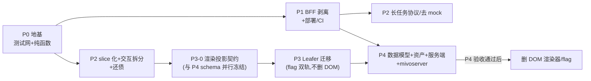

# MivoCanvas 产品化改进路线图(P0-P4)

> REVIEW_DOMAIN: 应用代码
> REVIEW_FOCUS: 可落地性 / 工作量颗粒度 / 验收可证伪性
> 状态:方案已经两轮 GPT-5.5 xhigh 独立评审(架构视角 + 执行视角)整合定稿;作为后续各阶段开工的权威依据。**本文档不含任何 P0 编码,各阶段按「一子项一 PR」另行开工。**

## Context

MivoCanvas 当前是跑通了「对话 + 无限画布 + AI 生成链路」的高完成度 Demo。产品愿景已定稿:对话式 + 无限画布,用户是美术/设计师,目标四层架构 = L1 画布文档层(Canvas/Node/Anchor/Edge/Version 真相源)→ L2 Agent 编排层 → L3 能力层(复用 mivoserver)→ L4 渲染交互层(薄)。对标 Figma + Lovart。

本轮探查核实的关键事实,**其中两条修正了此前评估**:

| # | 已核实事实 | 影响 |
|---|-----------|------|
| 1 | 所有 `/api/mivo/*` 端点实现在 `vite.config.ts` dev middleware(L782-997),生产构建后不存在 | **产品化头号硬阻断** |
| 2 | **全仓零单元测试**(此前"41 个测试全过"有误),只有 Playwright e2e-smoke;无 vitest 依赖 | 重构前必须先建安全网 |
| 3 | **无 V2 数据模型双轨**(此前评估有误):只有单一 `MivoCanvasNode`(src/types/mivoCanvas.ts:116-177);normalize 是 store 变更时 eager 内聚修复,非每帧开销 | Anchor/Version 是全新设计而非收尾 |
| 4 | Leafer 三依赖(^2.1.7)零绘制调用(MivoCanvas.tsx:465-499 空实例);渲染 100% React DOM + CSS transform;culling 已有(overscan 520px);CanvasNodeView 无 memo;**`.canvas-host` 为 `pointer-events:none`,全部命中判定依赖 DOM 节点事件**(canvasInteraction.ts:134-137) | 决策:真接入 Leafer;事件桥是 P3 最大前置 |
| 5 | canvasStore.ts 2616 行 6 域混杂;快照历史 60 条;persist key 'mivo-canvas-demo' v7;104 处单字段 selector;**chatStore 直接 getState() 调 canvasStore 生成 action**(chatStore.ts:162-179) | 按 slice 门面方案拆,chatStore 纳入拆分边界 |
| 6 | useCanvasInteractionController.ts 1498 行,6 条天然缝隙 | P2 拆 hooks,P3 前置 |
| 7 | **资产存 IndexedDB(assetStorage.ts:61-68),节点只记 `mivo-asset:` 伪 URL**;localStorage persist 不含 blob | P4 必须含资产服务端迁移,否则跨设备丢图 |
| 8 | 已知债:局部重绘 54-98s 无进度/取消;Eagle 拖拽被 backdrop 截获;横图 mask 遮挡;variations/annotation 仍 mock(canvasStore.ts:2157-2192/2429-2508) | 归 P2 收口 |
| 9 | 无 CI workflow | CI 在 P1 落地 |

**核心决策**:① Leafer **真正接入**(不移除);② P0-P4 全量规划,后期阶段进入前再细化。

## 评审整合(2× GPT-5.5 xhigh 独立评审)

- **架构视角**:ADOPT_WITH_CHANGES。核心必改:P3 前置渲染投影契约、DOM 渲染器保留到 P4 后、事件桥/命中语义/坐标同步/文本度量升级为架构前置与验收项、BFF 安全面、P4 并发冲突模型、P1 契约测试。→ **全部采纳**。
- **执行视角**:ADOPT_WITH_CHANGES。核心必改:PR 颗粒度重估(P2/P4 远超 2-4 PR)、slice vs 多 store 二义性、chatStore 归属、P4 资产迁移、P1 部署形态/CORS、错误与日志规范、e2e CI 落地、验收去形容词化。→ **全部采纳**。
- **冲突裁决(静态托管)**:一方倾向 Hono 只做 API(serveStatic 有 CVE-2026-29087/39406,<1.19.13 受影响);另一方倾向 BFF 同源托管 dist 消 CORS。**裁决:默认同源托管 dist + pin `@hono/node-server` ≥1.19.13**,单人部署最简、无浏览器 CORS 面;上平台托管时再切分离模式(届时补 origin allowlist)。
- **store 拆分形态裁决**:探查期草案是"多个独立 store + getState() 互调",与"104 处 selector 零改动"矛盾。**裁决:采用单一 persisted `useCanvasStore` 门面 + slice 模块化**(文档/生成/选择三个 slice 文件组合进同一 store),真·多 store 化留待 P4 后再评估。

---

## 总体排序与依赖

排序原则:测试网最先;生产阻断次之;渲染迁移在 store/交互拆干净之后、且必须先冻结「渲染投影契约」避免绑定旧模型;数据模型最后但 schema 设计与 P3 并行;**DOM 渲染器作为回滚阀保留到 P4 验收通过后才删**。mivoserver 只读 spike 提前到 P2/P3 期间做(不接入,只摸契约),防 P4 反向推翻 BFF API 与 Anchor 设计。

工作量总览(单人+AI agent,评审校准后):

| 阶段 | 子 PR 数 | 预估周期 |
|------|---------|---------|
| P0 | 3-4 | 3-5 天 |
| P1 | 4-6 | 5-8 天 |
| P2 | 9-13(分四组) | 2-3 周 |
| P3 | 1(P3-0)+ 6-8 | 2-3 周 |
| P4 | 设计 spike + 10-15+ | 另行细化,≥4 周 |

---

## P0 — 地基:测试网 + 纯函数抽取(3-4 PR,3-5 天)

**只做「提取+引用」,不改 store 对外 action 签名,不动 persist key。**

| 子项 | 内容 |
|------|------|
| P0-a | vitest + `@vitest/coverage-v8`(复用 vite alias,不引 jsdom),`npm run test` |
| P0-b | 抽 `src/store/historyManager.ts`(snapshotFromState/remember/patchWithHistory/applySnapshot,源 canvasStore.ts L286-626)+ 单测:undo/redo/60 条裁剪边界 |
| P0-c | 抽 `src/canvas/geometry/nodeGeometry.ts`(normalizeCanvasNodes/syncDerivationEdgeNodes/rectsIntersect/culling 判定)+ 单测 |
| P0-d | 抽 `src/store/nodeFactory.ts`(cloneNode/createNodeCopy/节点构造;注意生成结果落库路径的异步耦合,只抽纯构造部分)+ `snapshotValidation.ts` 单测(P4 迁移守门员) |

**验收**(可证伪):`npm run test` 绿;关键分支用例清单全覆盖——undo/redo/裁剪、normalize/edge sync/culling、clone/createNodeCopy、snapshotValidation v1-v7 分支(coverage-v8 报告作参考,不设硬指标);`tsc -b` + e2e-smoke 不回归。

## P1 — 后端剥离:独立 BFF + 部署/CI(4-6 PR,5-8 天)

**1:1 平移语义,不换上游**(继续直连 llm-proxy;mivoserver 留 P4)。端点契约与现状一致,前端零改动。

| 子项 | 内容 |
|------|------|
| P1-a | 新建 `server/`(Hono);**部署形态定死:BFF 同源托管 dist + `/api/mivo/*`,无浏览器 CORS**;pin `@hono/node-server` ≥1.19.13(serveStatic CVE) |
| P1-b | 端点平移:generate/edit/enhance/local-assets/eagle/*/pinterest。**不是裸搬 handler**:保留并规范化现有 body limit(mivoImageRequestMaxBytes)/上游超时(mivoUpstreamTimeoutMs)/错误映射(readUpstreamError);统一 error envelope + request id;日志分类(上游状态/latency/timeout/abort),**禁止记录 API key/原图 blob/完整 prompt**;local-assets 路径穿越防护、Eagle 代理 SSRF 边界、文件类型白名单 |
| P1-c | **API contract tests**:固定 generate/edit/enhance/local-assets/eagle/status 的响应 shape、错误码、超时、multipart 行为(先对 vite middleware 录基线,平移后断言一致) |
| P1-d | vite 改 `server.proxy` → 本地 BFF,删 configureServer API 逻辑;dev 体验不变 |
| P1-e | 生产运行:`npm run start:server` + Dockerfile;e2e 拆 `test:e2e:dev` / `test:e2e:prod`(build+BFF 真启动拓扑,当前 e2e-smoke.mjs:141 固定起 dev 需改造) |
| P1-f | CI(GitHub Actions):lint + tsc + test + e2e(**mock BFF 上游/fixture 模式,不打真实 llm-proxy**);真链路留手动/nightly;上传截图 artifacts |

**验收**:契约测试全绿(与 dev middleware 基线一致);`vite build` + BFF 启动后完整生成链路可跑;错误用例(超时/413/上游 4xx5xx/Eagle 离线/路径越权)有断言;grep 确认前端 bundle 无 key;CI 全绿。

## P2 — slice 化 + 交互拆分 + 还债(9-13 PR,分四组,2-3 周)

**组 1:store slice 化(3-4 PR)** — 单一 persisted `useCanvasStore` 门面不变,内部拆 slice 文件:
- `documentSlice`(canvases/nodes/edges/历史/commitGenerationResult)、`generationSlice`(5 个生成 action 的网络编排 + tasks,经稳定 facade 暴露)、`selectionSlice`(activeTool/selection/剪贴板)。104 处 selector 零改动;persist v7 key 不动。
- **chatStore 纳入边界**:只保留会话 UI 状态/模型参数/消息持久化,生成命令改调 generation facade(替换 chatStore.ts:162-179 的 getState() 直调);文档写入仍经 commitGenerationResult。
- 拆分前先补 **store contract tests**:persist v7 JSON shape、selectNode(s)/undo/redo/commitGenerationResult/task 状态/chatStore→facade,含 hydration 顺序与 partialize 行为。

**组 2:交互控制器拆 hooks(2-3 PR)** — 按 6 缝隙:`useViewport`(L101-345)/几何引 P0-c(L390-437)/`useMarqueeSelection`(L479-575)/`useNodeTransform`(L577-750)/`useTextAnnotation`(L752-1050)/`useGlobalCanvasEvents`(L1206-1452)。CanvasNodeView 加 React.memo。

**组 3:长任务协议(2-3 PR,依赖 P1)** — BFF 任务 registry;进度(SSE 或轮询);client abort → upstream abort 的真取消语义(非仅 UI 取消);重试幂等 key;验收:取消后 task 态为 canceled、BFF 收到 abort、**不再 commit result**。

**组 4:体验债 + 去 mock(2-3 PR,依赖 P1)** — Eagle 拖拽 backdrop(App.tsx:180/184, LibraryWorkspace.tsx:924/934);横图 mask 遮挡(ImageMaskEditOverlay.tsx:319/367/412);variations/annotation 去 mock(先设计端点契约再接;验收 `rg mockGeneration` 生产路径零命中 + prod e2e)。

**期间并行**:mivoserver 只读 spike(任务/存储/鉴权/模型能力/board schema 边界,产出一页纪要供 P3-0/P4 消费)。

**验收**:contract tests + e2e 全绿;长任务取消语义断言;100 节点 stress 拖拽/缩放性能 trace(p95 frame time 阈值,基线在组 2 前录制)。

## P3 — Leafer 渲染迁移(P3-0 + 6-8 PR,2-3 周)

**P3-0 渲染投影契约(先行 PR,与 P4 schema 设计并行冻结)**:
- 定义 `RenderNode/RenderEdge` 投影类型(renderer 不直接消费 `MivoCanvasNode`,P4 引入 Anchor 后只改投影层,不重写 renderer sync);
- 统一 **viewport matrix** 单一来源(Leafer 相机与 DOM overlay 共享同一矩阵);
- 显式 **Layer enum**(frame 底层/内容/selected 提升/preview/handles/floating UI),对齐现有 DOM 顺序+z-index 语义;
- **InteractionAdapter 契约**:pointer event → viewport 逆变换 → 自有 topmost hit-test → 现有 interaction hooks。**当前命中全靠 DOM 节点事件(`.canvas-host` pointer-events:none),迁移后必须补齐纯函数命中**:点选、路径/描边命中(连线箭头现依赖 SVG pointer-events:stroke)、重叠 topmost、frame 背景/子节点穿透、locked/hidden 规则——全部带单测。

**混合渲染矩阵(明确哪些节点永不迁)**:

| 走 Leafer paint | 永久留 DOM overlay |
|---|---|
| 图片、frame/section、画笔/markup、连线、静态文本 | markdown/pdf/video/task-placeholder/ai-slot/annotation 卡片、文字编辑态、选择框/handles、工具条、ChatPanel、菜单、mask/crop overlay |

**迁移切片(每 PR 保持 dom 模式可用)**:
- P3-a `RendererAdapter` 接口 + DomRenderer 包装 + flag(`?renderer=leafer|dom`),e2e 双模式;
- P3-b 图片节点(收益最大):Leafer Image + 资源生命周期单列(IndexedDB blob URL 异步加载/失败占位/revoke/naturalSize/crop 语义/CORS taint);
- P3-c frame/section + markup(Path)+ 连线(connectorGeometry 喂 Leafer);
- P3-d 静态文本:**先建文本度量 golden fixtures**(CJK/wrap/line-height/weight,对照 DOM 测量;textGeometryFor 与 Markdown scrollHeight 回写高度是已知耦合点),编辑态切 DOM overlay;
- P3-e 收尾:culling 策略基准择一(Leafer 内建 vs 自有 culling 只 sync 视口内);stress 500/1000 节点基准。**不删 DomRenderer/flag——保留到 P4 验收通过。**

**验收**(可证伪):e2e M1-M6 双渲染模式全绿;固定关键场景清单(5 个 demo scene + mask/crop/文字编辑态)截图 diff ≤ 设定阈值;坐标同步专项(zoom/pan/DPR/浏览器缩放/ResizeObserver 下 overlay 与 paint 层像素对齐);1000 节点 pan/zoom p95 frame time 阈值 + sync diff 耗时 + heap 增量,对照 DOM 基线;命中判定纯函数单测全绿。

## P4 — 数据模型 + 资产 + 服务端持久化 + mivoserver(spike + 10-15 PR,进入前另行细化)

先做**设计 spike**(消费 P2 期间的 mivoserver 纪要),再拆执行 PR:

- P4-a L1 schema:`Canvas/Node/Anchor/Edge/Version`。Anchor(坐标+绑定图+指令)为 Node 之上引用/派生层,渐进引入;renderer 只需扩展 P3-0 投影层。
- P4-b **资产服务端化(评审补入的关键遗漏)**:`/api/assets` 上传/下载(或对象存储 facade);迁移器把 IndexedDB `mivo-asset:` blob 上传并**重写节点 URL** 为服务端 asset id;chat history 是否随 canvas 服务端持久化在 spike 中定。
- P4-c 文档持久化:`GET/PUT /api/canvas/:id`(先 SQLite,后对齐 mivoserver Mongo/PG);**并发/冲突模型**:document revision/etag + 幂等 PUT + last-write-wins(多 tab/跨设备/离线缓存),冲突提示;迁移器(localStorage v7 → 服务端)带单测 + snapshotValidation 守门 + 本地备份回滚 + 中断恢复。
- P4-d L2 编排上移 BFF + 对接 mivoserver 能力层,Celery 任务态在 BFF 消化不泄漏前端。
- P4 验收通过后:删 DomRenderer/flag(P3 遗留)。

**验收**:固定 v7 fixtures(含导入图/生成图/视频/PDF/Markdown 的旧数据)跨浏览器加载,断言节点/边/任务/选择/asset URL 重写逐项一致;Anchor 创建/绑定/挂指令可用;Version 可回溯;冲突用例(双 tab 并发写)有确定行为断言。

---

## 不做什么(防 scope creep)

- 不做多人实时协作(CRDT/OT/presence)——冲突模型仅到 revision/etag + LWW 级别。
- 不在 P1 换能力后端;P2/P3 期间对 mivoserver 只做只读 spike。
- 不拆 persist key;P2 只做 slice 门面,真·多 store 化 P4 后再议。
- 不追组件级覆盖率指标(纯函数单测 + contract tests + e2e 兜底)。
- 不重写 undo(快照式保留;千级节点后依据 P3-e 基准数据再评估 command-based)。
- P3 不引 @leafer-in/editor(选择编辑走自有 overlay;确认无用则移除该子包)。
- 不动 demoScenes/stress-test(P3 基准基线)。
- P3 完成前不删 DOM 渲染路径(回滚阀)。

## 风险清单

| 风险 | 阶段 | 影响 | 缓解 |
|------|------|------|------|
| Leafer 事件桥/命中语义(pointer-events:none 现状) | P3 | 高 | P3-0 InteractionAdapter 契约先行 + 命中纯函数单测 |
| 渲染语义差异(文字度量/图片时序/zIndex/DPR/overlay 坐标) | P3 | 高 | 投影契约 + golden fixtures + 截图 diff 阈值 + flag 双轨每 PR 可回滚 |
| renderer 绑死旧模型,P4 Anchor 引入后重写 | P3/P4 | 高 | P3-0 RenderNode 投影层隔离 + P4 schema 并行冻结 |
| 资产(IndexedDB blob)迁移丢失 | P4 | 高 | /api/assets + URL 重写迁移器 + 含资产 fixtures 验收 |
| store 拆分破坏 104 处 selector / hydration 顺序 | P2 | 高 | slice 门面(非多 store)+ contract tests 先行 + e2e 每 PR |
| BFF 安全面(路径穿越/SSRF/body limit/日志泄密) | P1 | 高 | P1-b 安全项显式验收 + 错误用例断言 |
| BFF dev/prod 行为分叉 | P1 | 高 | 契约测试录基线 + test:e2e:prod |
| localStorage→服务端迁移丢数据/中断 | P4 | 高 | 迁移器单测 + snapshotValidation + 备份回滚 + 中断恢复 |
| 长任务取消只到 UI 层,服务端任务悬挂 | P2 | 中 | BFF 任务 registry + upstream abort 语义断言 |
| mivoserver 契约反推翻 BFF/Anchor 设计 | P4 | 中 | P2/P3 期间只读 spike 提前摸底 |
| serveStatic CVE(<1.19.13) | P1 | 中 | pin ≥1.19.13;平台托管时切分离模式 |
| CI 依赖真实 llm-proxy/Eagle 不稳定 | P1+ | 中 | CI mock 上游,真链路 nightly/手动 |

## 关键文件

- `src/store/canvasStore.ts`(2616 行:P0 抽取源/P2 slice 化主体/commitGenerationResult 枢纽)
- `src/store/chatStore.ts`(L162-179 getState() 直调:P2 改走 generation facade)
- `vite.config.ts`(L782-997:P1 迁出源,body limit/超时/错误映射语义须保留)
- `src/canvas/useCanvasInteractionController.ts`(1498 行:P2 拆 hooks)+ `canvasInteraction.ts`(命中判定补齐处)
- `src/canvas/MivoCanvas.tsx` + `CanvasNodeView.tsx`(P3 主战场;Leafer 空实例 MivoCanvas.tsx:465-499)
- `src/lib/assetStorage.ts` + `canvasArchive.ts`(P4 资产迁移源)
- `src/types/mivoCanvas.ts`(P4 数据模型真相源)/ `src/lib/snapshotValidation.ts`(P0 补测,P4 守门)
- `scripts/e2e-smoke.mjs`(P1 拆 dev/prod 两套启动器)

## 验证方式

每子 PR:`tsc -b` + `npm run lint` + `npm run test` + 对应 e2e 模式。P1 起:契约测试 + test:e2e:prod + CI(mock 上游)。P2 起:store contract tests + 长任务取消断言 + 性能 trace 基线。P3 起:双渲染模式 e2e + 截图 diff(固定场景清单+阈值)+ 1000 节点基准(p95 frame time/sync 耗时/heap)。P4:v7 含资产 fixtures 迁移断言 + 双 tab 冲突用例。
