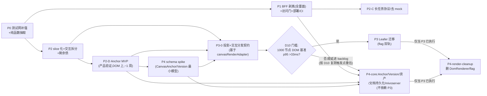

> REVIEW_DOMAIN: 应用代码
> REVIEW_FOCUS: 可落地性 / 工作量颗粒度 / 验收可证伪性
> 审查状态: Claude 自审 ✅ + GPT-5.5 xhigh 架构评审 APPROVED_WITH_NOTES(notes 已清)✅ + GPT-5.5 xhigh 执行评审 APPROVED_WITH_NOTES(notes 已清)✅(2026-07-03)

# MivoCanvas 产品化改进方案(P0-P4,rev4.4)

> **文档信息**
> - 基线:origin/main = `22e2e4c`(demo/improve-hud 已并入;PR #11 为本文档载体)
> - 版本:rev1 初稿 → rev2 整合 2× GPT-5.5 xhigh 双评审 → rev3 对齐 main(3× GPT-5.5 high 盘查)→ rev4 详细版 → rev4.1 合入用户 4 条改进点(Anchor MVP 提前 / P3 门槛 / e2e 拆分 / BFF 访问门)→ rev4.2 修复终审双评审(2× xhigh,均 REQUIRES_CHANGES)全部必改项:P1 契约矛盾消除(保持现有 error shape,统一 envelope 延后)、§6.1 补契约语义列、生产安全模型、P3-0 唯一交互分发模型、基准采集协议(§12.1)、PR/周期口径重估、P1 回滚开关、undo 与 Version 分离、Anchor 命名去冲突 → rev4.3 合入 arch 复审增量:D9 实验字段硬化、D10 补"gate 只控时机"+复测触发、依赖图 P4 拆 core/render-cleanup、P1-e0 独立 e2e 纯搬移、访问门生产边界(bind 127.0.0.1 + MIVO_PUBLIC + token 不入 bundle)→ **rev4.4 合入 exec 复审增量**:token gated 测试矩阵(CI 专项 job)、e2e 拆分细化为 harness 提取+scenario 搬移两步、Anchor MVP 冻结为 2 PR+字段契约、基准产物命名与 D10 决策记录模板、P1/P2 工期再校准
> - REVIEW_DOMAIN: 应用代码;REVIEW_FOCUS: 可落地性 / 工作量颗粒度 / 验收可证伪性
> - 本文档是后续各阶段开工的权威依据;各阶段按「一子项一 PR」执行,本文档本身不含任何代码改动

---

## 一、背景与目标

MivoCanvas(Vite 8 + React 19 + TS + Zustand 5)是已跑通「对话 + 无限画布 + AI 生成链路」的高完成度 Demo。产品愿景(用户定稿):**对话式 + 无限画布**,用户是美术/设计师,"图和锚点是他们的语言";对标 Figma(协作无限画布)+ Lovart(AI 设计 agent 范式)。

目标四层架构:

| 层 | 职责 | 现状 → 目标 |
|----|------|-----------|
| L1 画布文档层(真相源) | Canvas / Node / **Anchor(坐标+绑定图+指令)** / Edge / Version | V2 语义字段已在,缺 Anchor/Version/服务端持久化 |
| L2 Agent 编排层 | 读画布上下文→规划→调能力→写回画布 | 编排逻辑散在前端 store,需上移 |
| L3 能力层 | 多模型生成/异步任务/存储/鉴权(复用 mivoserver:FastAPI+Celery+Mongo+PG+OSS) | 现直连 llm-proxy + mivo 平台通道,P4 对接 |
| L4 渲染交互层(薄) | 无限画布渲染 + 对话进场 + 锚点交互 | DOM+CSS 渲染,P3 迁 Leafer |

**用户已拍板的两个决策**:① LeaferJS **真正接入**(不移除死依赖);② P0-P4 全量规划,后期阶段进入前再细化。

**头号硬阻断**:所有 `/api/mivo/*` 后端逻辑实现在 `vite.config.ts` dev middleware 里(1630 行),`vite build` 产物中这些端点不存在——不剥离后端,一切改进只能活在 dev 模式。

---

## 二、现状事实基线(全部对 origin/main 22e2e4c 复核)

> 勘误记录:rev1/rev2 曾写"零单元测试""无 V2 模型",系在 demo 分支测量所得,对 main 不成立,已于 rev3 改写。

| # | 已核实事实 | 证据 | 对计划的影响 |
|---|-----------|------|------------|
| F1 | 全部 `/api/mivo/*` 在 vite.config.ts dev middleware(路由 L1405-1614);含 **mivo 平台通道**:gemini-3-pro-image/gpt-image-2 走平台 submit/poll/download(poll 上限 175s/间隔 2.5s),内存 token/chatSession 缓存 + 401 authRetry 单飞(L587-793);mask 场景无条件回落 llm-proxy(L958-1007);`/api/mivo/debug-logs`(L419-457,GET 支持 MIVO_DEBUG_VIEW_TOKEN/默认近 7 天/limit cap 1000);`/api/mivo/enhance` 降级链实际为 **claude-haiku-4-5 → gpt-5.4-mini**(上游 8s+8s,客户端 30s);body limit:JSON 1MB / multipart 40MB | vite.config.ts | P1 头号阻断,迁移面=全量 middleware 含全部行为语义 |
| F2 | 测试网已起步:vitest ^4.1.9 + `test:unit`;**10 个 *.test.ts**(canvasInteraction/brushGeometry/smartSelection/stampDefs/canvasRenderAdapter/documentModelV2/canvasSnapshotModel/aiCanvasCommands/remoteDebugReporter/vite.config);e2e-smoke 5647 行(含 debug/mask/chat 回归);`verify:logging` 守卫 | package.json:12-14 | P0=补强非新建 |
| F3 | V2 数据模型已存在:MivoCanvasNode 带 transform/fills/strokes/effects/layout/constraints/asset/relations(types/mivoCanvas.ts:131-290);documentModelV2.ts 做 legacy→V2 归一;snapshot version=2;**canvasRenderAdapter.ts 已从 V2 字段计算 DOM 渲染样式(带单测)**;尚无 Anchor/Version | src/model/、src/canvas/canvasRenderAdapter.ts:45-88 | P3-0 有现成起点;P4 演进非 greenfield |
| F4 | Leafer 三依赖(^2.1.7)仍是空实例零绘制(MivoCanvas.tsx:501-534 仅 new/start/resize/destroy);渲染 100% React DOM + CSS transform;culling 已有(overscan 520px + pinned,MivoCanvas.tsx:219-247);CanvasNodeView(830 行)无 React.memo;`.canvas-host` pointer-events:none——**全部命中判定依赖 DOM 节点事件** | src/canvas/ | P3 动机成立;事件桥是最大前置 |
| F5 | canvasStore.ts **3168 行**(6 域混杂:文档/任务/选择/剪贴板/历史/场景);快照式历史 60 条;persist `mivo-canvas-demo` **v8**(迁移覆盖 flat-state 兼容、<6 markdown 归一、<8 brushStyle 重置);task 已有 **canceled** 态;**网络型生成 action**(generateImageEdit/BesideNode/IntoAiSlot)与 commitGenerationResult 返回 Promise<string[]>,commit 支持跨 scene(L2519-2659);**variations/annotation 仍为 void 且走 mock**(P2-C2 需一并契约化返回值) | src/store/canvasStore.ts | P2 slice 化主体 |
| F6 | chatStore.ts **803 行**独立 store;persist `mivo-chat-demo` **v2**(v1→v2 ratio 收敛迁移);经 useCanvasStore.getState() 直调生成 action,**两条入口**:sendMessage(L310-356)与 retryMessage(L596-652);已有取消(AbortController)/超时条件化文案/重试(含降质重试) | src/store/chatStore.ts | P2 facade 覆盖双入口 |
| F7 | useCanvasInteractionController.ts **1775 行**,职责含 pan/框选/变换/文本批注/brush/stamp/smart-selection/连接吸附/键盘粘贴;canvasInteraction.ts 已抽部分纯函数+单测。缝隙:viewport 111-475 / 几何 145-249 / 框选 563-583+1220 / 节点变换 586-716+1022-1145 / 文本批注 719-957+1057-1211+1253-1356 / 全局事件 1449-1726 | src/canvas/ | P2 拆 hooks 按此切 |
| F8 | 资产:IndexedDB(`mivo-canvas-assets`)+ 节点记 `mivo-asset:` 伪 URL(assetStorage.ts:61-69);persist 不含 blob | src/lib/assetStorage.ts | P4 资产服务端化是硬需求,否则跨设备丢图 |
| F9 | 旧体验债重估:**Eagle 拖拽已修**(App.tsx:93-112)、**横图 mask 已有 e2e 覆盖**(e2e-smoke.mjs:5346-5489)→均降为回归项;长任务:有取消/canceled/重试,**无真实进度**(progress 硬编码 20→100,canvasStore.ts:891-916)、无服务端任务 registry;**variations/annotation 仍走 mock**(canvasStore.ts:2672-2708/3019-3084) | 多处 | P2 债清单 |
| F10 | 可观测体系已落地:debugLogger→remoteDebugReporter(仅 warning/error、脱敏、批量 flush)→`/api/mivo/debug-logs`(JSONL)→DebugReportsPage(`#/debug-reports`);独立 scripts/debug-log-server.mjs(静态部署 CORS collector);**无 CI workflow** | src/store/remoteDebugReporter.ts 等 | P1 随迁+CI 落地 |

> 外部环境注记(非代码可验证事实):origin 指向 kirozeng/MivoCanvas,经 `gh api` 实测当前账号有 push 权限;分支/PR 工作流按此执行,执行前仍建议复核。

---

## 三、关键架构决策(含理由)

| # | 决策 | 理由 |
|---|------|------|
| D1 | **Leafer 定位:纯 paint 层**。命中判定/交互保留自有几何方案,Leafer 不接管事件;@leafer-in/editor 不引入 | 把"渲染迁移"和"交互重写"解耦,交互代码(P2 拆好的 hooks + canvasInteraction 纯函数)零重写;风险减半 |
| D2 | **混合渲染矩阵**:图片/frame/markup/连线/静态文本走 Leafer;markdown/pdf/video/task/ai-slot/annotation 卡片与一切编辑态、浮层**永久留 DOM** | 富文本/内嵌媒体用 canvas 重画性价比为负;Figma 同款做法(编辑态 DOM overlay) |
| D3 | **BFF 形态**:独立 `server/`(Hono),**同源托管 dist + /api**,pin `@hono/node-server` ≥1.19.13(serveStatic CVE-2026-29087/39406);上平台托管再切分离+origin allowlist | 单人部署最简、无浏览器 CORS 面;版本 pin 消 CVE |
| D4 | **P1 不换上游**:llm-proxy + mivo 平台通道**原样随迁**,mivoserver 留 P4 | 解阻断与换后端不叠加风险;BFF 作稳定契约层,后端切换对前端透明 |
| D5 | **store 拆分形态:单一 persisted `useCanvasStore` 门面 + slice 模块化**(documentSlice/generationSlice/selectionSlice 组合进同一 store);真·多 store 化 P4 后再议 | 全仓 100+ 处单字段 selector 零改动;persist v8 key 不拆,规避多 store 持久化一致性问题 |
| D6 | **数据模型:演进不重建**。产品级锚点命名为 **CanvasAnchor**(避开现有 `ConnectorAnchor` 与 `aiWorkflow.anchorNodeId`,迁移关系在 P4 spike 中明确),设计为 Node 之上的引用/派生层,扩展现有 V2 语义字段;renderer 只消费 P3-0 投影 | main 已有 V2 桥(documentModelV2/snapshot v2),绿地重建=返工;投影层隔离让 Anchor 引入不重写 renderer;命名冲突会造成类型误读 |
| D7 | **本地 undo 保持快照式(60 条),与 P4 服务端 Version 分离**:undo=会话内编辑历史;Version=服务端独立版本日志/检查点(保留与清理策略在 P4 spike 定),两者不共用存储 | Demo~中等画布够用;千级节点后凭 P3 基准数据再评估 command-based;"Version 可回溯任意历史点"由服务端版本日志承担,不由 60 条本地快照承担 |
| D8 | **测试策略:纯函数单测 + 契约测试 + e2e 三层,不追组件覆盖率** | 组件层由 e2e 兜底;契约测试是 P1 平移和 P4 换后端的安全网 |
| D9 | **产品验证提前:Anchor MVP 在 P2 期间做,不等 P4**。在现有 DOM 渲染上实现最小锚点交互(选中图上一点 + 挂指令 + 走现有生成链路),~1 周量级 | 产品愿景核心是"人↔图(锚点)对话",若锚点范式要返工,越晚发现 P3 投影/P4 schema 返工面越大;MVP 结论反哺 P3-0 与 P4 spike |
| D10 | **P3 设进入门槛(gate)——gate 只控制"全量渲染迁移的启动时机",不推翻"接 Leafer"这一已定技术方向**:P2 完成后跑 500/1000 节点 DOM 基准,p95 >33ms(或产品侧确认大画布需求)即启动;未超标则 P3 顺延,Leafer 保留为已选方向进 backlog,**复测触发点**:Anchor MVP 结论落地后 / P4c 服务端持久化上线后 / 节点规模需求确认时 | 千级节点性能目前是假设性需求(100 节点无卡顿证据);2-3 周高风险投入应由实测数据触发,不由排期触发;顺延≠弃置 |

---

## 四、阶段总览

排序原则:测试网最先(P0);生产阻断次之(P1);渲染迁移(P3)在 store/交互拆干净(P2)之后且先冻结投影契约(P3-0),**且受 D10 进入门槛控制——基准不超标则 P3 顺延**;**P4 schema spike 是 P3-0 的显式前置门禁**——必须先产出 CanvasAnchor/Version 最小字段映射与投影字段清单,P3-0 才能冻结 renderer contract(否则投影仍绑旧语义,"隔离 P4"承诺落空);**Anchor MVP 在 P2 期间并行(D9),其结论输入 spike 与 P3-0**;**DomRenderer 作为回滚阀保留到 P4 验收通过后才删**;mivoserver 在 P2/P3 期间只做只读 spike。

| 阶段 | 最低 PR | 推荐 PR | 预期工作日 | 硬依赖 |
|------|--------|--------|-----------|--------|
| P0 | 2 | 3 | 3-5 | — |
| P1 | 9 | 11 | 12-18 | P0 |
| P2 | 9 | 13(含组 D) | 15-22 | P0;组 C 依赖 P1 |
| P3 | 8(含 P3-0) | 10 | 15-25 | P2、P3-0、**P4 spike 结论**、**D10 门槛达成** |
| P4 | 本轮只承诺 **spike + 设计冻结**;实施拆 **P4a 数据契约 / P4b 资产迁移 / P4c 服务端持久化 / P4d mivoserver 切换** 四个子阶段,各自进入前单独估 PR/周期 | — | spike 3-5 | P1、P2;渲染相关项依赖 P3 |

> 每阶段执行约定:子 PR 之间标注可并行性(P1 端点三组可并行、P2 组 A/B 可并行);每 PR 必须写回滚方式(revert 即可 / 需要开关 / 需要数据回迁);PR 总数与该阶段子项加总一致,超出即回来修表。

---

## 五、P0 — 测试网补强 + 纯函数抽取(2-3 PR,3-5 工作日)

**原则**:只做「提取+引用+补测」;不改 store 对外 action 签名;不动 persist key;**不重建 main 已有模块**(documentModelV2/canvasSnapshotModel/canvasInteraction/canvasRenderAdapter/brushGeometry/smartSelection)。

| 子项 | 内容 | 产出/涉及文件 |
|------|------|-------------|
| P0-a 补缺口单测 | ① `snapshotValidation.ts`(存在但无测试,P4 迁移守门员):合法/非法 snapshot、v1/v2 分支;② canvas persist v8 迁移分支:flat-state 兼容、<6 markdown 归一、<8 brushStyle 重置;③ chatStore v1→v2 迁移(ratio 收敛/clampChatGenerationContext) | `src/lib/snapshotValidation.test.ts`、`src/store/canvasStoreMigrate.test.ts`、`src/store/chatStoreMigrate.test.ts`(迁移函数如内嵌需先 export) |
| P0-b 抽 historyManager | 快照 push/undo/redo/60 条裁剪从 canvasStore 提为纯函数 + 单测(undo/redo 边界、裁剪、快照内容完整性) | `src/store/historyManager.ts` + 测试 |
| P0-c 抽 nodeFactory | cloneNode/createNodeCopy/生成结果节点构造的纯部分 + 单测(id 唯一性、几何克隆、衍生边节点构造) | `src/store/nodeFactory.ts` + 测试 |

**验收(可证伪)**:`npm run test:unit` 全绿且新增用例清单逐项存在;`tsc -b`、`npm run lint`、`npm run test:e2e`、`npm run verify:logging` 均不回归;canvasStore.ts 行数净减(抽出部分)且 `git diff` 无对外 API 变化。

---

## 六、P1 — 后端剥离:独立 BFF(全量面)+ 部署/CI(9-11 PR,12-18 工作日)

**原则**:P1 只做**平移**——端点入参/出参 body shape 与 dev middleware 完全一致(先录基线再平移),前端除 base URL 外零改动;不换上游(D4);**不引入新的统一 error envelope**(现有 `{error}` / `{ok,error}` / 上游透传语义原样保留,requestId 只放响应 header 与服务端日志;统一 envelope 是 P1 之后的独立 PR,届时同步改前端 readMivoError/DebugReportsPage 与全部契约测试)。

### 6.1 端点迁移清单(全量,含契约语义,源:vite.config.ts)

| 端点 | 方法 | 行为要点 | 契约语义(必须随迁并测试) | 源行 |
|------|------|---------|------------------------|------|
| /api/mivo/generate | POST | 模型分流:平台通道(gemini-3-pro-image/gpt-image-2:submit→poll→download)否则 llm-proxy | JSON limit 1MB(413);上游超时 240s(504);平台 poll 上限 175s/间隔 2.5s;错误 shape `{error}` 或上游状态透传;**不回落**:平台失败不转 llm-proxy | L883-920 |
| /api/mivo/edit | POST(multipart) | 无 mask 且平台模型→平台;**有 mask 无条件 llm-proxy** | multipart limit 40MB(413);上游超时 180s;上传失败固定 502 脱敏文案;错误 shape 同上 | L958-1007 |
| /api/mivo/enhance | POST | chat completions 降级链 **claude-haiku-4-5 → gpt-5.4-mini** | 上游每级 8s(客户端 30s);无 key 返回 `{enhanced:false, degradedReason:'no-key'}`;degradedReason 枚举入契约 | L1260-1398 |
| /api/mivo/debug-logs | POST/GET | POST 归一(仅 warning/error)+脱敏+JSONL append;GET 查询 | GET:`MIVO_DEBUG_VIEW_TOKEN`(header/query 两种携带)、默认近 7 天、limit cap 1000、403 语义;POST:body limit/origin 限制;可与 scripts/debug-log-server.mjs 合并实现 | L408-457 |
| /api/mivo/local-assets(+文件) | GET | 目录列表+文件流 | 路径穿越防护(realpath 校验+去重)、mime 推断、`Cache-Control: no-store`;root=MIVO_ASSET_DIR | L1433+ |
| /api/mivo/eagle/* (status/folders/tags/assets/:id/thumbnail\|file) | GET | 本机 Eagle 代理 | host 仅允许 MIVO_EAGLE_API_URL(SSRF 边界);现状**无上游超时**——BFF 补默认超时并记录为有意变更 | L1466+ |
| /api/mivo/pinterest/status | GET | 占位 | 原样 | L1600+ |
| 平台通道 helpers | — | 内存 token 缓存、chatSession ensure、authRetry、文件 upload/signUrl/poll/download | **可测项**:token 单飞、chatSession 单飞、submit/poll/signUrl/upload/chat 各自 401 后刷新 token 且**只重试一次**、重试仍败即报错不回落;上传失败 502 脱敏 | L587-793 |
| 非常规方法 | — | 各端点对非 POST/GET 的现状行为 | 录基线时记录;保持 dev 行为或统一 405 需列为**有意变更**并测试 | — |

**环境变量矩阵(BFF 启动契约)**:`MIVO_IMAGE_API_KEY`、`MIVO_LLM_API_KEY`(fallback 关系)、`MIVO_PLATFORM_KEY`、`MIVO_PLATFORM_ENDPOINT`、`MIVO_ASSET_DIR`、`MIVO_EAGLE_API_URL`、`MIVO_DEBUG_LOG_DIR`、`MIVO_DEBUG_VIEW_TOKEN`、`VITE_MIVO_DEBUG_ENDPOINT`、`MIVO_BFF_TOKEN`(访问门)、`MIVO_ENABLE_LOCAL_ASSETS`、`MIVO_ENABLE_EAGLE_PROXY`、`MIVO_API_MODE`——逐个写默认值/必填性/生效端点,进 server/README 与部署验收。

**生产安全模型(默认收紧)**:`MIVO_ENABLE_LOCAL_ASSETS` 与 `MIVO_ENABLE_EAGLE_PROXY` **生产默认 false**(这两组端点读服务器本机文件,公网部署即文件泄露面);启用需 localhost 绑定或管理 token;debug-logs GET 生产必须配 `MIVO_DEBUG_VIEW_TOKEN`,POST 限 origin/rate/body;e2e 断言「prod 默认 404/403,显式启用后才可用」。

### 6.2 子项

| 子项 | 内容 |
|------|------|
| P1-a server/ 骨架 | Hono + `@hono/node-server`(pin ≥1.19.13);同源托管 dist;`server/` 目录结构:routes/ platform/ lib/ |
| P1-b 契约基线 | **先对 dev middleware 录契约基线**(每端点:正常/超时/413/上游 4xx5xx/Eagle 离线/路径越权的响应 shape+状态码),存 `server/contracts/`;vite.config.test.ts 的 debug 归一/脱敏/过滤用例随迁 |
| P1-c 端点平移(3 个 PR:生成组 generate/edit/enhance+平台 helpers → 资产组 local-assets/eagle/pinterest → debug-logs) | 按 6.1 清单与契约语义列逐组平移;**响应 body shape 原样保留(见原则,不引入新 envelope)**;requestId 进 header+日志;请求日志分类(上游状态/latency/timeout/abort),**禁止记录 API key/原图 blob/完整 prompt**;**访问门契约**——定位是"内部门禁/临时防滥用",**不等同用户鉴权**:server **默认 bind 127.0.0.1**,显式 `MIVO_PUBLIC=1` 才监听公网且公网模式强制要求 `MIVO_BFF_TOKEN`;token 经 header 携带,**禁止进前端 bundle**(本地部署=启动时注入/内网网关注入/HttpOnly session 三选一,不用 VITE_ 变量;选 HttpOnly cookie 时由网关/BFF 在服务端把 cookie 换算为等价内部认证,BFF 鉴权中间件统一按「header 或 cookie 二者其一」判定,测试与部署文档用同一口径);CI 断言未授权 401/403;真实用户鉴权 P4 对接 mivoserver;生产安全模型按 §6.1 执行 |
| P1-d dev 接线 + 回滚开关 | vite 改 `server.proxy` → 本地 BFF;**middleware 代码暂不删除,加 `MIVO_API_MODE=dev-middleware\|bff` 开关**(缺省 bff),P1 全部验收通过后的独立收尾 PR 才删 middleware——回滚 = 改一个环境变量;revert 步骤写进 server/README |
| P1-e0 e2e 拆分(**两个独立前置 PR,只移动不改行为**) | e2e-smoke.mjs(5647 行)不是可直接切块的文件(顶部起服务/mock,中段共享 page/route/store readers,后段顺序状态)。分两步:**e0a** 提取 harness/fixtures/API mock/server launcher(单入口行为不变);**e0b** 按 scenario 纯搬移(debug / shell-sidebar / archive-assets / canvas-interactions / chat-generation / mask / migration),提供 `--scenario` 过滤。每步验收:旧 `npm run test:e2e` 仍全绿、同场景断言数一致、mock 记录/截图路径不变(行为 diff=0) |
| P1-e 生产运行 | `npm run start:server` + Dockerfile;**`/healthz` 探活**;反向代理 body limit 与 BFF 对齐说明、静态 dist history fallback、日志目录持久化卷、secret 注入方式(env/secret file)写进部署文档;e2e 启动器抽参数,拆 `test:e2e:dev`(vite dev+proxy)/`test:e2e:prod`(build+BFF 真拓扑)——在 P1-e0 拆好的模块上做,不与搬移混在一个 PR |
| P1-f CI | GitHub Actions:lint + tsc + test:unit + **verify:logging** + e2e(**mock 上游 fixture server**,不打真实 llm-proxy/平台/Eagle);Playwright 浏览器安装走 cache;artifact retention 明确(截图/trace 保 14 天);真链路 nightly 触发条件+失败通知渠道写明 |

**验收(可证伪)**:`server/contracts/` 每端点至少覆盖 200 / 非常规方法语义 / 413 / 504 / 上游 4xx5xx / debug 403 / Eagle 离线 / 路径越权 / 401 authRetry 只重试一次——BFF 与 dev middleware 对基线逐字段 diff = 0,**有意变更**(如 Eagle 补超时、统一 405)单独列表并各有测试;`vite build` + BFF 后 test:e2e:prod 通过;prod 安全断言(local-assets/eagle 默认 404/403、debug GET 无 token 403);**访问门 gated 矩阵**——`MIVO_BFF_TOKEN` 未设置:dev/prod 全兼容;已设置:裸请求(浏览器 fetch、remoteDebugReporter POST、Playwright page.request)均 401 且错误脱敏,注入 token(Playwright extraHTTPHeaders / 部署层 cookie)后 generate/edit/enhance/debug-logs/local-assets/eagle 契约用例全过;**CI 专项 job:`MIVO_BFF_TOKEN=e2e-token` 先断言裸 401,再带 header 跑 test:e2e:prod 通过**;`MIVO_API_MODE=dev-middleware` 回退可用;`grep` 前端 bundle 无真实 key(CI fixture token 除外);CI 全绿。

---

## 七、P2 — slice 化 + 交互拆分 + 剩余债 + Anchor MVP(9-13 PR,15-22 工作日)

### 组 A:store slice 化(3-4 PR)

- **A1 契约先行**:store contract tests——persist v8 JSON shape(partialize 字段清单)、selectNode(s)/undo/redo/commitGenerationResult(含跨 scene)/task 状态机(pending→running→done/failed/**canceled**)、hydration 顺序与 partialize 行为、chat persist v2 shape。
- **A2 slice 拆分**:单一 persisted `useCanvasStore` 门面内拆 `documentSlice`(canvases/nodes/edges/历史/commitGenerationResult)/`generationSlice`(5 个生成 action 网络编排+tasks,经稳定 facade 暴露)/`selectionSlice`(activeTool/selection/剪贴板/brush/stamp 工具态)。全部 selector 入口不变;persist v8 key/版本不动。
- **A3 chatStore 边界**:chatStore 只留会话 UI 态/模型参数/消息持久化;**sendMessage(L310-356)与 retryMessage(L596-652)两条入口**都改调 generation facade;文档写入仍经 commitGenerationResult;facade 契约测试覆盖两入口+跨 scene notice 路径。

### 组 B:交互控制器拆 hooks + 渲染小优化(2-3 PR)

- 按 F7 缝隙提取:`useViewport`(含 localStorage viewport 持久化)/`useMarqueeSelection`/`useNodeTransform`(移动/缩放/组缩放)/`useTextAnnotation`(文本/批注/markup)/`useBrushStamp`(brush/stamp/smart-selection 归置)/`useGlobalCanvasEvents`(键盘/wheel/paste/blur);几何计算全部走 canvasInteraction.ts/canvasGeometry.ts 纯函数(已有测试)。
- CanvasNodeView 加 `React.memo` + 稳定 props(callback 用 useCallback 固定);以 100 节点 stress 场景录制拖拽/缩放 trace 作为前后对照。

### 组 C:剩余债(2-3 PR,依赖 P1)

- **C1 长任务服务端协议**:BFF 任务 registry(**P2 范围=单进程内存实现**;BFF 重启后未完成任务一律置 unknown/failed 且**永不 commit**,持久任务态留 P4);真实进度(SSE 或轮询)替换硬编码 progress 20→100;client abort → **upstream abort**(平台通道 poll 中断/llm-proxy 请求中断);重试幂等 key(重启后失效视为新任务)。验收:取消后 task=canceled、BFF 停止上游轮询、**不再 commitGenerationResult**;进度值单调且非硬编码;kill -9 BFF 重启后无僵尸 commit。
- **C2 去 mock**:variations(canvasStore.ts:2672-2708)/annotation(L3019-3084)接真端点(先定契约:variations=同图多参数并发 generate;annotation=区域+指令 edit);验收:`rg mockGeneration src/` 生产路径零命中 + test:e2e:prod 覆盖。
- ~~Eagle 拖拽 / 横图 mask~~:已修,**保留 e2e 回归项**,不再列为工作。

### 组 D:Anchor MVP(产品验证,固定 2 PR,~1 周,D9)

在**现有 DOM 渲染**上实现最小锚点闭环,不等 P3/P4。**范围排除(冻结)**:不做聊天语义改造、不做正式 schema/persist 版本变更、不做与 mask 编辑的复杂合并——只验证"点/框 + 指令 → 生成 → 可追踪"这一条范式。

- **D1 数据与命令契约(1 PR)**:冻结实验字段 shape——`experimentalAnchors?: Array<{id, type:'point'|'box', targetNodeId, x, y, width?, height?, instruction, createdAt, resultNodeIds?}>`(canvas 坐标系,box 时 width/height 必填,禁存 UI 临时态);新增 store action + 纯函数;`cloneNode`/snapshot 归一化/导入校验对该字段**显式深拷贝 + 轻校验**(现状 cloneNode 对未知字段仅浅拷贝,嵌套对象会在 history/clipboard/persist 间共享引用——必须先补);snapshotValidation 单测 + archive roundtrip 单测;不动 persist key/version;P4-a 写明"收编为 CanvasAnchor 或清除"的迁移规则。
- **D2 DOM 闭环 + e2e(1 PR)**:图片节点上创建/显示/选择 anchor → 挂 instruction → 调现有 generateImageEdit/generateBesideNode → 结果节点回写 `resultNodeIds` 并建衍生边;产出**范式验证纪要**(锚点粒度/指令载体形态/与 mask 的关系)→ 输入 P3-0 与 P4 spike。
- **验收(可证伪,mock 上游,不用真实 API 作闭环)**:e2e 断言——anchor 创建成功、发出的 prompt 包含 instruction、mock 生成结果节点存在、anchor.resultNodeIds 与衍生边指向一致;snapshot roundtrip(`getSnapshot → parse → replaceSnapshot`)后 experimentalAnchors JSON 深等。

**期间并行(不占 PR 序列)**:mivoserver 只读 spike(任务/存储/鉴权/模型能力/board schema 边界)+ **P4 schema spike**(V2 字段→Anchor/Version 演进设计,消化组 D 纪要),各产出一页纪要。

**验收**:contract tests + 全部 e2e 模式全绿;facade 后 `rg "useCanvasStore.getState" src/store/chatStore.ts` 仅剩白名单调用;100 节点 trace p95 帧时间不劣于拆分前基线 10%。

---

## 八、P3 — Leafer 渲染迁移(P3-0 + 共 8-10 PR,15-25 工作日)

> **进入门槛(D10)**:P2 完成后先在 DOM 模式跑 500/1000 节点基准。**仅当 p95 帧时间 >33ms(或有明确的产品侧大画布需求)才启动 P3-a 及后续切片**;达标则 P3 顺延,资源转投 Anchor 深化与 P4 前置项。P3-0(投影契约)不受门槛限制——它同时服务 P4,照常做。

### P3-0 投影与交互契约(1 PR,可并入 P2 尾部)

- **RenderNode/RenderEdge 投影**:把现有 `canvasRenderAdapter.ts`(已从 V2 字段算样式)固化为正式投影类型;renderer 只消费投影,不直接读 MivoCanvasNode——P4 引入 Anchor 后只改投影层。
- **统一 viewport matrix**:单一来源,Leafer 相机与 DOM overlay 共享;screenToCanvas/canvasToScreen 收敛到一处。
- **Layer enum**:frame 底层/内容/selected 提升/preview/handles/floating UI,对齐现有 DOM 顺序+z-index 语义。
- **InteractionAdapter + 唯一交互分发模型**:所有 pointer 事件在 **shell 层统一捕获**(pointer capture 归 shell)→ viewport 逆变换 → **自有 topmost hit-test** → 现有 interaction hooks。硬规则:**DOM 承载节点(markdown/pdf/video/task/ai-slot/annotation)不再各自消费 onPointerDown**,统一委托给 InteractionAdapter;topmost hit-test 基于**同一份投影 z-order 同时纳入 DOM 承载节点与 Leafer 绘制节点**(否则两类节点重叠时命中顺序错乱);DOM overlay 容器 pointer-events 策略显式定义(容器 none、需要原生交互的内部控件如 video 播放条/pdf 滚动白名单 auto);编辑态/crop/mask overlay 拥有最高优先级并短路 hit-test。命中纯函数补齐并带单测:点选、路径/描边命中(连线箭头现依赖 SVG pointer-events:stroke)、重叠 topmost、frame 背景/子节点穿透、locked/hidden 规则。**专项测试**:DOM markdown/PDF/video 与 Leafer 图片上下重叠命中、selected 提升后顺序、line/brush stroke 命中、编辑态/crop/mask 优先级。

### 迁移切片(每 PR 双模式可用)

| 子项 | 内容 |
|------|------|
| P3-a | `RendererAdapter` 接口 + 现有 DOM 渲染包装为 DomRenderer + flag(`?renderer=leafer\|dom`);e2e 双模式跑通 |
| P3-b | **图片节点**(数量最多收益最大):Leafer Image;资源生命周期专项——IndexedDB blob URL 异步加载/失败占位/revoke 时机/naturalSize/crop 语义/CORS taint |
| P3-c | frame/section + markup/画笔(Leafer Path)+ 连线(connectorGeometry 输出喂 Leafer Line/Path) |
| P3-d | 静态文本:**先建文本度量 golden fixtures**(CJK/wrap/line-height/weight,对照 DOM 测量;textGeometryFor 与 markdown scrollHeight 回写是已知耦合点);编辑态切 DOM overlay,退出回 Leafer |
| P3-e | 收尾:culling 策略基准择一(Leafer 内建 vs 自有 culling 只 sync 视口内节点);stress 场景扩 500/1000 节点基准;**不删 DomRenderer/flag(保留至 P4 验收后)** |

**验收(可证伪,采集协议见 §12.1)**:e2e 全量用例双渲染模式通过;固定场景清单(5 个 demo scene + mask/crop/文字编辑态)截图 diff ≤ 冻结阈值(P3-a 合入前定死,起点 1%);坐标同步专项——zoom 0.1/0.5/1/2/4、pan、DPR 1&2、浏览器缩放、ResizeObserver 下,采样节点四角/中心/handle/文本编辑 overlay,最大偏差 ≤1 **CSS px**;性能基准——1000 节点 pan/zoom:同机同 fixture,DOM 与 Leafer 各 5 次取中位,Leafer p95 ≤33ms 且不劣于 DOM 基线 10%;sync 分口径:≤10 节点增量 applyDelta p95 ≤4ms(trace mark `store-to-renderer-sync`),1000 节点全量重建单独记录(非门禁,参考 ≤16ms);**生命周期指标**:长时编辑脚本(10 分钟连续增删改)下 Leafer 对象 create/update/delete 计数收支平衡、blob URL revoke 无泄漏、卸载 overlay 清理干净、sync 有 rAF 合并;heap 增量对照记录;命中判定单测全绿。

---

## 九、P4 — V2 → Anchor/Version 演进 + 资产 + 服务端 + mivoserver(本轮只承诺 spike + 设计冻结;实施拆 P4a-d 各自另估)

> 实施子阶段:**P4a 数据契约**(CanvasAnchor/Version schema + 投影扩展)→ **P4b 资产迁移** → **P4c 服务端持久化** → **P4d mivoserver 切换**。下表子项按归属标注;每个子阶段进入前单独细化 PR 数与周期。

**先行 spike**(消费 P2 期间两份纪要),议题:Anchor 字段设计(坐标锚定模型/绑定图引用/指令载体)、Version 粒度(全量快照 vs 增量)、chat history 是否随 canvas 服务端化、mivoserver board 域与 MivoCanvas 文档模型的映射边界、资产对象存储选型(mivoserver OSS vs 自建)。

| 子项 | 内容 |
|------|------|
| P4-a L1 schema 演进(属 P4a) | 在 V2 语义字段之上扩展 `CanvasAnchor`(Node 之上引用/派生层,D6 命名)与 `Version`;documentModelV2/normalize 扩展为「文档内聚 + Anchor 派生」;组 D 的 experimentalAnchors 在此**收编为 CanvasAnchor 或清除**;renderer 仅改 P3-0 投影层 |
| P4-b 资产服务端化 | `/api/assets` 上传/下载(或对象存储 facade);迁移器把 IndexedDB `mivo-asset:` blob 上传并**重写节点 URL** 为服务端 asset id;本地 IndexedDB 降级为缓存 |
| P4-c 文档持久化 | `GET/PUT /api/canvas/:id`(先 SQLite,后对齐 mivoserver Mongo/PG);并发模型:document revision/etag + 幂等 PUT + last-write-wins + 冲突提示(多 tab/跨设备/离线缓存);前端 persist 转「本地缓存 + 服务端真相」 |
| P4-d 迁移器(属 P4b/P4c) | localStorage(canvas v8 + chat v2)+ snapshot v2 → 服务端;snapshotValidation 守门(P0 已补测);**dry-run 模式(只报告不写)、迁移版本戳(幂等重入)、失败重试、部分资产上传失败的跳过/回滚策略**;本地备份可回滚;中断恢复;迁移器自身带单测 |
| P4-e L2 上移 + mivoserver | generation 编排逻辑上移 BFF,前端只发意图;BFF 切换/并接 mivoserver 能力层(生图 facade/异步任务/存储),Celery 任务态在 BFF 消化不泄漏前端 |
| P4-f 合规复核 | debug/logging 隐私策略随部署形态复核(JSONL 落盘位置/token/CORS collector 配置) |
| P4-g 收尾 | P4 验收通过后删 DomRenderer/flag(P3 遗留) |

**验收(可证伪)**:固定 fixtures(canvas v8 + chat v2 + snapshot v2,含导入图/生成图/视频/PDF/Markdown)跨浏览器加载,节点/边/任务/选择/asset URL 重写逐项断言;Anchor 创建/绑定图/挂指令可用且有 e2e;Version 可回溯到任意历史点;双 tab 并发写冲突用例行为确定;资产迁移后 IndexedDB 清空重载仍完整显示。

---

## 十、不做什么(防 scope creep)

1. 不做多人实时协作(CRDT/OT/presence)——冲突模型止步 revision/etag + LWW。
2. 不在 P1 换能力后端;P2/P3 期间 mivoserver 只读 spike。
3. 不拆 persist key;P2 只做 slice 门面,真·多 store 化 P4 后再议。
4. 不追组件级测试覆盖率指标(D8 三层策略)。
5. 不重写 undo(D7)。
6. P3 不引 @leafer-in/editor;确认无用后从依赖移除该子包。
7. 不重建 main 已有模块(documentModelV2/canvasSnapshotModel/canvasInteraction/canvasRenderAdapter/brushGeometry/smartSelection)——只扩展。
8. P4 验收前不删 DOM 渲染路径(回滚阀)。
9. 不动 demoScenes/stress-test 既有场景(基准基线);扩充只加新场景。

---

## 十一、风险清单

| 风险 | 阶段 | 影响 | 缓解 |
|------|------|------|------|
| Leafer 事件桥/命中语义(`.canvas-host` pointer-events:none 现状) | P3 | 高 | P3-0 InteractionAdapter 契约先行 + 命中纯函数单测 |
| 渲染语义差异(文字度量/图片时序/zIndex/DPR/overlay 坐标) | P3 | 高 | 投影契约 + golden fixtures + 截图 diff 阈值 + flag 双轨每 PR 可回滚 |
| renderer 绑死旧模型,P4 Anchor 引入后重写 | P3/P4 | 高 | RenderNode 投影层隔离 + P4 schema spike 提前并行 |
| mivo 平台通道迁移破坏 token/chatSession 缓存语义(内存单飞) | P1 | 高 | 契约测试覆盖 401 重试/会话复用;BFF 保持单实例缓存语义,水平扩展前不引入多实例 |
| 资产(IndexedDB blob)迁移丢失 | P4 | 高 | /api/assets + URL 重写迁移器 + 含资产 fixtures 验收 + 本地备份 |
| store 拆分破坏 selector/hydration | P2 | 高 | slice 门面(非多 store)+ A1 契约先行 + e2e 每 PR |
| BFF 安全面(路径穿越/SSRF/body limit/日志泄密) | P1 | 高 | 6.2 安全项显式验收 + 错误用例断言 + 复用现有脱敏函数 |
| BFF dev/prod 行为分叉 | P1 | 高 | 契约基线先录 + test:e2e:prod |
| localStorage→服务端迁移丢数据/中断 | P4 | 高 | 迁移器单测 + snapshotValidation + 备份回滚 + 中断恢复 |
| 长任务取消只到 UI 层,服务端任务悬挂 | P2 | 中 | C1 registry + upstream abort 语义断言 |
| BFF 重启丢内存任务态(进度/幂等 key) | P2/P4 | 中 | P2 契约=重启后未完成任务置 unknown/failed 永不 commit;持久任务态 P4 落地 |
| debug-logs 迁移后脱敏回归 | P1 | 中 | vite.config.test.ts 用例随迁 + 契约断言 |
| e2e(5647 行)与拓扑耦合 | P1 | 中 | 启动器抽参数,dev/prod 两套 |
| P2 拆分撞上 main 持续演进 | P2 | 中 | 每子 PR 快进 rebase;PR 保持小 |
| mivoserver 契约反推翻 BFF/Anchor 设计 | P4 | 中 | P2/P3 只读 spike 提前摸底 + 组 D Anchor MVP 实测反馈 |
| Anchor MVP 实验字段泄漏进正式模型/persist | P2 | 中 | 可选字段向后兼容、不动 persist 版本、代码标注实验;P4-a 正式化时统一收编或清除 |
| serveStatic CVE(<1.19.13) | P1 | 中 | pin 版本;平台托管时切分离模式 |
| CI 依赖真实上游不稳定 | P1+ | 中 | CI mock 上游,真链路 nightly |

---

## 十二、验证与门禁(每子 PR 必过)

- 恒定门禁:`tsc -b` + `npm run lint` + `npm run test:unit` + `npm run verify:logging` + 对应 e2e 模式。
- P1 起追加:契约测试 + `test:e2e:prod` + prod 安全断言 + CI 全绿。
- P2 起追加:store contract(v8/v2)+ 取消语义断言 + 性能 trace 对照(§12.1)。
- P3 起追加:双渲染模式 e2e + 截图 diff(§12.1 协议)+ 500/1000 节点基准。
- P4 追加:fixtures 迁移断言(含 **dry-run 模式、迁移版本戳、失败重试、部分资产失败的跳过/回滚策略**)+ 双 tab 冲突用例 + 资产完整性断言。

### 12.1 基准与视觉对比采集协议(所有量化门禁的前提)

| 项 | 协议 |
|----|------|
| 环境 | 固定同一台参考机;Chromium(Playwright 固定版本);viewport 1920×1080;DPR 1 与 2 各跑;固定字体集;禁动画(`prefers-reduced-motion` + 禁 transition);固定随机 seed |
| 截图 diff | P3-a 合入前先生成 **DomRenderer baseline**;pixelmatch(或 Playwright snapshot)固定 threshold;动态区域(光标/时间戳)mask 掉;每 scene 输出 diff artifact;阈值一经冻结,调整需在 PR 描述中声明 |
| 性能采样 | 固定 fixture(100/500/1000 节点场景)+ 固定拖拽/缩放脚本;每配置跑 **5 次取中位数**;p95 按帧时间分布计算;记录 heap、FPS、long task;trace mark 名固定:`store-to-renderer-sync`、`canvas-pan`、`canvas-zoom` |
| 基线管理 | baseline trace/截图 JSON 入库(`bench/baselines/`);D10 门槛产物固定命名 `bench/baselines/dom-500-1000-<date>.json`,**P2 结束必须产出该文件**,gate 判定只认它;对照=同机同 fixture 重跑;CI 只跑轻量阈值检查,完整基准本地/nightly |
| D10 例外决策 | "产品侧确认大画布需求"走一页决策记录模板(`docs/decisions/`):需求来源/预期节点规模/时间窗/签署人——没有记录不得以"产品需要"为由绕过基准数据启动 P3 |
| 产物 | CI 上传可下载 artifacts;任何阈值失败能定位到具体 scene + metric;bench/README 记录复现命令 |

## 附:关键文件索引

`src/store/canvasStore.ts`(3168)· `src/store/chatStore.ts`(803,耦合点 L310-356/596-652)· `vite.config.ts`(1630,平台通道 L587-793/debug L419-457/路由 L1405-1614)· `src/canvas/useCanvasInteractionController.ts`(1775,缝隙见 F7)· `src/canvas/canvasInteraction.ts`(纯函数+测试)· `src/canvas/canvasRenderAdapter.ts`(P3-0 基础)· `src/model/documentModelV2.ts`+`canvasSnapshotModel.ts`(P4 基础)· `src/canvas/MivoCanvas.tsx:501-534`(Leafer 空实例)/`:219-247`(culling)· `src/canvas/CanvasNodeView.tsx`(830,无 memo)· `src/lib/assetStorage.ts`(F8)· `src/lib/snapshotValidation.ts`(P0 补测)· `scripts/debug-log-server.mjs`(P1 复用)· `scripts/e2e-smoke.mjs`(5647)
