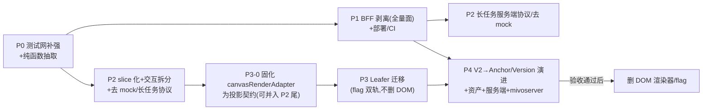

> REVIEW_DOMAIN: 应用代码
> REVIEW_FOCUS: 可落地性 / 工作量颗粒度 / 验收可证伪性

# MivoCanvas 产品化改进方案(P0-P4,rev3 — 已对齐 origin/main 22e2e4c)

> rev 历史:rev1 初稿(基线 5a7439d)→ rev2 整合 2× GPT-5.5 xhigh 双评审 → **rev3 对齐 main 最新 44 commits**(3× 骨折 GPT-5.5 high 盘查:inv-core / inv-ui / plan-fit,verdict = NEEDS_UPDATE,已全部吸收)。
> 勘误:rev1/rev2 的"零单元测试""无 V2 模型"两条基于 demo 分支测量,对 main 不成立,本版已改写。

## Context(基线:origin/main = 22e2e4c,demo/improve-hud 已并入)

产品愿景不变:对话式 + 无限画布,用户是美术/设计师;四层架构 L1 画布文档(Canvas/Node/Anchor/Edge/Version)→ L2 Agent 编排 → L3 能力层(复用 mivoserver)→ L4 薄渲染。对标 Figma + Lovart。用户决策不变:① 真接入 Leafer;② P0-P4 全量规划。

### 已核实事实(rev3,全部对 origin/main 复核)

| # | main 现状 | 对计划的影响 |
|---|----------|------------|
| 1 | 所有 `/api/mivo/*` 仍在 vite.config.ts dev middleware,但文件已 **1630 行**:新增 `/api/mivo/debug-logs`(vite.config.ts:419-457)、`/api/mivo/enhance`、**mivo 平台通道**(gemini-3-pro-image/gpt-image-2 走平台 submit/poll/download + 内存 token/chatSession 缓存 + 401 authRetry 单飞,vite.config.ts:587-793;mask 场景回落 llm-proxy) | **P1 仍是头号阻断,但迁移面大幅扩大** |
| 2 | **测试网已起步**:vitest ^4.1.9 + `test:unit`,10 个 *.test.ts(canvasInteraction/brushGeometry/smartSelection/stampDefs/canvasRenderAdapter/documentModelV2/canvasSnapshotModel/aiCanvasCommands/remoteDebugReporter/vite.config);e2e-smoke 5647 行覆盖 chat/debug/mask 回归;`verify:logging` 守卫 | P0 从"建"改"补强" |
| 3 | **V2 数据模型已存在**:MivoCanvasNode 已带 transform/fills/strokes/effects/layout/constraints/asset/relations 语义字段(types/mivoCanvas.ts:131-290);documentModelV2.ts 做 legacy→V2 归一;snapshot version=2;**canvasRenderAdapter.ts 已从 V2 字段计算 DOM 渲染样式(带单测)** | P3-0 接续现有 adapter;P4 是演进非 greenfield |
| 4 | Leafer 仍空实例零绘制(MivoCanvas.tsx:501-534);DOM+CSS 渲染;culling 520px(MivoCanvas.tsx:219-247);CanvasNodeView(830 行)仍无 memo;`.canvas-host` 仍 pointer-events:none | P3 动机与策略不变 |
| 5 | canvasStore.ts **3168 行**;persist `mivo-canvas-demo` **v8**(brushStyle 重置迁移);chatStore.ts **803 行**独立 store,persist `mivo-chat-demo` **v2**(v1→v2 ratio 收敛迁移);chatStore 经 getState() 直调 canvas 生成 action(chatStore.ts:310-356 sendMessage / 596-652 retryMessage 两条入口);task 已有 **canceled** 态 | P2 slice/contract 按 v8+v2 设计 |
| 6 | useCanvasInteractionController.ts **1775 行**(rev1 的 1498 系测量口径错误;M8/M10 未动它),新增职责:brush/stamp/smart-selection/连接吸附;canvasInteraction.ts 已抽出部分纯函数+单测。缝隙重标:viewport 111-475/几何 145-249/框选 563-583+1220/节点变换 586-716+1022-1145/文本批注 719-957+1057-1211+1253-1356/全局事件 1449-1726 | P2 拆分仍必要,按新缝隙 |
| 7 | 资产仍 IndexedDB + `mivo-asset:` 伪 URL(assetStorage.ts:61-69);persist 不含 blob | P4 资产服务端化仍是硬需求 |
| 8 | 旧 P2 债重估:**Eagle 拖拽已修**(App.tsx:93-112 backdrop 转发)→降回归项;**横图 mask 已被 e2e 覆盖**(e2e-smoke.mjs:5346-5489)→降回归项;**长任务已有** AbortController 取消/canceled 态/超时文案条件化/重试(chatStore.ts:88-138,572-641),**仍缺**真实进度(progress 硬编码 20→100)与服务端任务 registry;**variations/annotation 仍 mock**(canvasStore.ts:2672-2708/3019-3084) | P2 债清单洗牌 |
| 9 | **可观测体系已落地**:debugLogger→remoteDebugReporter(仅 warning/error,脱敏,批量 flush)→/api/mivo/debug-logs(JSONL)→DebugReportsPage(`#/debug-reports`);独立 scripts/debug-log-server.mjs(静态部署用);无 CI workflow;origin(kirozeng)实测有 push 权限 | P1 迁移+CI 需纳入 |

## 评审整合记录

- rev2 双评审(xhigh):P3-0 投影契约、DOM 渲染器保留至 P4 后、事件桥/命中/坐标/文本度量为架构前置、BFF 安全面、P4 冲突模型、颗粒度重估、slice 门面裁决、chatStore 归属、资产迁移、同源托管+pin `@hono/node-server`≥1.19.13——**全部保留**。
- rev3 盘查(high×3):9 条事实 6 条改写;工作项按下文 [删/改/增] 落定;**阶段主序维持 P0→P1→P2→(P3-0)→P3→P4**,plan-fit 建议的两点调整已采纳:P3-0 可并入 P2 尾部提前冻结;P4 schema spike 在 P2/P3 期间并行启动。

---

## 总体排序与工作量(rev3)

| 阶段 | 子 PR 数 | 周期 | rev3 变化 |
|------|---------|------|----------|
| P0 | 2-3 | 2-4 天 | 缩(测试网已有底子) |
| P1 | 5-7 | 7-10 天 | 扩(平台通道+debug-logs 入迁移面) |
| P2 | 8-11 | 2-3 周 | 缩(两项债已修) |
| P3 | 1+6-8 | 2-3 周 | P3-0 起点更实(adapter 已存在) |
| P4 | spike+10-15 | ≥4 周 | 演进式(V2 已在),spike 提前并行 |

## P0 — 测试网补强 + 纯函数抽取(2-3 PR)

**[改]** 不再安装 vitest(已有);统一测试入口(`test:unit` 已存在,验收命令改用它);**[改]** 抽取清单避开已抽模块(documentModelV2/canvasSnapshotModel/canvasInteraction/canvasRenderAdapter/brushGeometry/smartSelection 已存在勿重建)。

- P0-a 补缺口单测:`snapshotValidation.ts`(存在但无测试,P4 守门员)、persist v8 迁移分支(brushStyle 重置/`<6` markdown 归一/flat state 兼容)、chatStore v1→v2 迁移纯函数。
- P0-b 抽 `historyManager`(快照 push/undo/redo/60 条裁剪,仍内嵌 canvasStore)+ 单测。
- P0-c 抽 `nodeFactory`(节点构造纯部分)+ 单测;coverage-v8 报告仅参考。

**验收**:`npm run test:unit` 全绿;缺口用例清单覆盖;`tsc -b` + `npm run test:e2e` + `npm run verify:logging` 不回归。

## P1 — 后端剥离:独立 BFF(全量面)+ 部署/CI(5-7 PR)

**[改]** 迁移面按 main 实际:不再是"直连 llm-proxy 平移"——**mivo 平台通道整体随迁**(token/chatSession 内存缓存语义、401 authRetry 单飞、文件 upload/signUrl/poll/download、mask 回落 llm-proxy 的分流规则);**[增]** `/api/mivo/debug-logs` 收集端点入迁移清单(可基于现成 scripts/debug-log-server.mjs 合并实现);**[增]** enhance(kimi→qwen 降级)、eagle 全家、local-assets、pinterest。

- P1-a server/ 骨架(Hono):同源托管 dist,pin `@hono/node-server`≥1.19.13。
- P1-b 端点平移(保留 body limit/上游超时 240s/180s/错误映射语义);统一 error envelope+request id;日志脱敏(禁 key/blob/完整 prompt——debug-logs 已有脱敏函数可复用);路径穿越/SSRF/文件类型白名单。
- P1-c **契约测试**:对 dev middleware 录基线→BFF 断言一致;**[增]** 覆盖 debug-logs(仅 warning/error+脱敏)、eagle assets/:id/file|thumbnail、平台通道成功/401 重试/超时/upload/poll。
- P1-d vite 改 server.proxy,删 configureServer API 逻辑。
- P1-e 生产运行:start:server + Dockerfile;e2e 拆 test:e2e:dev / test:e2e:prod。
- P1-f CI:lint + tsc + test:unit + **verify:logging** + e2e(mock 上游);真链路 nightly;截图 artifacts。

**验收**:契约全绿;build+BFF 全链路可跑;错误用例断言;bundle 无 key;CI 全绿。

## P2 — slice 化 + 交互拆分 + 剩余债(8-11 PR,三组)

**组 1:store slice 化(3-4 PR)** — 单一 persisted `useCanvasStore` 门面 + documentSlice/generationSlice/selectionSlice;**[改]** contract tests 按 **persist v8 + chat v2 + snapshot v2** 设计;chatStore 只留会话 UI 态,**sendMessage 与 retryMessage 两条入口**都改走 generation facade(chatStore.ts:310-356/596-652);hydration/partialize 专项测试。

**组 2:交互控制器拆 hooks(2-3 PR)** — 按 rev3 新缝隙(含 brush/stamp/smart-selection 职责归置);复用已有 canvasInteraction.ts 纯函数;CanvasNodeView 加 React.memo。

**组 3:剩余债(2-3 PR,依赖 P1)** — **[改]** 长任务从"客户端取消+粗进度"升级为**服务端任务协议**(BFF registry、SSE/轮询真进度替换硬编码 20→100、client abort→upstream abort、幂等 key;验收:取消后不再 commit result);**[改]** variations/annotation 去 mock(先定端点契约;验收 `rg mockGeneration` 生产路径零命中);**[删]** Eagle 拖拽、横图 mask 移出待修 → e2e 回归项保留。

**期间并行**:mivoserver 只读 spike + **P4 schema spike 启动**(V2 字段→Anchor/Version 演进设计,一页纪要)。

## P3 — Leafer 渲染迁移(P3-0 + 6-8 PR)

**P3-0(可并入 P2 尾部)[改]**:**基于现有 canvasRenderAdapter.ts 固化**为正式 RenderNode/RenderEdge 投影(renderer 不直接消费 MivoCanvasNode;V2 语义字段是现成投影输入);统一 viewport matrix;Layer enum;InteractionAdapter 契约 + 命中纯函数补齐(点选/描边命中/topmost/frame 穿透/locked-hidden,带单测——现状命中全靠 DOM 事件,`.canvas-host` pointer-events:none)。

**混合渲染矩阵与迁移切片不变**(图片→frame/markup/连线→静态文本;markdown/pdf/video/task/ai-slot/annotation 卡片与所有编辑态/浮层永久留 DOM;flag 双轨;文本度量 golden fixtures;**DomRenderer 保留至 P4 验收后**)。

**验收不变**:双模式 e2e 全绿;固定场景截图 diff 阈值;坐标同步专项(zoom/pan/DPR);1000 节点 p95 frame time 对照 DOM 基线;命中单测全绿。

## P4 — V2 → Anchor/Version 演进 + 资产 + 服务端 + mivoserver(spike+10-15 PR)

**[改]** 定性为**演进**:在已有 V2 语义字段/documentModelV2/snapshot v2 之上扩展 Anchor(坐标+绑定图+指令,Node 之上引用层)与 Version;renderer 只改 P3-0 投影层。
- 资产服务端化:/api/assets + `mivo-asset:` blob 上传 + 节点 URL 重写;chat history 持久化归属在 spike 定。
- 文档持久化:GET/PUT /api/canvas/:id(先 SQLite 后对齐 mivoserver);revision/etag + 幂等 PUT + LWW + 冲突提示;**[改]** 迁移 fixtures 用 **canvas v8 + chat v2 + snapshot v2**(含导入图/生成图/视频/PDF/Markdown);snapshotValidation 守门 + 备份回滚 + 中断恢复。
- **[增]** debug/logging 隐私策略随部署形态复核(JSONL 落盘位置/token/CORS——debug-log-server 已有独立 CORS collector 模式)。
- L2 编排上移 BFF + mivoserver 对接(Celery 任务态 BFF 消化);验收通过后删 DomRenderer/flag。

## 不做什么(不变项从略,新增/修改)

- 不重建 main 已有模块(documentModelV2/canvasSnapshotModel/canvasInteraction/canvasRenderAdapter 等)——只扩展。
- 不做多人协作;不拆 persist key;不追组件覆盖率;不重写 undo;P3 不引 @leafer-in/editor;P3 完成前不删 DOM 渲染;P2/P3 期间 mivoserver 只读 spike。

## 风险清单(rev3 增量)

rev2 全部保留,新增/修订:

| 风险 | 阶段 | 影响 | 缓解 |
|------|------|------|------|
| mivo 平台通道迁移破坏 token/chatSession 缓存语义(内存单飞) | P1 | 高 | 契约测试覆盖 401 重试/会话复用;BFF 内保持单实例缓存语义 |
| debug-logs 迁移后日志隐私/脱敏回归 | P1 | 中 | 复用现有 sanitize 函数+vite.config.test.ts 用例随迁 |
| e2e(5647 行)与 BFF 拓扑耦合(内置 MIVO_DEBUG_LOG_DIR 等) | P1 | 中 | e2e 启动器抽参数,dev/prod 两套 |
| P2 拆分撞上 main 持续演进(demo 迭代未停) | P2 | 中 | 每子 PR 快进 rebase main;拆分 PR 保持小 |

## 关键文件(rev3 更新)

- `src/store/canvasStore.ts`(3168 行)/ `src/store/chatStore.ts`(803 行,双入口耦合点 310-356/596-652)
- `vite.config.ts`(1630 行,P1 迁出源:平台通道 587-793/debug-logs 419-457/路由 1405-1614)
- `src/canvas/useCanvasInteractionController.ts`(1775 行,rev3 缝隙表)/ `canvasInteraction.ts`(已有纯函数+测试)
- `src/canvas/canvasRenderAdapter.ts`(P3-0 基础)/ `src/model/documentModelV2.ts` + `canvasSnapshotModel.ts`(P4 演进基础)
- `src/canvas/MivoCanvas.tsx:501-534`(Leafer 空实例)/ `CanvasNodeView.tsx`(830 行无 memo)
- `src/lib/assetStorage.ts` / `snapshotValidation.ts`(P0 补测)/ `scripts/debug-log-server.mjs`(P1 复用)/ `scripts/e2e-smoke.mjs`(5647 行)

## 验证方式

每子 PR:`tsc -b` + `npm run lint` + `npm run test:unit` + `npm run verify:logging` + 对应 e2e 模式。P1 起:契约测试+test:e2e:prod+CI。P2 起:store contract(v8/v2)+取消语义断言+性能 trace。P3 起:双渲染 e2e+截图 diff+1000 节点基准。P4:v8/v2 含资产 fixtures+双 tab 冲突用例。
