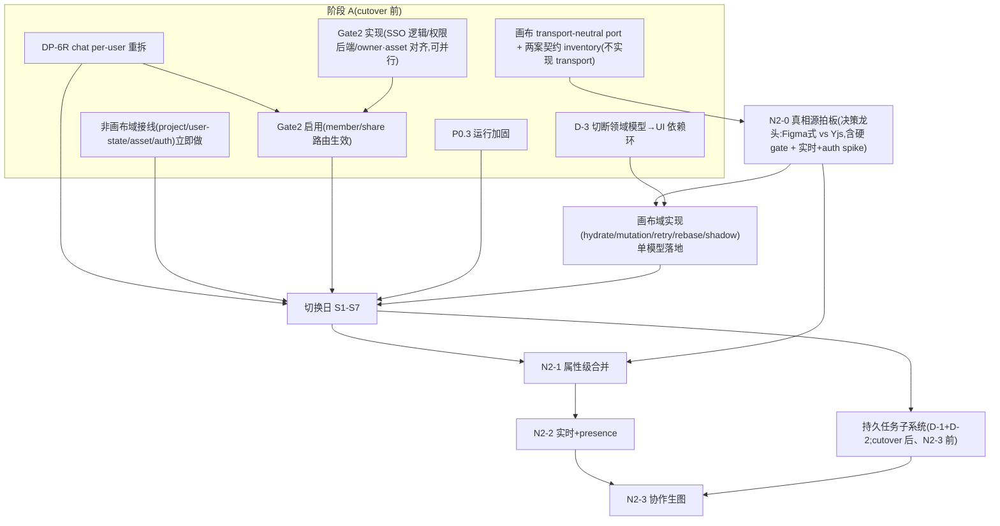

# MivoCanvas 收尾 + 协作近期化计划(v6.1,Fable5 + gpt-5.6-sol/xhigh 共识迭代中)

> v6.1:v6 复核 7/9 闭合,剩 2 条纯依赖图未收口(DP-6R 未画成 Gate2 启用前置 / TASKQ 错放阶段A且成整个 N2 前置)——已修 §1 依赖图(见图注 v6.1),正文 §3/§7/§8 无需改(复核确认正文正确)。

> 演进:v1→四轮审至 v4(cutover 蓝图 APPROVE)→ v5(整合 audit + 协作近期化 + Figma 式方向)→ **v5 审出 6 实质问题(3 P1+3 P2)**→ v6。
> **v5 被推翻的关键错误(存档)**:v5 声称"chat per-user ≈ 现有域边界、不用重拆"——**错**。现状 chat 是 `document` scope、按画布 owner 存**一份共享 collection**,GET 按 `authz.ownerId` 列出全部 chat(`server/routes/canvas.ts:558-600`;`record-schema.md:250-257`;`memory-layer-seam.md:61-67` 明写"随画布分享对成员可见")。因此"对话私有"不是 N2-3 体验项,而是 **Gate2 成员/分享一启用即发生的隐私违约**;必须重拆 chat 存储且前移到阶段 A。
> v4 骨架(四 gate/S1-S7/三态开关/auth DAG/G3 拆包)仍定案不重审;v6 只改 v5 增量部分。

## Review 对齐
- REVIEW_DOMAIN: 应用代码 + 基础设施
- REVIEW_FOCUS: 接口与契约(adapter CRUD + transport-neutral port)/ 数据与结构(chat per-user 重拆 + owner 迁移)/ 状态与并发(revision×属性LWW 兼容协议 + 文本同编 + undo)/ 安全(SSO header + chat 隐私 + 实时 revoke)/ 部署运行(持久任务子系统 + 实时通道+auth)

---

## 0. 阶段与完成定义(v6 修订:隐私前移)

**阶段 A(cutover)**:服务端底座接入生产 + **chat per-user 重拆(新)**。
**阶段 B(协作,近期)**:多人同画布实时 + 协作生图过程私有/结果共享。
**park**:agent 化 + command transport(audit#1)——用户拍板放,不进本计划。

**阶段 A 完成定义**:①换设备数据原样在;②owner/editor/viewer 生效;③两人各改不同节点最终双留+重启无损;④无基础设施雷;⑤sync command 27/27 emitter 接线;**⑨(前移)chat 双向隐私——A/B 同画布各自 GET 只见自己的普通消息+任务卡,owner 不见 editor chat 反之亦然;匿名分享按拍定策略;旧 owner chat 只迁 owner 本人**。
**阶段 B 完成定义**:⑥同节点不同属性并发各留(属性级)+ 改动 ≤2s 互见;⑦presence 可见;⑧A 触发局部重绘,进度只在 A 的 chat,成品图 B 实时可见可打开(不 404)。

---

## 1. 总依赖图(v6:新增 chat 重拆 gate + Gate1 三分 + N2-0 扩为决策龙头)

> 图注(v6.1):①`CHATR --> G2E` 使 chat 重拆成为 **Gate2 成员/分享启用(member/share 路由生效)的硬前置**——沿任何路径都不能先启用分享再做 chat 重拆(堵死 v5-P1-1 隐私违约);Gate2 实现(G2I)可并行,只是"启用"卡在 CHATR 后。②持久任务子系统(TASKQ)在 **CUT 之后、仅 N2-3 前置**(`CUT-->TASKQ-->N23`),不再是 cutover / N2-1 / N2-2 的前置,与 §7/§8 正文时点一致。

**client 三态(local/shadow/server)+ 激活 DAG + shadow 不变量:v4 §1 原文有效。**

---

## 2. P0 · 稳生产(v4 不变)
- **P0.1** PG 网段 PR #212(终审返修 2 处 fail-open 中)→ PASS 合并 → 服务器 compose up。
- **P0.2** cron 核验;P1.3 前须一次真实成功备份。
- **P0.3** 运行加固(pm2 看护/readiness/连接预算/restore 含业务行+asset/固定 asset dir)。

---

## 3. DP-6R · chat per-user 重拆(v6 新增,阶段 A,Gate2 前必须完成)

**问题**:现状 chat = document scope、按画布 owner 存共享 collection,成员 GET 读全部 → cutover 启用分享即隐私违约(不是 N2 才发生)。用户拍板"对话不共享"要求重拆。
**任务**:
- 存储键改为 **actorId × canvasId × messageId**(或等价 subject 列);画布 authz 只证明 actor 可访问画布,chat CRUD 强制**只读写 actor 自己的 collection**;
- 旧 owner chat **只迁到 owner 本人**,不复制给成员;
- **匿名 share-link 无稳定 user identity 时**:chat 三选一(禁用 / 仅本地临时不入服务端 / 要求登录)——**推荐:匿名链接 chat 禁用(画布按链接角色可访问,但无 chat)**,待用户确认;
- 同步改:G1.0 契约表、G1.4 adapter、PG schema/backend(chat owner 语义)、软删/恢复语义、G3 export/ingest/verify;
- 完成定义⑨(双向隐私)前移到阶段 A 验收。
**验收**:A/B 同画布各自 POST 普通消息+任务卡,双方 GET 只见自己;owner↔editor 互不见;匿名分享符合拍定策略;旧数据迁移后仅原 owner 可见;删/恢复画布不串 actor collection。

---

## 4. Gate1 · 客户端接线(v6:三分,破 v5 "接口两案通用"伪命题)

**问题(v5 P1-2)**:Figma 式需 field-path PATCH+服务端合并元数据;Yjs 写主通道是 Y.Update/state-vector/y-protocol,**根本不复用整 payload+If-Match 的 HTTP adapter**;两案的读取/补拉、离线队列、冲突返回、shadow compare 都不同,不只合并语义。故 Gate1 真正切三块:

- **G1-a 非画布域立即做**:project/canvas-meta/user-state/asset/auth 的 fetch adapter + hydrate + 增量写 + retry(这些不受合并模型影响)。含 G1.0 这部分契约表、G1.1 fetch 底座+三态脚手架、G1.2 project/canvas-meta CRUD、chat(走 DP-6R 新模型)、G1.6 asset attach/detach seam(生产接线,为 N2-3 铺底)。默认 mode=local。
- **G1-b transport-neutral 画布 port(N2-0 前,不实现 transport)**:定义画布变更的中性接口 `loadSnapshot / submitChange / subscribe` + **两案契约 inventory**(Figma 属性 PATCH 案 vs Yjs 通道案各自的 wire/hydrate/retry/conflict/shadow 清单)。**不写任何被某一候选独占的 HTTP transport DTO**。
- **G1-c 画布域实现(挂 N2-0)**:node/edge/anchor 的 hydrate、mutation、retry op、rebase/conflict、shadow reconciliation **全体等 N2-0 决议**,只落**一个**模型,另一模型无死接口。选 Figma 才实现属性 PATCH;选 Yjs 则实现 snapshot+Y.Update/state-vector 通道。
**验收**:N2-0 前生产代码无某候选独占的画布 transport DTO;决议后契约/adapter/retry/hydrate/shadow 四处只落一个模型。

---

## 5. Gate2 · 身份与归属(v4 骨架 + G2.2 升级)
**G2.1 严格 SSO**(v4 原文):缺/错 secret·header→401 不回退指纹;header 仅网关注入,client 不携带;dev 命名 dev mode;四边界验收;未通不切。
**G2.2 owner/asset 对齐 + 资产随画布可见(v5 升级为协作硬前提)**:owner audit(空→SSO username;非空→唯一映射,不可唯一 no-go;事务 migration 覆盖四表);asset 脱离 mivo-key 指纹改可信 SSO actor;**资产可见性 = 请求者对该资产所引用画布有 view 权限 ⇒ 可读**(经权限矩阵)。验收:B(editor/viewer)能打开 A 在共享画布生成的图;非成员/无引用画布 404。

---

## 6. Gate3 搬迁 + 切换日 S1-S7(v4 原文,+ DP-6R 纳入 export/ingest/verify)
G3.1-3.5 拆包/owner/DAG/stale-client 状态机照 v4;**export/ingest/verify 增加 chat per-actor 迁移与校验**(旧 owner chat 只迁 owner)。S1-S7 序列一字不改;回滚=冻结窗;S7 不可逆点。

---

## 7. 债务子系统(v6:D-1+D-2 合并纠类别错误,D-3 定死前置)

- **持久任务子系统(D-1+D-2 合并)**:v5 P2-5 指出 FX-5 是浏览器 IDB 网络写重试队列、client-only、不含生成 job,**不能替代多人生成的服务端 admission/job queue**。改为:**PG job/intent 表**(actorId/canvasId、FIFO/并发上限、幂等、状态机、取消、claim/lease/recovery);客户端只提交 intent + 订阅个人状态;FX-5 最多负责"提交 intent 的网络失败重试",不作执行队列。**时点**:cutover 后、N2-3 前;若阶段 A"重启无损"要含 in-flight job 则前移 cutover 前(默认不含,明示)。
- **D-3 切断领域模型→UI 依赖环**:`canvasDocumentModel.ts:13-17` 不再 value-import canvas 几何/node registry,破 `canvasStore→canvasPersistConfig→canvasDocumentModel→canvasStore` 环。**定死为 G1-c 实现前置**(不再"前后评估"),可与 N2-0 并行。验收:G1-c PR 的 import graph 无该环。
- **D-4 三组双轨删轨决议**:renderer/kernel/persist 各出默认切换条件+观察指标+删除 PR+终止日+owner。纯决策文档,随时做。
- **P2.1 5-kind emitter + canvasActionModel:708-725 "view details" 残口**一起清,27/27 direct call 清零。
- **P2.2 memory 瘦身**。

---

## 8. 阶段 B · N2 协作(v6:N2-0 扩为 decision-complete 决策龙头)

**产品拍板(已入 memory)**:画布对象(图/文/框/stamp/annotation/markup)+布局全共享;chat per-user;协作生图过程私有/结果共享。(注:**锚点 anchor** 作为现有 document invariant 合理共享,属数据模型推导,非本轮用户明示——单独确认或按推导纳入。)

### N2-0 真相源拍板(立即开工;产出必须 decision-complete,直接生成唯一 G1-c/N2-1 契约)
对比 **Figma 式(服务端做主+属性级 LWW+实时广播)vs Yjs**,落现有底座。**必须逐项给两案结果+证据+成本+go/no-go 的 hard gates**:
1. **文本同编**:v1 接受整串 LWW(现 record schema 把 text 整串当 LWW 叶子,两人同编整串互吞)还是必须 Y.Text/OT;
2. **多人 undo/redo**:本地 undo 在远端交错 + 拖拽 coalescing 后语义(只撤自己 op 时远端后写如何保留;Yjs UndoManager 关系 spike 自列未决);
3. **跨 record invariant/事务**:node-delete+edge、group/frame、result node+asset ref、delete-vs-update 的原子边界;
4. **revision × 属性 LWW 兼容协议(见 N2-1)**:选 (A) cutover 前受控修订 #194 / (B) 保留严格 endpoint + 新增 versioned ops endpoint;
5. **实时 transport + auth spike**:真实 SSO 网关下验 WS upgrade(网关是否放行 ws 未知,`owner.ts` 可信链依赖网关注入);Figma 案 REST+SSE/WS、Yjs 案双向 y-protocol 各自 fallback;若网关不放行 → 影响选型(不是到 N2-2 才临时回退);
6. **迁移/双协议窗口**:#194/PG JSONB/FX-5/stale-client 的迁移;
7. **事件序号/补拉日志/压缩、权限撤销、性能与存储放大**评分。
每项有最小 PoC/测试矩阵 + 一票否决。产出改写 spike Q1-Q5(**倾向 Figma 式,以对比为准**),xhigh 审。

### N2-1 属性级合并(依赖 N2-0;选 Yjs 则替换为 Y.Doc 通道)
按 N2-0 拍定的兼容方案(A 改 #194 / B versioned ops)实现:**op schema**(opId/clientId/actor/baseRevision/fieldPaths/order key)、field/nested-field 原子边界、每字段 clock/服务端序号全序、record revision 每 accepted op 单调 bump 且**只供 snapshot/catch-up**、delete/不可变字段/跨 record invariant 走**严格事务路径**(非 LWW)。验收:同节点不同属性/同属性/延迟重试/重复 op/nested field/delete-vs-update/旧客户端/重连按序号补拉。

### N2-2 实时 + presence(依赖 N2-1 + cutover;transport+auth 已在 N2-0 定)
WS/SSE:变更实时推(≤2s)+ presence(在线/选区/光标)+ 断线按 revision/序号增量补拉。BFF 单实例起步(合并 P0.3 连接预算)。验收:真实网关双浏览器;伪造 header/跨 canvas 订阅拒绝;**移除成员/撤销 share 后连接立即或限时断开**;gap 补齐;慢消费者有界 backpressure;所选模型 fallback 实测。

### N2-3 协作生图(依赖 G2.2 + G1.6 生产接线 + N2-2 + 持久任务子系统)
局部重绘等:任务进度卡只写触发者 chat(DP-6R per-user);成品图节点落共享画布经实时广播;资产随画布可见(G2.2);任务活过重启+actor 隔离(持久任务子系统)。验收:并发 busy/重启/取消/重复提交;A 触发→B 实时见结果图可打开;B 的 chat 看不到 A 的任务卡。

---

## 9. 需要用户的输入(v6)
**已拍**:协作近期/agent park;画布共享/chat 私有;协作生图过程私有结果共享。
1. **P-6**:restore 补偿 (a) saga(推荐)/ (b) 人工对账。
2. **DP-6R 匿名分享 chat 策略(新)**:匿名 share-link 访客 chat → 禁用(推荐)/ 仅本地临时 / 要求登录。
3. **授权推进**:**可并行启动**(完成验收仍按各自 gate 依赖)——G1-a 非画布域 + G1-b 画布 port/inventory + DP-6R + P0.3 + G2.1 + N2-0(决策龙头)+ D-3 + D-4。**注**:这些"可并行开工"指开始编码;真实 restore drill 仍依赖 P0.2 成功备份、生产 smoke 依赖 P0.1/PG——验收按 gate 依赖。

---

## 10. 风险登记(v4+v5 全表继承 + v6 新增)
v4/v5 风险行全部继承。v6 新增:

| 风险 | 影响 | 触发/检查 | 回退 | owner |
|---|---|---|---|---|
| chat 重拆晚于 Gate2 分享启用 | 成员读到 owner/他人对话(隐私违约) | Gate2 member/share 上线时 DP-6R 未完成 | DP-6R 前移为 Gate2 硬前置 | DP-6R |
| 画布 port 泄漏候选协议细节 | N2-0 前固化 DTO→重写 | G1-b 出现属性PATCH 或 Y.Update 独占 DTO | port 保持 transport-neutral,transport 等 N2-0 | G1-b |
| revision×LWW 兼容未定契约 | 原地改端点破坏 #194 | N2-1 改 existing PATCH 无版本策略 | N2-0 拍 A 改#194 / B versioned endpoint | N2-0 |
| 文本整串 LWW 被当默认 | 两人同编文字互吞,后期翻案 | N2-0 未把 text 同编列 hard gate | N2-0 文本 gate 一票否决 | N2-0 |
| FX-5 误当执行队列 | 换设备不可见/关页失调度/双队列真相 | D-2 只入 IDB | 持久任务子系统 PG job 表 | 持久任务子系统 |
| 实时通道网关不放行 ws | N2-1 完成才发现协议不通 | N2-0 未做网关 ws spike | transport+auth spike 并入 N2-0 选型 | N2-0 |
| 长连接权限撤销不断流 | 移除成员仍收变更 | N2-2 验收缺 revoke 边界 | 连接绑 actor+canvas+revoke 断流 | N2-2 |
| D-3 依赖环晚切 | G1-c 把 UI/store 依赖带进新 transport 再拆二次 | G1-c 实现前环未断 | D-3 定死 G1-c 前置 | D-3 |
